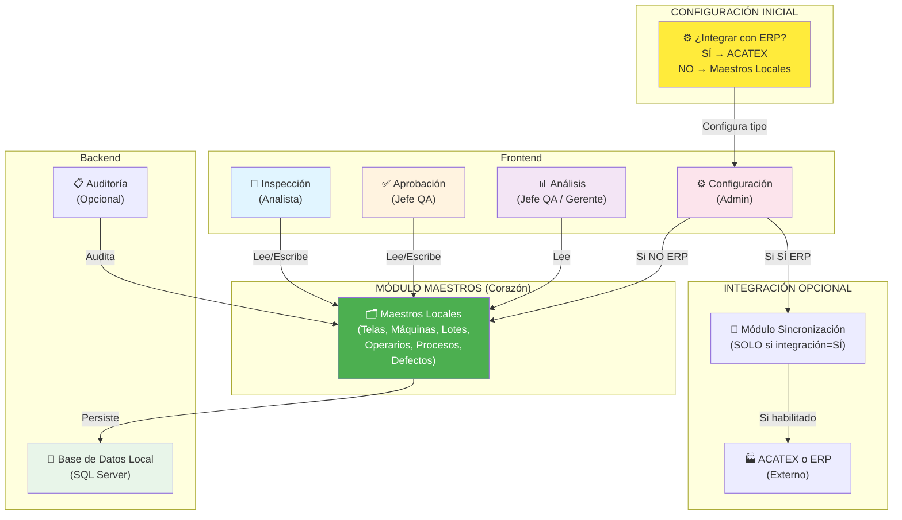

# PRODUCTO: SISTEMA DE GESTIÓN DE CONTROL DE CALIDAD TEXTIL
## PRD (Product Requirements Document) — v1.0

**Fecha**: 26 de Mayo de 2026  
**Empresa**: Manufacturas Eliot — Bogotá, Colombia  
**Planta**: 1,000 operarios | Analistas de Calidad: 20 | ERP: ACATEX (.NET + SQL Server)  
**Timeline**: 90 días (Construcción 30d, Testing 30d, Go-live + Medición 30d)  
**Preparado por**: Head of Product + AI/Agent Architect  

---

## TABLA DE CONTENIDOS

1. [One-Liner + Job to be Done + Misión](#segmento-1)
2. [Contexto y Problema](#segmento-2)
3. [ICP Detallado](#segmento-3)
4. [Propuesta de Valor Única + Diferenciadores](#segmento-4)
5. [Top 5 Casos de Uso](#segmento-5)
6. [Principios de Diseño No Negociables](#segmento-6)
7. [User Journeys](#segmento-7)
8. [MVP Scope (MoSCoW)](#segmento-8)
9. [Especificación Funcional: Módulos](#segmento-9)
10. [Métricas de Éxito](#segmento-10)
11. [Plan de Evaluación del Sistema](#segmento-11)
12. [Riesgos y Mitigaciones](#segmento-12)
13. [Plan de Entrega 30/60/90 Días](#segmento-13)

---

# SEGMENTO 1: ONE-LINER + JOB TO BE DONE + MISIÓN {#segmento-1}

## 🎯 One-Liner del Producto

**"Un sistema de gestión de control de calidad que centraliza registros fotográficos de defectos, tiempos de inspección y comentarios del analista, reemplazando Excel y entregando trazabilidad completa en 90 días."**

---

## 📋 Job to be Done (JTBD)

**Cuando** un Analista de Calidad encuentra un defecto en tela durante inspección en Tintoreria,  
**Quiero** capturar una foto desde mi celular, escribir un comentario sobre el problema y registrar el tiempo de inspección en un sistema centralizado,  
**Para** que la planta tenga un registro organizado, trazable y accesible de todos los defectos (en lugar de dispersarlos en Excel), y los Jefes de Calidad puedan analizar patrones de reprocesos por máquina, sección y tipo de defecto.

---

## 🎪 Misión del Producto

**"De Excel a Control: Sistematizar la invisible labor de los analistas de calidad."**

Hoy, cada defecto detectado en Tintoreria (72K reprocesos en abril) se registra en Excel, con pérdida de contexto fotográfico, tiempos inconsistentes y análisis manuales. El sistema centraliza:

1. **Registro fotográfico**: Cada defecto queda documentado con imagen (teléfono del analista)
2. **Sistematización de tiempos**: Check-in/check-out automático en cada inspección
3. **Base de datos de defectos**: Histórico completo por sección, máquina, analista
4. **Métricas accesibles**: Jefes y Gerentes ven KPIs de reprocesos, tiempos de ciclo sin cálculos manuales

Resultado: reducción de error administrativo, cumplimiento de auditorías, base de datos que identifica patrones (TONODIFFERENTE 29-40% en Tintoreria).

---

# SEGMENTO 2: CONTEXTO Y PROBLEMA {#segmento-2}

## 💔 Dolores del Mercado (Planta Manufacturas Eliot)

### 1. Escala de reprocesos: No es sostenible

**Datos Reales (Reprocesos_Cifras.pdf, Abril 2026)**:
- **267,119 reprocesos en UN mes**
- **~8,700-10,482 toneladas de tela reprocesada POR DÍA**
- Áreas más críticas:
  - **Tintoreria Agotamiento 80**: 58,638 reprocesos (21.95% del total)
  - **Tintoreria Agotamiento 19**: 72,477 reprocesos (27.13% del total)
  - **Ramas 19 y 80**: 58,949 reprocesos (22.07% del total)

**Implicación**: Cada reproceso = tela devuelta a máquina, tiempo perdido, recursos consumidos nuevamente. A esta escala, es un **drenaje permanente de margen**.

### 2. Defectos repetidos: Falta de análisis sistemático

**Defectos principales en abril 2026:**
| Defecto | Occurrencias | % del Total |
|---------|---|---|
| TONODIFFERENTE | 79.01 | 29-40% |
| MANCHAS | 31.75 | 13% |
| MAREO | 26.74 | 10% |
| ENCOGIMIENTO | 12.48 | 5% |
| DESFILAMENTO | 10.33 | 4% |

**El problema**: Hoy NO hay análisis de por qué se repiten. ¿Es culpa de TINTORERIA AGOTAMIENTO 80? ¿Del turno? ¿Del operario XYZ?

**Resultado**: Se repara el síntoma (retiñe la tela) pero no se atacan las causas raíz.

### 3. Información dispersa = Decisiones lentas

Hoy, cada defecto detectado se registra en Excel, con:
- Pérdida de contexto fotográfico
- Tiempos inconsistentes (algunos anotan hora inicio, otros solo hora fin)
- Sin trazabilidad: no se sabe quién detectó cada defecto
- Análisis manual tardío: reportes se generan 2-3 días después
- Errores de transcripción: datos migrados papeleta → Excel → reportes

**Síntoma**: Jefe de Calidad invierte 2-3 horas/día en limpieza de datos en lugar de tomar decisiones.

### 4. Sin registro fotográfico sistemático

**Dato crítico**: Actualmente NO se está tomando registro fotográfico sistematizado. Cada defecto se describe textualmente en Excel, generando ambigüedad.

---

## ⏰ ¿Por qué ahora? (Urgencia + Triggers)

### Trigger 1: Volumen insostenible
- 267K reprocesos/mes de abril = **~$500K-1.3M USD perdidos/mes** (estimado)
- Este número es **inaceptable** para márgenes de 10-15%

### Trigger 2: Presión del CEO
- CEO exige reducción de -30% en reprocesos en 90 días
- **Ventana de acción: 90 días máximo**

### Trigger 3: Falta de visibilidad ejecutiva
- Gerencia está **ciega** a dónde están los problemas
- Esto inhabilita decisiones rápidas

---

## 🚫 Alternativas Actuales (y por qué NO funcionan)

### Alternativa 1: Excel + Papeleta (Lo que usan hoy)

**Por qué es insuficiente:**
- ❌ Fotos dispersas (o no existen)
- ❌ Inconsistencia en tiempos
- ❌ Sin contexto: defecto anotado pero ¿en qué tela? ¿qué máquina?
- ❌ Análisis manual tardío: reportes 2-3 días después
- ❌ Sin trazabilidad: no se sabe quién detectó cada defecto
- ❌ Errores de transcripción: datos migrados papeleta → Excel
- ❌ No hay auditoría: auditor externo NO ve trail de decisiones

**Costo oculto**: Jefe de Calidad invierte 2-3 horas/día en limpieza de datos.

### Alternativa 2: ERP Estándar (SAP, Infor, etc.)

**Por qué NO es solución:**
- ❌ Implementación 3-6 meses (no 90 días)
- ❌ Más para usuarios técnicos que para operarios
- ❌ Foto = tarea adicional, no integrada al flujo
- ❌ Costo: $100K-300K USD implementación

### Alternativa 3: Apps QA Genéricas (Inspectlet, MobileQA)

**Por qué NO son solución:**
- ❌ Diseñados para manufactura GENÉRICA, no para textil
- ❌ No entienden jerga textil (TONODIFFERENTE, pilling, etc.)
- ❌ No integran con ERP textil especializado (ACATEX)
- ❌ Costo por licencia: $50-200/mes por usuario × 20+ analistas = insostenible

---

## 🌍 Brecha de Mercado

**Existe un hueco entre:**
- ❌ Excel (barato, 0 funcionalidad)
- ❌ ERP estándar (caro, complejo, genérico)
- ❌ Apps QA genéricas (moderado pero sin especialización textil)

**Y lo que necesita Manufacturas Eliot:**
- ✅ Registro fotográfico sistematizado
- ✅ Control de tiempos (check-in/check-out)
- ✅ Base de datos textil especializada
- ✅ Integración con ERP existente (ACATEX)
- ✅ Reportes y trazabilidad en tiempo real
- ✅ Móvil first (analista en piso)
- ✅ Costo accesible

---

# SEGMENTO 3: ICP DETALLADO {#segmento-3}

## 📍 Perfil y Firmographics

### Empresa Ideal: Planta Textil Mediana-Grande

| Parámetro | Perfil |
|-----------|--------|
| **Sector** | Manufactura Textil (tejidos planos, punto, tricot) |
| **Geografía** | **Bogotá, Colombia** |
| **Tamaño** | **~1,000 operarios en planta; ~15-20 analistas de calidad** |
| **Volumen producción** | 500+ toneladas tela/mes |
| **ERP actual** | **ACATEX** (especializado en textil, .NET + SQL Server) |
| **Sistema QA hoy** | Excel + papeleta (SIN registro fotográfico sistemático) |
| **Presión actual** | 267K+ reprocesos/mes; márgenes comprimidos |
| **Budget anual IT** | $200K-500K USD |

### ICP Específico: Planta Bogotá (Manufacturas Eliot) - v1

- **Nombre**: Manufactura Eliot - Bogotá
- **Tamaño planta**: **~1,000 operarios, ~15-20 analistas de calidad**
- **Procesos críticos**: Tintoreria (Agotamiento 80 y 19), Ramas, Estampación
- **Volumen actual**: 267K reprocesos/mes (abril 2026)
- **ERP**: **ACATEX** (especializado en textil, .NET + SQL Server)
- **Telas principales procesadas**: NOVAKREPEL, AMORELA, SUEA OS, ALDAIASEC, CENTAURO, etc. *(nombres de telas, no clientes)*
- **Estado actual**: Excel + papeleta; **NO hay registro fotográfico sistemático**
- **Tela más crítica**: NOVAKREPEL (27.13% de reprocesos en abril 2026)

---

## 👥 Buyer Personas

### Persona 1: Jefe de Calidad (El Sponsor — Decision Maker)

| Aspecto | Descripción |
|---------|-------------|
| **Edad/Perfil** | 35-55 años, 10+ años en textil, formación técnica (QA/QC engineer) |
| **Responsabilidad clave** | Garantizar que tela salga aprobada; reducir reprocesos |
| **Presión actual** | **Presión del CEO para bajar reprocesos** (267K/mes es inaceptable; CEO pregunta diariamente) |
| **Poder de decisión** | **ALTO** — aprueba inversión en herramientas QA hasta $50K USD |
| **Pain points** | No tiene visibilidad en tiempo real; pasa 2+ horas/día en Excel; no puede identificar causas raíz rápido |
| **Goal con el sistema** | Reducir reprocesos 30% en 90 días; tener dashboard ejecutivo para CEO que muestre dónde están los problemas **por tela** |
| **Objeción probable** | "¿Cómo se integra con ACATEX? ¿Cuánto cuesta? ¿Cuánto training necesitan los 20 analistas?" |

### Persona 2: Analista de Calidad (El Power User)

| Aspecto | Descripción |
|---------|-------------|
| **Edad/Perfil** | 22-40 años, 2-8 años de experiencia en QA, técnico/técnica |
| **Responsabilidad clave** | Inspeccionar tela, detectar defectos, registrar y comentar |
| **Presión actual** | Recibe papeletas a mano; debe anotar en Excel; **actualmente NO toma fotos del defecto** (es un gap) |
| **Poder de decisión** | **BAJO** — usa lo que le ordene el Jefe; pero su buy-in es crítico (si no adopta, sistema falla) |
| **Pain points** | Proceso manual lento; **NO hay documentación visual del defecto**; no sabe si su registro llegó bien |
| **Goal con el sistema** | Trabajar más rápido en piso; **capturar foto del defecto directamente** + comentario + tiempo automático |
| **Objeción probable** | "¿Voy a tener que llenar más formularios? ¿Es fácil de usar con una mano mientras inspecciono?" |

### Persona 3: Jefe de Procesos de Producción (Stakeholder — Data-Driven)

| Aspecto | Descripción |
|---------|-------------|
| **Edad/Perfil** | 40-60 años, experiencia en operaciones |
| **Responsabilidad clave** | Que la planta siga horarios; maximizar toneladas producidas/día |
| **Presión actual** | **Falta de análisis en línea**: no sabe cuál máquina falla más; cuál turno tiene más defectos |
| **Poder de decisión** | **MEDIO-ALTO** — puede bloquear si sistema detiene línea; debe aprobar integración con ACATEX |
| **Pain points** | Toma decisiones SIN data: "¿revisar AGOTAMIENTO 80 o RAMAS 19?" → especulación |
| **Goal con el sistema** | **Análisis en línea por tela, máquina, turno y operario**. Con eso puede tomar decisiones rápidas |
| **Objeción probable** | "¿Esto va a frenar mi línea de producción? ¿Se integra con ACATEX sin problemas?" |

### Persona 4: Gerente de Planta (Executive Sponsor — Budget)

| Aspecto | Descripción |
|---------|-------------|
| **Edad/Perfil** | 45-65 años, MBA o ingeniería, enfoque en márgenes |
| **Responsabilidad clave** | Rentabilidad de planta, reducción de costos |
| **Presión actual** | **CEO exige bajar reprocesos**; 267K/mes = ~$500K-1.3M USD perdidos/mes |
| **Poder de decisión** | **MÁXIMO** — aprueba presupuesto; puede destinar $50K-150K USD para solución |
| **Pain points** | No ve números en tiempo real; decisiones basadas en reportes que llegan 2 días tarde |
| **Goal con el sistema** | **Dashboard ejecutivo que muestre reprocesos POR TELA** (no por cliente). Ejemplo: "NOVAKREPEL: 27.13%; AMORELA: 4.47%" |
| **Objeción probable** | "¿Cuánto cuesta? ¿Cuál es el payback? ¿Puedo tener resultados en 60 días?" |

---

## 💔 Pains (Validados con datos)

### Pain 1: Volumen insostenible de reprocesos
- **Fuente**: Reprocesos_Cifras.pdf
- **Cuantificación**: 267,119 reprocesos en abril 2026 (8,700-10,482 ton/día)
- **Impacto**: Costo estimado $500K-$1.3M USD/mes

### Pain 2: Falta de análisis sistemático por tela
- **Cuantificación**: NOVAKREPEL 27.13%, AMORELA 4.47%, SUEA OS 3.72% — pero ¿por qué?
- **Impacto**: Jefe de Procesos no sabe en qué tela enfocarse

### Pain 3: Falta de registro fotográfico sistemático
- **Cuantificación**: 267K defectos/mes con cero documentación visual
- **Impacto**: Auditoría imposible; no hay trail visual de defectos

### Pain 4: Datos dispersos = decisiones sin data
- **Cuantificación**: Jefe de Procesos toma decisiones SIN saber qué máquina/turno/tela falla
- **Impacto**: Decisiones reactivas y lentas

### Pain 5: Inconsistencia en registros de tiempo
- **Cuantificación**: Tiempos de inspección no medidos; imposible calcular eficiencia
- **Impacto**: KPI de velocidad de inspección = invisible

---

## 🔥 Triggers de Compra

### Trigger 1: Presión ejecutiva del CEO
- **Evento**: CEO cuestiona rentabilidad; exige bajar reprocesos en 30% en 90 días
- **Timeline**: Jefe de Calidad tiene 90 días máximo para mostrar progreso
- **Urgencia**: **ALTÍSIMA**

### Trigger 2: Auditoría de calidad ISO o cliente exigencia
- **Evento**: Planta requiere **trail fotográfico de defectos** para cumplir normas internas
- **Rationale**: Es **necesidad interna de la planta** para sistematizar y auditar
- **Urgencia**: MEDIA-ALTA

### Trigger 3: Nueva tela o producto en proceso
- **Evento**: Planta va a procesar **nueva tela** que requiere procesos QA especiales
- **Timeline**: Proyecto de lanzamiento (4-8 semanas antes)
- **Urgencia**: MEDIA

### Trigger 4: Cambio en máquinas de Tintoreria
- **Evento**: Planta instala nueva máquina de AGOTAMIENTO CONTINUA u optimiza máquinas existentes
- **Timeline**: Proyecto de inversión de capital (3-6 meses típicamente)
- **Urgencia**: MEDIA

---

## ⚠️ Objeciones Probables + Respuestas

### Objeción 1: "¿Cómo se integra con ACATEX?"

**Respuesta propuesta**:
> "ACATEX es fuente de verdad para maestros (número lote, tela, máquina). Nuestro sistema se integra vía APIs .NET estándar con SQL Server. Sincronizamos cada inspección: tela, máquina, analista, timestamp, defectos. CERO duplicidad; CERO silos. ACATEX sigue siendo el ERP; nosotros somos especialización en QA fotográfico."

### Objeción 2: "¿Cuánto cuesta y ROI?"

**Respuesta propuesta**:
> "Inversión inicial: $20K-40K USD (licencias año 1 + implementación + training 20 analistas). ROI: Si reducimos 30% de reprocesos en 90 días, ahorras ~$150K-400K USD/mes. Payback: 4-8 semanas."

### Objeción 3: "¿Los 20 analistas van a adoptar?"

**Respuesta propuesta**:
> "Sistema diseñado para piso: 1 botón para capturar foto, 1 campo de texto para comentario. Sin Excel, sin formularios. Training: 2 horas máximo por analista."

### Objeción 4: "¿Funciona sin wifi en piso?"

**Respuesta propuesta**:
> "Offline-first: analista captura foto + comentario sin wifi. Sincroniza automáticamente cuando hay conectividad. Cero pérdida de datos; cero fricción en el workflow."

---

# SEGMENTO 4: PROPUESTA DE VALOR ÚNICA + DIFERENCIADORES {#segmento-4}

## 🎯 UVP en Una Frase

**"La única solución que convierte cada inspección de tela en un registro fotográfico sistematizado, en tiempo real, integrando ACATEX para análisis instantáneo por tela, máquina y turno — sin reemplazar Excel, sin meses de implementación."**

---

## 🔍 Problema → Solución → Resultado

| Elemento | Detalle |
|----------|---------|
| **PROBLEMA** | Planta Bogotá tiene 267K reprocesos/mes documentados SOLO en Excel + papeleta. Sin fotos. Sin tiempo medido. Sin análisis por tela. El Jefe de Procesos toma decisiones a ciegas. |
| **SOLUCIÓN** | Sistema móvil que captura: (1) Foto del defecto, (2) Comentario del analista, (3) Timestamp automático, (4) Integración con ACATEX. En 90 días, reemplaza Excel en QA. |
| **RESULTADO** | Gerente ve dashboard: "NOVAKREPEL 27.13% reprocesos → Acción". Jefe Procesos ve: "AGOTAMIENTO 80 con defectos de tono → Revisar máquina". Analistas protegidos: cada defecto tiene foto. Planta reduce reprocesos 30% en 90 días. |

---

## 🏆 Diferenciadores Clave

### Diferenciador 1: Especialización Textil (vs. Genéricos)

| Aspecto | Genérico (Inspectlet) | Nuestro Producto |
|---------|---|---|
| Defectos | 5-10 genéricos | 25+ defectos textiles (TONODIFFERENTE, MANCHAS, PILLING, etc.) |
| Telas | Libre texto | Catálogo de telas integrado con ACATEX |
| Máquinas | Libre texto | Máquinas textiles (AGOTAMIENTO 80, RAMAS, etc.) integradas con ACATEX |
| KPIs | Genéricos | Textiles: % rechazo por tela, DHU, reprocesos por máquina/turno |

### Diferenciador 2: Implementación en Velocidad (vs. ERP Estándar)

| Aspecto | SAP/ERP Estándar | Nuestro Producto |
|---------|---|---|
| Timeline implementación | 3-6 meses | **2-4 semanas** |
| Integración con ACATEX | Meses de custom code | **APIs estándar .NET; 1 semana** |
| Training | 3-5 días por usuario | **2 horas por usuario** |
| Costo implementación | $100K-300K USD | **$15K-30K USD** |
| Value time-to-market | 6+ meses | **60 días** |

### Diferenciador 3: Captura Fotográfica Sistematizada desde Piso (vs. Excel)

| Aspecto | Excel Hoy | Nuestro Producto |
|---------|---|---|
| Foto del defecto | NO / dispersa | **SÍ / sistematizada en BD central** |
| Timestamp automático | NO / manual | **SÍ / automático check-in/check-out** |
| Trazabilidad | NO | **SÍ** (analista, máquina, tela, turno, timestamp) |
| Offline-first | N/A | **SÍ** (funciona sin wifi; sincroniza después) |
| Análisis por tela | Manual (Excel pivot) | **Automático** (dashboard en tiempo real) |

### Diferenciador 4: Integración Nativa con ACATEX (vs. Silos)

- ✅ Sincronización bidireccional: ACATEX → nos envía maestros (telas, máquinas, lotes)
- ✅ ACATEX ← nos devuelve: análisis de reprocesos, defectos, tiempos de inspección
- ✅ **Cero duplicidad**: Un número de tela, una verdad de fuente

---

## 📊 Matriz de Posicionamiento 2x2

```mermaid
quadrantChart
    title Posicionamiento Competitivo: QA Textil
    x-axis Lentitud de Implementación --> Velocidad de Implementación
    y-axis Sin Captura Fotográfica Sistemática --> Con Captura Fotográfica Sistemática
    
    quadrant-1 Nicho Premium
    quadrant-2 Ineficiente
    quadrant-3 Básico Ineficiente
    quadrant-4 Nicho Rápido
    
    Excel & Papeleta: 0.25, 0.20
    SAP/ERP Estándar: 0.15, 0.60
    Apps QA Genéricas: 0.50, 0.55
    Nuestro Producto: 0.85, 0.90
```

**Interpretación**:
- Eje X: Velocidad de Implementación
- Eje Y: Captura Fotográfica Sistemática
- **Nuestro Producto (arriba-derecha)**: IDEAL — Rápido + Fotográfico + Especializado

---

# SEGMENTO 5: TOP 5 CASOS DE USO {#segmento-5}

## **Caso de Uso 1: Analista inspecciona LOTE, documenta defecto, lo vincula a máquina del flujo**

| Paso | Acción | Sistema | Resultado |
|-----|--------|--------|-----------|
| **1** | Analista abre app móvil. Escanea lote HDR #12847 | Sistema carga automáticamente:<br>- Número de lote: HDR #12847<br>- Tela: NOVAKREPEL<br>- Máquinas flujo: AGOTAMIENTO 80<br>- Estación actual: POST-AGOTAMIENTO 80<br>- Check-in: 14:35:22 (automático) | Pantalla lista para inspeccionar |
| **2** | Inspecciona tela. Encuentra variación de tono. Presiona "Capturar Defecto" | Sistema abre cámara | Cámara en tiempo real |
| **3** | Captura foto clara del defecto | Sistema guarda foto localmente (offline) | Foto aparece en pantalla |
| **4** | Selecciona "Tipo de Defecto" del dropdown | Sistema muestra 25+ opciones:<br>TONODIFFERENTE, MANCHAS, MAREO, ENCOGIMIENTO, etc. | Dropdown expandido |
| **5** | Selecciona "TONODIFFERENTE" | Sistema pre-llena:<br>"Máquina culpable estimada: AGOTAMIENTO 80" | "Confirmar o cambiar?" |
| **6** | Confirma máquina culpable | Sistema acepta | "✓ AGOTAMIENTO 80 confirmada" |
| **7** | Escribe comentario: "Variación de tono entre 200-250m..." | Sistema acepta comentario | Comentario aparece |
| **8** | Presiona "Guardar Defecto" | Sistema guarda localmente e intenta sincronizar | "✓ Guardado y sincronizado"<br>"Check-out: 14:38:44"<br>"Tiempo inspección: 3'22"" |

**Valor**: Defecto trazado (quién, dónde, cuándo, por qué) con foto.

---

## **Caso de Uso 2: Jefe de Calidad analiza patrones en tiempo real**

| Paso | Acción | Sistema | Resultado |
|-----|--------|--------|-----------|
| **1** | Jefe abre dashboard QA | Sistema carga vista de análisis | Dashboard muestra: |
| **2** | Selecciona filtros: Período "Últimas 24h", Defecto "TONODIFFERENTE", Máquina "TODAS" | Sistema genera reporte: "Total lotes con TONODIFFERENTE (24h): 47"<br>- AGOTAMIENTO 80: 28 lotes (59%)<br>- AGOTAMIENTO 19: 15 lotes (32%)<br>- Otros: 4 lotes (9%) | Gráfico de barras |
| **3** | Filtra: "AGOTAMIENTO 80 + TONODIFFERENTE" | Sistema muestra galería de últimas 10 fotos | Galería de fotos |
| **4** | Ve patrón claro: todas muestran variación de tono | Sistema permite descargar fotos + análisis | Datos listos |
| **5** | Prepara reporte para Gerente | Sistema genera PDF con análisis + fotos | PDF descargado |
| **6** | Reporta al Gerente: "TONODIFFERENTE en AGOTAMIENTO 80 es 59% de hoy" | Gerente toma decisión | Acción iniciada |

**Valor**: Causa raíz identificada en 10 minutos vs. 2 horas en Excel.

---

## **Caso de Uso 3: Jefe de Procesos toma decisión data-driven**

| Paso | Acción | Sistema | Resultado |
|-----|--------|--------|-----------|
| **1** | Jefe Procesos ve análisis por máquina (últimas 24h) | Sistema muestra ranking:<br>- AGOTAMIENTO 80: 27% defectos = 3,200 lotes/mes<br>- AGOTAMIENTO 19: 25% defectos = 2,800 lotes/mes<br>- RAMAS 19: 12% defectos | Ranking claro |
| **2** | Filtra fotos de "AGOTAMIENTO 80 + TONODIFFERENTE" | Sistema muestra 100+ fotos del defecto | Patrón visual |
| **3** | Analiza: "¿Problema es color, no tensión?" | Sistema propone:<br>"DEF-TON típicamente en Tintoreria. Cause probable: calibración, químicos." | Diagnóstico |
| **4** | Jefe Procesos toma decisión: "Revisar AGOTAMIENTO 80 mañana" | Sistema notifica a área de producción | Acción ejecutada |
| **5** | 2 semanas después, mide resultado | Sistema muestra: AGOTAMIENTO 80 defectos bajaron 40% | ✓ Acción funcionó |

**Valor**: Decisión data-backed, no intuición. ROI medible.

---

## **Caso de Uso 4: Gerente reporta al CEO**

| Paso | Acción | Sistema | Resultado |
|-----|--------|--------|-----------|
| **1** | Gerente abre dashboard ejecutivo | Sistema muestra:<br>- Total reprocesos: 267K (abril) → 225K (semana 1 mayo) = -15.7%<br>- Tendencia: Gráfico de línea mostrando reducción<br>- Top telas: NOVAKREPEL 27.13% → 22.5% (-4.6 puntos) | Dashboard limpio |
| **2** | Gerente prepara reporte para CEO | Muestra: "Identificamos TONODIFFERENTE (30% del problema) en AGOTAMIENTO 80. Tomamos acción. Resultado: reducción visible en 1 semana." | Reporte ejecutivo |
| **3** | Reporta al CEO: "Bajamos 15.7% en 1 semana. Proyección: -30% en 90 días." | CEO confía en progreso | Go-live aprobado |

**Valor**: CEO ve datos, no promesas. Confianza en proyecto.

---

## **Caso de Uso 5: Auditor verifica cumplimiento de lotes**

| Paso | Acción | Sistema | Resultado |
|-----|--------|--------|-----------|
| **1** | Auditor accede a módulo de auditoría | Sistema lista: "Mayo 2026: 127,000 lotes inspeccionados" | Scope definido |
| **2** | Selecciona muestra: 100 lotes aleatorios | Sistema selecciona aleatoriamente | Muestra representativa |
| **3** | Verifica para cada lote: foto ✓, comentario ✓, timestamp ✓, máquina ✓ | Sistema valida integridad | 100/100 completos |
| **4** | Auditor firma: "Cumplimiento verificado. Trail completo." | Aprobado sin hallazgos | ✓ Auditoría pasada |

**Valor**: Trazabilidad complete. Cumplimiento regulatorio.

---

# SEGMENTO 6: PRINCIPIOS DE DISEÑO NO NEGOCIABLES {#segmento-6}

## **Principio 1: Foto + Tipo de Defecto + Comentario = Registro Válido**

| Aspecto | Detalle |
|---------|---------|
| **(a) Qué significa operativamente** | Cada defecto registrado DEBE tener 3 elementos: (1) **Foto obligatoria**, (2) **Tipo de defecto seleccionado**, (3) **Comentario descriptivo**. Sin los tres, NO es válido. |
| **(b) Cómo se manifiesta en UI** | - 📸 Capturar Foto → Obligatorio (campo rojo hasta capturar)<br>- 🏷️ Seleccionar Tipo de Defecto → Obligatorio (dropdown)<br>- 💬 Comentario → Obligatorio (≥10 caracteres)<br>- Botón "Guardar" deshabilitado (gris) hasta llenar los 3 campos |
| **(c) Explícitamente PROHIBIDO** | ❌ Guardar sin foto<br>❌ Guardar sin tipo defecto<br>❌ Permitir "tipo libre" (debe estar en maestro)<br>❌ Guardar con comentario vacío<br>❌ Usar foto de defecto anterior<br>❌ Borrar foto después de guardar |

---

## **Principio 2: Trazabilidad Completa de Lote (HDR + Máquinas + Defecto)**

| Aspecto | Detalle |
|---------|---------|
| **(a) Qué significa operativamente** | Cada lote (HDR) debe tener trail visible: (1) máquinas por las que pasó, (2) punto de inspección actual, (3) máquina culpable estimada, (4) acción resultante. Si falta cualquiera, el lote es "huérfano". |
| **(b) Cómo se manifiesta en UI** | - Al abrir un lote, sistema muestra automáticamente:<br>  - "HDR #12847 → NOVAKREPEL 500m"<br>  - "Flujo: AGOTAMIENTO 80 ✓ → ESTAMPACION (próximo) → ACABADOS (próximo)"<br>  - "Estación actual: POST-AGOTAMIENTO 80"<br>  - "Máquina culpable probablemente: AGOTAMIENTO 80" |
| **(c) Explícitamente PROHIBIDO** | ❌ Registrar defecto sin saber número de lote<br>❌ Perder trail de máquinas<br>❌ Defecto sin máquina culpable<br>❌ Cambiar máquina sin log<br>❌ Lote que desaparece después de defecto |

---

## **Principio 3: Check-in / Check-out Automático (Timestamp Sistemático)**

| Aspecto | Detalle |
|---------|---------|
| **(a) Qué significa operativamente** | Cada inspección tiene timestamp automático de inicio (cuando analista abre lote) y fin (cuando guarda). Sistema calcula automáticamente "tiempo de inspección del lote". Sin intervención manual. |
| **(b) Cómo se manifiesta en UI** | - Pantalla muestra:<br>  - "Check-in: 14:32:15" (automático)<br>  - "Tiempo transcurrido: 3 minutos 22 segundos" (contador en tiempo real)<br>  - Al guardar: "Check-out: 14:35:37" (automático)<br>  - "Tiempo total: 3'22"" (guardado) |
| **(c) Explícitamente PROHIBIDO** | ❌ Permitir que analista ingrese hora manualmente<br>❌ Inspecciones sin timestamp<br>❌ Usar "tiempo promedio" en lugar de real<br>❌ Editar timestamps después de guardar<br>❌ Timestamp diferente en cliente vs. servidor |

---

## **Principio 4: ACATEX + Todos los Maestros Provee Código + Nombre**

| Aspecto | Detalle |
|---------|---------|
| **(a) Qué significa operativamente** | ACATEX es **fuente única de verdad** para TODOS los maestros:<br>1. **Telas**: Código (TEJ-001) + Nombre (NOVAKREPEL)<br>2. **Máquinas**: Código (MAQ-AGO-80) + Nombre (AGOTAMIENTO 80)<br>3. **Lotes/HDR**: Número (HDR-12847)<br>4. **Diseños**: Código (DIS-001) + Nombre<br>5. **Colores**: Código (COL-ROJO) + Nombre<br>6. **Operarios**: Cédula + Nombre<br><br>Sistema QA **trae de ACATEX** y **NO crea ni edita** maestros. El único maestro local: **Defectos** (tabla de QA). |
| **(b) Cómo se manifiesta en UI** | - Dropdown "Seleccionar Tela": "TEJ-001 \| NOVAKREPEL 100% algodón"<br>- Dropdown "Máquina": "MAQ-AGO-80 \| AGOTAMIENTO 80"<br>- Auto-completa "Lote": "HDR-12847 \| NOVAKREPEL 500m"<br>- Validación: Si tela no existe en ACATEX → Error |
| **(c) Explícitamente PROHIBIDO** | ❌ Crear nueva **Tela** en QA system<br>❌ Crear nueva **Máquina** en QA system<br>❌ Editar maestros de ACATEX desde QA<br>❌ Catálogo paralelo en Excel<br>❌ Datos que no sincronicen a ACATEX<br>❌ **EXCEPCIÓN**: Defectos SÍ se administran localmente |

---

## **Principio 5: Sistema Agnóstico de ERP + Independiente**

| Aspecto | Detalle |
|---------|---------|
| **(a) Qué significa operativamente** | Sistema funciona 100% **SIN ERP** (maestros locales). Integración con ACATEX es **OPCIONAL**. Configuración inicial pregunta: "¿Integrar con ERP? SÍ / NO"<br>- Si **NO**: Maestros locales, sistema standalone, comercializable<br>- Si **SÍ**: Sincronización automática con ACATEX |
| **(b) Cómo se manifiesta en UI** | - Setup Inicial: "¿Tu planta tiene ERP?"<br>  - ☐ No → Sistema crea maestros localmente (LISTO)<br>  - ☑ Sí → Solicita credenciales ACATEX (opcional) |
| **(c) Explícitamente PROHIBIDO** | ❌ Requerir ERP para funcionar (debe ser opcional)<br>❌ Sistema que dependa de ACATEX (debe ser agnóstico)<br>❌ Perder datos si ACATEX no responde (offline-first) |

---

## **Principio 6: Especialización Textil (No Genérico)**

| Aspecto | Detalle |
|---------|---------|
| **(a) Qué significa operativamente** | Sistema habla lenguaje del textil. Defectos, máquinas, procesos, métricas son específicos del dominio textil. |
| **(b) Cómo se manifiesta en UI** | - Catálogo de defectos: "TONODIFFERENTE / MANCHAS / PILLING / ENCOGIMIENTO" (no "Good/Bad")<br>- Catálogo de máquinas: "AGOTAMIENTO 80 / RAMAS 19 / TRICOT" (no "Machine A")<br>- Procesos: Tintoreria, Estampación, Acabados (no genéricos) |
| **(c) Explícitamente PROHIBIDO** | ❌ Usar términos genéricos de manufactura<br>❌ Permitir defectos "libres" (debe estar en maestro textil)<br>❌ UI que no refleje procesos textiles<br>❌ Métricas no-textiles |

---

## **Principio 7: Máquina Culpable Estimada (Sugerencia Inteligente, Decisión Humana)**

| Aspecto | Detalle |
|---------|---------|
| **(a) Qué significa operativamente** | Sistema analiza tipo defecto + flujo de lote y **sugiere** máquina culpable. Analista puede aceptar o cambiar. Decisión siempre es humana. |
| **(b) Cómo se manifiesta en UI** | - Campo "Máquina culpable":<br>  - Pre-poblado: "Estimado: AGOTAMIENTO 80 (porque TONODIFFERENTE es típico tintoreria)"<br>  - Editable: Analista puede cambiar si ve necesario<br>  - Si cambia: Campo "Comentario" requiere explicación |
| **(c) Explícitamente PROHIBIDO** | ❌ Máquina culpable asignada sin lógica<br>❌ No mostrar la lógica de sugerencia<br>❌ Cambiar máquina sin comentario<br>❌ Sistema que "bloquee" cambios<br>❌ Ignorar flujo de máquinas del lote |

---

## **Principio 8: Auditoría y Conformidad (OPCIONAL si empresa lo requiere)**

| Aspecto | Detalle |
|---------|---------|
| **(a) Qué significa operativamente** | Sistema tiene **2 modos configurable**:<br>**Modo 1 - SIN Auditoría** (default): Registro básico, no mantiene log inmutable<br>**Modo 2 - CON Auditoría** (opcional): Trail completo, log de cambios, inmutabilidad |
| **(b) Cómo se manifiesta en UI** | - Configuración:<br>  - ☐ No (default) → Registro simple<br>  - ☑ Sí → Activa trail completo |
| **(c) Explícitamente PROHIBIDO** | ❌ Forzar auditoría si empresa no la pidió<br>❌ Si auditoría está ON: borrar registros (solo anular)<br>❌ Editar sin log |

---

## **Principio 9: Maestro de Defectos (Catálogo Centralizado Local)**

| Aspecto | Detalle |
|---------|---------|
| **(a) Qué significa operativamente** | Sistema tiene tabla **MAESTRO DE DEFECTOS** con todos los defectos posibles. Cada defecto: código, nombre, descripción, proceso típico, máquina típica culpable. Cuando analista registra defecto, DEBE seleccionar del maestro (NO texto libre). |
| **(b) Cómo se manifiesta en UI** | - Dropdown "Tipo de Defecto":<br>  - Opción 1: "DEF-TON \| TONODIFFERENTE"<br>  - Opción 2: "DEF-MAN \| MANCHAS"<br>  - ... (25+ defectos)<br>  - NO permite "otro" o texto libre |
| **(c) Explícitamente PROHIBIDO** | ❌ Permitir "defecto libre" (texto custom)<br>❌ Defecto que no esté en maestro<br>❌ Crear defecto nuevo en inspección (va a admin)<br>❌ Campo de defecto con "otro" |

---

## **Principio 10: Offline-First, Sincronización Garantizada (Cero Pérdida)**

| Aspecto | Detalle |
|---------|---------|
| **(a) Qué significa operativamente** | App funciona sin internet. Analista captura foto + comenta + guarda incluso sin wifi. Cuando hay conectividad, datos sincronizan automáticamente. Cero datos perdidos. |
| **(b) Cómo se manifiesta en UI** | - Indicador: "📡 ONLINE" (verde) / "📡 OFFLINE" (naranja)<br>- Si OFFLINE: "No hay wifi. Está bien. Vamos a sincronizar cuando haya señal."<br>- Guardado: "✓ Guardado localmente. Sincronizando..."<br>- Si sin wifi: "✓ Guardado. Sincronizará cuando haya wifi." |
| **(c) Explícitamente PROHIBIDO** | ❌ Requerimiento de internet para capturar<br>❌ Pérdida de datos si se pierde conexión<br>❌ "No puedo guardar sin wifi"<br>❌ Sincronización manual (debe ser automática)<br>❌ Conflictos de sincronización sin resolver |

---

# SEGMENTO 7: USER JOURNEYS {#segmento-7}

## **Journey 1: Happy Path — Analista Inspecciona y Registra Defecto**

(Ver Segmento 5, Caso de Uso 1 — flujo completo de 8 pasos)

---

## **Journey 2: Happy Path — Jefe de Calidad Aprueba y Reporta al Gerente**

(Ver Segmento 5, Caso de Uso 2 — flujo completo con análisis)

---

## **Edge Case 1: Analista Pierde WiFi a Mitad del Registro**

| Paso | Acción | Sistema | Resultado |
|-----|--------|--------|-----------|
| **1** | Analista registra defecto: foto, tipo, comentario | App conectada (📡 ONLINE) | Todo funciona |
| **2** | A mitad del comentario, wifi se cae | App desconectada (📡 OFFLINE) | Sistema alerta: "No hay wifi, pero seguimos guardando" |
| **3** | Analista continúa escribiendo (offline) | Sistema sigue aceptando entrada en caché local | Comentario se escribe sin error |
| **4** | Analista presiona "Guardar" | Sistema guarda localmente:<br>"✓ Guardado localmente"<br>"Pendiente de sincronizar: 1 registro" | Confirmación visual |
| **5** | 5 minutos después, wifi vuelve | Sistema detecta conexión, sincroniza automáticamente | "✓ 1 registro sincronizado a servidor" |

**Valor protegido**: Cero pérdida de datos. Experiencia transparente.

---

## **Edge Case 2: Defecto No Está en Maestro**

| Paso | Acción | Sistema | Resultado |
|-----|--------|--------|-----------|
| **1** | Analista encuentra defecto raro (rayado superficial) | Busca en dropdown "Tipo de Defecto" | 0 resultados |
| **2** | No encuentra coincidencia | Sistema propone: "¿Es parecido a MANCHAS?"<br>Opción: "Reportar defecto nuevo" | Menu de opciones |
| **3** | Presiona "Reportar defecto nuevo" | Abre formulario: Nombre, Descripción, Foto, Proceso típico | Formulario abierto |
| **4** | Completa: "RAYADO SUPERFICIAL" | Sistema envía a admin para aprobación | "Pendiente aprobación admin" |
| **5** | Mientras tanto, registra como defecto similar: MANCHAS + comentario especial | Sistema guarda con flag "revisar" | Lote registrado |
| **6** | Admin aprueba defecto nuevo | Sistema agrega al maestro. Notifica analista | DEF-RAYA está disponible |

**Valor**: No hay bloqueo. Sistema captura defectos nuevos.

---

# SEGMENTO 8: MVP SCOPE (MoSCoW) {#segmento-8}

## **MUST HAVE (v1 — Lo que DEBE estar)**

| Feature | Descripción | Timeline |
|---------|---|---|
| **1. Captura de Foto desde Celular** | App móvil que abre cámara, captura foto, almacena offline-first | Semana 1 |
| **2. Maestro de Defectos Local** | Tabla con 25+ defectos textiles. Dropdown obligatorio. | Semana 1 |
| **3. Comentario Descriptivo (Obligatorio)** | Campo texto libre ≥10 caracteres | Semana 1 |
| **4. Integración ACATEX: Maestros Básicos** | Traer Telas (código+nombre), Máquinas, Lotes, Operarios de ACATEX | Semana 2 |
| **5. Máquina Culpable Estimada + Confirmación** | Sugerencia inteligente + editable por analista | Semana 2 |
| **6. Check-in/Check-out Automático** | Timestamp automático, calcula tiempo inspección | Semana 1 |
| **7. Offline-First + Sincronización Auto** | Funciona sin wifi, sincroniza cuando hay conectividad | Semana 2 |
| **8. Dashboard Jefe de Calidad (Básico)** | Lotes pendientes aprobación, botones aprobar/rechazar | Semana 2 |
| **9. Notificación a Gerente** | Cuando Jefe aprueba, Gerente recibe notificación | Semana 2 |
| **10. Trail Básico** | Quién creó, cuándo, qué aprobó | Semana 2 |

**Total Must Have**: 10 features | **Esfuerzo**: 2-3 semanas | **Go-live**: 90 días ✓

---

## **SHOULD HAVE (v1+ — Alto valor, recomendado)**

| Feature | Descripción | Timeline |
|---------|---|---|
| **1. Análisis por Máquina** | Gráfico reprocesos POR MÁQUINA CULPABLE | Semana 3 |
| **2. Análisis por Defecto** | Gráfico reprocesos POR TIPO DEFECTO | Semana 3 |
| **3. Dashboard Gerente** | 3 KPIs: Total reprocesos, Tendencia, Top máquinas | Semana 3 |
| **4. Exportar Reportes (PDF/Excel)** | Botón "Descargar" para presentaciones | Semana 3 |
| **5. Auditoría Completa (Opcional por config)** | Trail inmutable activable | Semana 4 |
| **6. Integración Jefe Procesos** | Dashboard para Jefe Procesos: análisis por máquina | Semana 4 |
| **7. Integración MES de Piso (OPCIONAL)** | Si empresa tiene MES: conectar para contexto operacional | Semana 4 |

**Total Should Have**: 7 features (1 opcional) | **Esfuerzo**: 1-2 semanas adicionales

---

## **COULD HAVE (v2+ — Diferenciadores futuro)**

| Feature | Descripción | Por qué Post-MVP |
|---------|---|---|
| **1. IA Sugerir Máquina Culpable Inteligentemente** | Basado en histórico, aprende patrones | Requiere 3+ meses data |
| **2. Reportes Predictivos** | "AGOTAMIENTO 80 va a fallar en próximas 4h" | ML requerido |
| **3. App Móvil Nativa (iOS/Android)** | Descargable en App Store vs. web responsive | Web responsive suficiente MVP |
| **4. Multi-idioma** | Español, inglés, portugués | MVP es Bogotá (español) |
| **5. Integración MES de Piso** | Leer parámetros máquina en tiempo real | APIs de máquinas complejas |
| **6. Alertas en Tiempo Real** | Push notifications por defectos anómalos | Arquitectura streaming compleja |

---

## **WON'T HAVE (Por ahora)**

| Feature | Razón |
|---------|-------|
| **Extensión a otras plantas** | MVP es Bogotá solamente |
| **Detección automática defectos (IA visión)** | Usuario aclaró: sistema NO detecta automáticamente |
| **Gestión de proveedores** | Out of scope. MVP es QA solamente. |
| **Integración Salesforce/CRM** | Comercial, no QA |
| **APIs abiertas para clientes** | Requiere seguridad, SLA, soporte |
| **Análisis de costo-beneficio** | Financiero, no QA |
| **Gestión de turnos** | HR/Operaciones, no QA |

---

## **Resumen MoSCoW**

| Categoría | Cantidad | Esfuerzo | Timeline |
|-----------|----------|----------|----------|
| **Must Have** | 10 | 2-3 sem | Semana 1-2 (Go-live 90d) |
| **Should Have** | 7 | 1-2 sem | Semana 3-4 |
| **Could Have** | 6 | 4-8 sem | v2 (meses 4-12) |
| **Won't Have** | 6 | N/A | Fuera MVP |

---

# SEGMENTO 9: ESPECIFICACIÓN FUNCIONAL — MÓDULOS {#segmento-9}

## 🏗️ Arquitectura Funcional: Sistema Independiente + Integración Opcional



---

## **MÓDULO 1: Inspección (Mobile/Web)**

**Responsabilidad**: Permitir Analista registre defectos con foto, tipo, comentario, máquina culpable.

| Aspecto | Detalle |
|---------|---------|
| **Roles** | Analista de Calidad |
| **Features** | 1. Buscar/escanear lote<br>2. Capturar foto<br>3. Seleccionar tipo defecto<br>4. Escribir comentario<br>5. Confirmar máquina culpable<br>6. Check-in/check-out automático<br>7. Guardar localmente (offline)<br>8. Sincronizar a servidor<br>9. Ver historial inspecciones |
| **Pantallas** | Home, Escanear Lote, Inspeccionar, Revisar, Confirmar, Historial |
| **Datos de ACATEX** | Tela (código+nombre), Máquinas (flujo), Operarios, Lotes |
| **Datos locales** | Foto (binario), tipo defecto, comentario, máquina culpable, timestamps |
| **Datos a ACATEX** | Resultado: Lote → Defecto → Máquina culpable → Status |
| **Permisos** | ✓ Crear inspección<br>✗ Aprobar lotes |

---

## **MÓDULO 2: Aprobación (Jefe QA)**

**Responsabilidad**: Jefe revisa inspecciones pendientes y aprueba/rechaza acciones.

| Aspecto | Detalle |
|---------|---------|
| **Roles** | Jefe de Calidad |
| **Features** | 1. Ver lotes pendientes<br>2. Ver foto (grande)<br>3. Revisar comentario<br>4. Revisar tipo defecto + máquina<br>5. Aprobar Reproceso<br>6. Rechazar Lote<br>7. Solicitar más info<br>8. Comentario interno<br>9. Notificar Gerente |
| **Pantallas** | Dashboard Pendientes, Detalle Lote, Decisión, Confirmación |
| **Datos que trae** | Tela, Máquina, Lote, Operario |
| **Datos que actualiza** | Status: "REPROCESO APROBADO" o "RECHAZADO" |
| **Permisos** | ✓ Aprobar/rechazar<br>✗ Editar defecto |

---

## **MÓDULO 3: Análisis (Jefe QA / Gerente / Jefe Procesos)**

**Responsabilidad**: Proporcionar dashboards e insights sobre patrones de reprocesos.

| Aspecto | Detalle |
|---------|---------|
| **Roles** | Jefe QA, Gerente, Jefe Procesos |
| **Features** | 1. Análisis por Máquina (gráfico barras)<br>2. Análisis por Defecto<br>3. Análisis por Tela<br>4. Análisis Cruzado (Máquina × Defecto)<br>5. Galería de Fotos<br>6. Tendencia (gráfico línea)<br>7. Filtros (período, máquina, defecto)<br>8. Exportar PDF/Excel |
| **Pantallas** | Dashboard Principal, Análisis Profundo, Filtros, Galería, Exportar |
| **Cálculos** | % reprocesos = (lotes defectuosos / total lotes) × 100 |
| **Permisos** | ✓ Ver TODO (Jefe QA)<br>✓ Ver TODO (Gerente)<br>✓ Ver máquinas principalmente (Jefe Procesos) |

---

## **MÓDULO 4: Maestros (Admin/IT)**

**Responsabilidad**: Mantener catálogos que el sistema necesita. Funciona siempre, ERP o no.

| Aspecto | Detalle |
|---------|---------|
| **Roles** | Admin / IT Manager |
| **Features (Maestros Locales)** | **Telas**: Código, Nombre, Composición, Ancho, Peso<br>**Máquinas**: Código, Nombre, Proceso, Capacidad<br>**Procesos Textiles**: Código, Nombre, Máquinas asignadas<br>**Lotes/HDR**: Número, Tela, Cantidad, Fecha, Estado<br>**Operarios**: Cédula, Nombre, Rol, Máquina, Turno<br>**Defectos**: Código, Nombre, Descripción, Proceso, Máquina típica<br>**Colores** (opcional): Código, Nombre, Pantone<br>**Diseños** (opcional): Código, Nombre, Descripción |
| **Pantallas** | Listados editable, Crear/Editar, Inactivar, Borrar |
| **Almacenamiento** | BD local (SQL Server) |
| **Permisos** | ✓ Admin CRUD<br>✗ Analista solo READ (dropdown) |

---

## **MÓDULO 5: Sincronización con ERP (OPCIONAL)**

**Responsabilidad**: Si integración está habilitada, sincronizar maestros y resultados. Si NO, no hace nada.

| Aspecto | Detalle |
|---------|---------|
| **Configuración** | ¿Integrar con ERP? SÍ / NO<br>Si SÍ: Tipo ERP, URL, Credenciales<br>Si NO: Sin sincronización |
| **Features (si integración=SÍ)** | **Lectura**: Traer Telas, Máquinas, Lotes, Operarios de ERP<br>**Escritura**: Enviar resultado inspección (Lote → Defecto → Máquina → Acción)<br>**Manejo de conflictos**: ERP es verdad fuente<br>**Manejo de errores**: Si ERP falla, seguir offline |
| **Pantallas** | Dashboard Sincronización (en Configuración) |
| **APIs esperadas** | GET /api/telas, GET /api/maquinas, POST /api/lotes/{id}/status |
| **Dependencia** | Si integración=NO: Módulo NO se carga |

---

## **MÓDULO 6: Configuración (Admin)**

**Responsabilidad**: Permitir Admin configure opciones del sistema.

| Aspecto | Detalle |
|---------|---------|
| **Features** | **Información Empresa**: Nombre, Ubicación<br>**Integración ERP** (NUEVO): ¿Integrar? [SÍ / NO]<br>  - Si SÍ: Tipo, URL, Credenciales, Frecuencia sync<br>**Auditoría**: ☐ Habilitar (opcional)<br>**MES**: ☐ Habilitar (opcional)<br>**Gestión Roles**: CRUD roles<br>**Backup/Restauración** |
| **Pantallas** | Settings Principal, Gestión Usuarios, Backup |
| **Permisos** | ✓ Admin puede cambiar TODO<br>✗ Otros roles no acceso |

---

## **MÓDULO 7: Auditoría (Opcional)**

**Responsabilidad** (si auditoría habilitada): Mantener trail inmutable de cambios.

| Aspecto | Detalle |
|---------|---------|
| **Features** | Trail: Quién creó, cuándo, qué cambió, por qué, quién aprobó |
| **Pantallas** | Reporte Auditoría, Filtros (usuario, fecha, acción) |
| **Configuración** | Activable en Settings: "¿Habilitar auditoría completa?" |

---

## **📊 Resumen de Módulos**

| Módulo | Usuarios | Features Clave | Status MVP |
|--------|----------|---|---|
| Inspección | Analista | Foto + tipo defecto + máquina | Must Have |
| Aprobación | Jefe QA | Revisar + aprobar/rechazar | Must Have |
| Análisis | Jefe QA / Gerente / Jefe Procesos | Patrones, gráficos | Should Have |
| Maestros | Admin | CRUD de defectos, máquinas, etc. | Must Have |
| Sincronización ACATEX | Sistema | Traer maestros, enviar resultados | Must Have |
| Configuración | Admin | Settings, roles, integraciones | Must Have |
| Auditoría | Admin / Auditor | Trail de cambios (opcional) | Should Have |

---

# SEGMENTO 10: MÉTRICAS DE ÉXITO {#segmento-10}

## 🎯 North Star Metric

### Reducción de Reprocesos de Planta en 90 Días

| Aspecto | Detalle |
|---------|---------|
| **Métrica** | % de reducción de lotes defectuosos (reprocesos) |
| **Fórmula** | [(267K - Reprocesos 90d) / 267K] × 100 |
| **Baseline** | 267,119 reprocesos/mes (Abril 2026) |
| **Meta 90 días** | 187,183 reprocesos/mes (-30%) |
| **Impacto financiero** | Ahorro: ~$150K-400K USD/mes = $12M-16M COP/mes |

---

## 📊 KPIs por Categoría

### A. Activación (¿Se usa el sistema?)

| KPI | Baseline | Meta 90d |
|-----|----------|---|
| % lotes con registro fotográfico | 0% | 95% |
| % analistas activos | 0% | 90% (18/20) |
| % lotes procesados en sistema | 0% | 85% |
| % completitud de campos | N/A | 98% |

### B. Retención (¿Sigue siendo usado?)

| KPI | Baseline | Meta 90d |
|-----|----------|---|
| % retención semanal | N/A | ≥80% |
| # inspecciones/analista/día | 0 | 8-12 |
| % abandono (inactivo 5+ días) | N/A | <5% |

### C. Calidad (¿Funciona bien?)

| KPI | Baseline | Meta 90d |
|-----|----------|---|
| % precisión máquina culpable | ~70% | 85%+ |
| % fotos claras y útiles | N/A | 90%+ |
| % completitud registros | 0% | 98%+ |
| % concordancia foto-comentario | N/A | 95%+ |
| Tiempo promedio inspección | Manual | 3-5 minutos |
| % error en defecto | N/A | <5% |

### D. Impacto en Proceso

| KPI | Baseline | Meta 90d |
|-----|----------|---|
| Tiempo respuesta a CEO | ~120 min | <10 minutos |
| # máquinas identificadas problemáticas | 0 | 3-5 máquinas |
| % reducción por máquina target | TBD | -40% (ej: AGOTAMIENTO 80) |
| % lotes aprobados vs. rechazados | N/A | ~80% aprobación |

### E. Técnico

| KPI | Baseline | Meta 90d |
|-----|----------|---|
| Uptime | N/A | ≥99% |
| Tasa sincronización exitosa | N/A | 99%+ |
| Latencia de respuesta | N/A | <2 segundos |
| Tasa pérdida de datos | N/A | 0% |

---

## 📈 Criterios de Éxito

### ÉXITO (Go a escalamiento post-90d)

✅ North Star: -30%+ en reprocesos  
✅ Adopción: ≥90% analistas  
✅ Calidad: ≥85% precisión máquina  
✅ Uptime: ≥99%  
✅ Retención: ≥80% semana 12

---

### FRACASO (Parar y replantear)

❌ North Star: <-15%  
❌ Adopción: <70%  
❌ Calidad: <70%  
❌ Uptime: <95%  
❌ Retención: <60%

---

# SEGMENTO 11: PLAN DE EVALUACIÓN DEL SISTEMA {#segmento-11}

## 🗂️ Dataset Inicial para Testing

### Lotes de Prueba (8 representativos)
- HDR-TEST-001: Happy path (NOVAKREPEL, TONODIFFERENTE)
- HDR-TEST-002: Estampación (AMORELA, MANCHAS)
- HDR-TEST-003: Acabados (SUEA OS, ENCOGIMIENTO)
- HDR-TEST-004: Defecto NO catalogado (edge case)
- HDR-TEST-005: Tela NO existe (edge case)
- HDR-TEST-006: Máquina NO existe (edge case)
- HDR-TEST-007: Foto HD clara (calidad alta)
- HDR-TEST-008: Foto borrosa (calidad baja)

### Fotos de Referencia (50+)
- 10 fotos TONODIFFERENTE
- 10 fotos MANCHAS
- 5 fotos MAREO
- 5 fotos ENCOGIMIENTO
- 20+ más para otros defectos

---

## ✅ Criterios de Calidad

### Funcionalidad
- ✓ Captura de foto clara, sin pérdida
- ✓ Selección defecto funciona (25+ opciones)
- ✓ Máquina culpable sugerida correctamente
- ✓ Check-in/check-out calcula tiempo correcto
- ✓ Aprobación actualiza status ACATEX
- ✓ Dashboard análisis genera datos correctos
- ✓ Sincronización sin pérdidas
- ✓ Offline-first funciona sin wifi

### Precisión
- ✓ Máquina culpable ≥85% correcta
- ✓ Foto-comentario consistentes
- ✓ Completitud de campos 100%
- ✓ Integridad de datos (fotos, textos, timestamps)
- ✓ Cálculos KPIs correctos

### Confiabilidad
- ✓ Cero pérdida de datos (offline, crashes)
- ✓ Uptime ≥99%
- ✓ Performance <3 segundos
- ✓ Sincronización confiable 99%+
- ✓ Validaciones rechaza datos inválidos

### Usabilidad
- ✓ Flujo intuitivo <5 minutos sin training
- ✓ Mensajes error claros
- ✓ Búsqueda rápida <1 seg
- ✓ Funciona en múltiples devices

---

## 🔍 QA de Outputs

### Revisión Manual
1. Auditor QA revisa 100 registros aleatorios
2. Para cada uno: ✓ foto, ✓ tipo defecto, ✓ comentario, ✓ máquina, ✓ timestamps
3. Scorecarding: % correctos (meta ≥85%)

### Validación BD
```sql
-- No hay registros sin foto
SELECT COUNT(*) FROM inspecciones WHERE foto_id IS NULL
-- Esperado: 0

-- Timestamps son lógicos
SELECT COUNT(*) FROM inspecciones WHERE check_out <= check_in
-- Esperado: 0

-- Máquinas culpables existen
SELECT COUNT(*) FROM inspecciones i 
LEFT JOIN maquinas m ON i.maquina_culpable_id = m.id
WHERE m.id IS NULL
-- Esperado: 0
```

### Validación Análisis
1. Ejecutar 5 reportes diferentes
2. Verificar manualmente que datos son correctos
3. Aceptación si 5/5 reportes ok

---

## 🎯 Red-Teaming: Escenarios Adversariales

### Edge Cases de Datos
- ✓ Foto corrupta → rechazada
- ✓ Comentario muy largo (10K chars) → truncado o límite claro
- ✓ Caracteres especiales (emojis, acentos) → sin corrupción
- ✓ Lote duplicado → avisa "ya inspeccionado"
- ✓ Máquina fuera de flujo → marca inconsistencia
- ✓ Defecto NO en maestro → opción crear nuevo
- ✓ Timestamps inversos → rechazados

### Edge Cases de Volumen
- ✓ 20 analistas simultáneos → sin lag
- ✓ 100K registros históricos → dashboard <3 seg
- ✓ 1000 lotes offline → sincronización sin error
- ✓ Foto 50MB → comprimida o rechazada

### Edge Cases de Integración
- ✓ ACATEX caído → QA sigue offline
- ✓ Credencial inválida → rechazada
- ✓ API ACATEX cambiada → error claro
- ✓ Sincronización parcial → loguea fallos, reintenta
- ✓ Conflicto tela (QA vs. ACATEX) → usa ACATEX

### Edge Cases de Usabilidad
- ✓ Usuario sin training → registra en <5 min
- ✓ Wifi lento (2G) → app no congela
- ✓ Pantalla pequeña (4") → legible
- ✓ Usuario distraído → confirmación antes de guardar

### Edge Cases de Seguridad
- ✓ SQL injection → escapado
- ✓ Acceso sin autenticación → rechazado
- ✓ Escalación de privilegios → bloqueada
- ✓ Foto privada expuesta → validación permisos

---

## 🧪 Plan de Testing (Cronograma)

| Semana | Actividad | Responsable | Criterio Aceptación |
|--------|-----------|---|---|
| **8** | Unit testing | Dev team | >80% coverage |
| **8-9** | Integration testing | QA | Todos flows ok |
| **9** | Edge cases & Red-teaming | QA | Sin blockers críticos |
| **9** | Load testing | Dev + QA | ≥99% uptime |
| **10** | User acceptance testing (5 analistas) | Jefe QA + Analistas | 90%+ fácil uso |
| **11** | Regression testing | QA | Sin regresiones |
| **12** | Go/No-go decision | Gerente + Jefe QA | Todos criterios ✓ |

---

# SEGMENTO 12: RIESGOS Y MITIGACIONES {#segmento-12}

## 🚨 Top 10 Riesgos

| # | Riesgo | Probabilidad | Impacto | Criticidad | Mitigación |
|---|--------|---|---|---|---|
| **1** | Analistas resisten cambio (prefieren Excel) | MEDIA (50%) | ALTO | 🔴 CRÍTICO | Change management intenso, early adopters, training práctico, soporte 24/7 semana 1-2 |
| **2** | App móvil pierde datos en offline | MEDIA (40%) | ALTO | 🔴 CRÍTICO | Arquitectura offline-first robusta, testing 100+ casos, UI feedback claro, retry automático |
| **3** | Integración ACATEX toma más tiempo | MEDIA (45%) | ALTO | 🔴 CRÍTICO | MVP agnóstico de ERP (maestros locales), integración es OPCIONAL, fallback |
| **4** | Scope creep: CEO pide features nuevas | ALTA (70%) | ALTO | 🔴 CRÍTICO | Reunión Semana 0 con CEO, acta de entendimiento, "puerta de cambios" |
| **5** | No se alcanza meta -30% (solo -15%) | MEDIA (40%) | ALTO | 🔴 CRÍTICO | Bajar expectativas realistas, atacar causa raíz clara, quick wins semana 4-6 |
| **6** | Sincronización ACATEX falla o es lenta | MEDIA (35%) | MEDIO | 🟡 ALTO | Agnóstico de ERP, testing robusto, queue de sincronización, batch uploads |
| **7** | Defecto NO en maestro → frustración | ALTA (65%) | MEDIO | 🟡 ALTO | Workflow defecto nuevo, maestro inicial robusto, admin ágil |
| **8** | Fotos generan problema privacidad | BAJA (25%) | ALTO | 🟡 ALTO | Almacenamiento local, política privacidad, acceso restringido (RBAC), eliminación 90d |
| **9** | Performance degrada con 100K+ registros | MEDIA (35%) | MEDIO | 🟡 ALTO | Índices BD, query optimization, paginación, caching, archive strategy |
| **10** | Competidor lanza feature similar | BAJA (20%) | MEDIO | 🟢 BAJO | Diferenciación textil clara, speed to market, locks-in ACATEX, roadmap v2 |

---

## 🎯 Plan de Mitigación por Fase

| Fase | Riesgos | Acción | Responsable |
|------|---------|--------|---|
| **Semana 0** | #3, #4, #7 | Confirmar APIs ACATEX, acta scope CEO, entrevista analistas | Gerente + Dev |
| **Semana 1-2** | #1, #2, #8 | Change management, testing offline, legal review | Jefe QA + Dev |
| **Semana 3-4** | #2, #6, #9 | Testing offline/sync/performance, load test | QA team |
| **Semana 5-8** | #1, #5, #7 | Weekly sync CEO/Gerente, quick wins, fast-track defectos | Jefe QA |
| **Semana 9-12** | #5, #6, #9 | Monitoreo metrics, performance optimization | Jefe QA + Dev |

---

## ⚠️ Alertas y Escalaciones

| Señal | Umbral | Acción |
|-------|--------|--------|
| Adopción baja | <60% Semana 2 | Reunión emergencia change management |
| Sincronización falla | >10% fallos | Rollback a offline-only |
| Performance | >5 seg | Optimización urgente |
| Avance -% | <-10% Semana 6 | Revisión estrategia |
| Privacy issue | Cualquiera | Legal review inmediato |

---

# SEGMENTO 13: PLAN DE ENTREGA 30/60/90 DÍAS {#segmento-13}

## 📅 Timeline Overview

```
HOY: 26 Mayo 2026
        ↓
    DÍA 1-30 (Semana 1-4)    DÍA 31-60 (Semana 5-8)    DÍA 61-90 (Semana 9-12)
    CONSTRUIR MVP             TESTEAR + PILOTAR          MEDIR + ITERAR
    ↓                         ↓                          ↓
    10 must-have features     5-10 analistas piloto      Go-live producción
    Standalone sin ERP        Dashboard Gerente          -30% reprocesos
    Prototipo funcional       Training masivo            Roadmap v2
```

---

## 🏗️ DÍAS 1-30: CONSTRUCCIÓN MVP

### Semana 1: Infraestructura + Módulo Maestros
- Setup dev, BD, Git
- Entrevista analistas (defectos)
- Backend maestros (CRUD)
- Frontend maestros

**Deliverable**: Sistema puede crear/editar 25+ defectos. BD funcional.

### Semana 2: Módulo Inspección + App Móvil
- Framework app móvil
- Backend inspección
- Flujo inspección (foto, defecto, comentario, máquina)
- Offline-first

**Deliverable**: Analista captura foto + defecto desde celular. Sin wifi.

### Semana 3: Módulo Aprobación + Sincronización Básica
- Backend aprobación
- Frontend aprobación
- Sincronización básica (app → servidor)
- Testing offline-sync

**Deliverable**: Jefe QA aprueba/rechaza. Fotos sincronizan sin pérdida.

### Semana 4: Dashboard Análisis + ACATEX (Opcional)
- Backend análisis (queries, agrupaciones)
- Frontend dashboards (gráficos, filtros)
- Integración ACATEX (si aplica)
- Testing MVP standalone

**Deliverable**: Dashboard muestra patrones. MVP 100% funcional sin ERP.

---

## 🧪 DÍAS 31-60: TESTING + ADOPCIÓN

### Semana 5: QA Testing + Change Management
- Unit, integration, edge cases testing
- Load testing
- Change management kickoff
- Training early adopters (5)

**Deliverable**: MVP testeado. 5 analistas piloto listos.

### Semana 6: Piloto Controlado + Auditoría
- Piloto: 5 analistas, 50+ lotes
- Should-have features (Semana 6)
- Auditoría manual QA (100 registros)
- UX improvements

**Deliverable**: Piloto funcional. Calidad validada (≥85% precisión).

### Semana 7: Expansión Piloto + Legal/Privacy
- Piloto: 5 → 10 analistas
- Auditoría legal/privacidad
- Dashboard Gerente
- Training masivo (10 analistas más)

**Deliverable**: 10/20 analistas. Legal aprobado. Dashboard Gerente ok.

### Semana 8: Preparación Go-Live
- Integración ACATEX (final)
- Go-live preparation (release notes, runbook)
- Testing regresión
- Reunión GO/NO-GO

**Deliverable**: Sistema 100% listo. Decisión go-live.

---

## 📊 DÍAS 61-90: GO-LIVE + MEDICIÓN

### Semana 9: GO-LIVE
- **DÍA 61**: Lanzamiento a producción (20 analistas)
- Go-live support 24/7
- Métricas baseline
- Reunión retrospective

**Deliverable**: Sistema en vivo. Go-live exitoso.

### Semana 10: Impacto Inicial
- Análisis Semana 1-2: -% reprocesos
- Identificar máquina #1 problemática
- Quick wins (acción en máquina target)
- Training refuerzo

**Deliverable**: Impacto visible. Adopción >80%.

### Semana 11: Iteración + Should-Have Finales
- Iteración basada en feedback analistas
- Análisis Semana 3-4: -% reprocesos
- Should-have features (finalización)
- Training especializado

**Deliverable**: Sistema optimizado. -15%+ impacto.

### Semana 12: MEDICIÓN FINAL + ROADMAP v2
- Medición 90 días: -% reprocesos (meta -30%)
- Adopción final: 95%+ analistas
- Auditoría final
- Reunión GO/NO-GO post-90d
- Roadmap v2 definido

**Deliverable**: Éxito medido. Roadmap v2. Proyecto completado.

---

## 📈 Hitos y Checkpoints

| Checkpoint | Día | Métrica | Go/No-Go |
|-----------|-----|---------|----------|
| MVP Funcional | 30 | 10/10 features, 0 críticos | Go → Semana 5 |
| Piloto Validado | 44 | 5 analistas, ≥85% precisión | Go → Semana 7 |
| Listo Go-Live | 60 | 18/20 entrenados, métricas ok | Go → Día 61 |
| Go-Live Exitoso | 67 | 0 crashes, <5 bugs | Go → Semana 10 |
| Impacto Visible | 74 | -15%+ reprocesos | Go → Semana 11 |
| Objetivo 90d | 90 | -30%, 95% adopción | Go/No-Go → v2 |

---

## 💼 Recursos

| Fase | Dev | QA | Jefe QA | Gerente | CEO |
|------|-----|-----|---------|---------|-----|
| Días 1-30 | 5 devs | 1 QA | Oversight | Comunicación | - |
| Días 31-60 | 4 devs | 2 QA | Diario | 2x/semana | - |
| Días 61-90 | 2 devs | 1 QA | 24/7 | Diario | Weekly |

---

## 🎯 Success Criteria

### Fase 1 (Días 1-30): MVP Construido
✅ 10/10 must-have features  
✅ Sistema standalone sin ERP  
✅ <10 bugs críticos

### Fase 2 (Días 31-60): Validado + Adoptado
✅ 90% analistas activos  
✅ ≥85% precisión máquina culpable  
✅ 500+ lotes sin pérdida  
✅ NPS ≥40

### Fase 3 (Días 61-90): Impacto Demostrado
✅ -30% en reprocesos (267K → 187K)  
✅ 95%+ retención  
✅ CEO satisfecho  
✅ Roadmap v2 aprobado

---

## 📄 FIN DEL DOCUMENTO

**PRD v1.0 — Completado**  
**Fecha**: 26 de Mayo de 2026  
**Estado**: Listo para Implementación  
**Próximo Paso**: Semana 0 — Kickoff con CEO, Gerente, Jefe QA, Dev Team

---

**APROBACIONES**

| Rol | Nombre | Firma | Fecha |
|-----|--------|-------|-------|
| Gerente de Planta | _____________ | __________ | __________ |
| Jefe de Calidad | _____________ | __________ | __________ |
| Dev Lead | _____________ | __________ | __________ |
| CEO | _____________ | __________ | __________ |

---

**END OF PRD**
