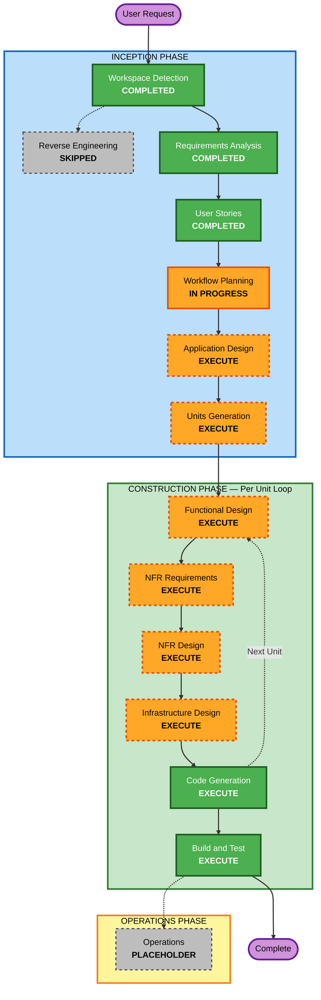

# Execution Plan — EntreVista AI

**Generated**: 2026-03-09
**Project**: Greenfield — new multi-service agentic interviewer platform
**Basis**: PRD v1.0 + Requirements Analysis + 34 User Stories (7 Epics)

---

## Detailed Analysis Summary

### Change Impact Assessment

| Impact Area | Status | Description |
|---|---|---|
| User-facing changes | YES | Telegram bot (candidate) + web dashboard (recruiter/operator) — both new |
| Structural changes | YES | 3 new services: `telegram-bot` (Node.js), `ai-backend` (Python), `dashboard` (React) |
| Data model changes | YES | New: Candidate, Session, Message, Evaluation, Campaign, Rubric, ConsentLog, KnowledgeDoc |
| API changes | YES | New REST API between telegram-bot and ai-backend; new dashboard API |
| NFR impact | YES | Security Baseline (SECURITY-01 to SECURITY-15), performance (100+ concurrent), serverless scaling |

### Architecture Pattern
```
[Telegram API] <--> [Service 1: telegram-bot (Node.js/Telegraf, AWS Lambda)]
                              |
                              | REST API (HTTP)
                              v
                    [Service 2: ai-backend (Python/FastAPI + Claude Agent SDK, AWS Lambda)]
                              |
                    +---------+---------+
                    |                   |
              [MongoDB Atlas]      [Pinecone]
              (primary store)      (vector/RAG)

[Recruiter Browser] --> [Service 3: dashboard (React/Vite, CloudFront + S3)]
                              |
                              | REST API (HTTP + JWT)
                              v
                    [Service 2: ai-backend]
```

### Risk Assessment

| Dimension | Level | Rationale |
|---|---|---|
| **Overall Risk** | High | New system, AI reasoning complexity, LATAM compliance, multi-service polyglot architecture |
| **Rollback Complexity** | Moderate | Serverless Lambda rollback is straightforward; DB schema is document-based (flexible) |
| **Testing Complexity** | Complex | AI outputs require human evaluation; 10 red-team scenarios; multi-service integration |
| **Regulatory Risk** | Medium | EU AI Act classification as High-Risk system; Colombia AI ethics regulation in progress |

---

## Workflow Visualization

### Mermaid Diagram


### Text Alternative
```
INCEPTION PHASE:
  [COMPLETED] Workspace Detection
  [SKIPPED]   Reverse Engineering (Greenfield)
  [COMPLETED] Requirements Analysis
  [COMPLETED] User Stories
  [IN PROG]   Workflow Planning
  [EXECUTE]   Application Design
  [EXECUTE]   Units Generation

CONSTRUCTION PHASE (per unit loop):
  [EXECUTE]   Functional Design
  [EXECUTE]   NFR Requirements Assessment
  [EXECUTE]   NFR Design
  [EXECUTE]   Infrastructure Design
  [EXECUTE]   Code Generation (always)
              --> loop back to Functional Design for next unit
  [EXECUTE]   Build and Test (always, after all units)

OPERATIONS PHASE:
  [PLACEHOLDER] Operations
```

---

## Phases to Execute

### INCEPTION PHASE

| Stage | Decision | Rationale |
|---|---|---|
| Workspace Detection | COMPLETED | Greenfield confirmed, no prior code |
| Reverse Engineering | SKIPPED | Greenfield — nothing to reverse-engineer |
| Requirements Analysis | COMPLETED | 10 FR areas, 7 NFR areas, full tech stack |
| User Stories | COMPLETED | 34 stories, 4 personas, 7 epics |
| Workflow Planning | IN PROGRESS | This document |
| **Application Design** | **EXECUTE** | 3 new services with inter-service REST APIs; complex AI agent module boundaries need design before coding; polyglot architecture increases risk of interface mismatch |
| **Units Generation** | **EXECUTE** | 3 distinct services (telegram-bot, ai-backend, dashboard) each warrant their own construction unit; ai-backend itself has multiple distinct modules (conversational engine, evaluation, compliance, RAG); decomposition ensures focused development cycles |

### CONSTRUCTION PHASE — Per Unit

| Stage | Decision | Rationale |
|---|---|---|
| **Functional Design** | **EXECUTE** | New data models (Session, Evaluation, Campaign, Rubric); complex business logic (multi-turn state machine, evaluation scoring, guardrails); HITL decision flow requires detailed design |
| **NFR Requirements** | **EXECUTE** | Security Baseline ENABLED (SECURITY-01 to SECURITY-15); explicit performance NFRs (< 5s latency, 100+ concurrent); serverless cold-start mitigation required |
| **NFR Design** | **EXECUTE** | Follows from NFR Requirements; rate limiting design, JWT security design, MongoDB encryption, Pinecone namespace isolation, structured logging architecture |
| **Infrastructure Design** | **EXECUTE** | Multi-service AWS infrastructure: API Gateway, Lambda functions per service, MongoDB Atlas VPC peering, Pinecone integration, CloudFront + S3 for dashboard, Secrets Manager, CloudWatch |
| **Code Generation** | **EXECUTE** | Always — core deliverable |
| **Build and Test** | **EXECUTE** | Always — comprehensive test suite including red-team scenarios from PRD |

### OPERATIONS PHASE

| Stage | Decision | Rationale |
|---|---|---|
| Operations | PLACEHOLDER | Future deployment and monitoring workflows |

---

## Anticipated Units of Work

*Note: Formal unit decomposition occurs in Units Generation stage. This is a preview to inform planning.*

| Unit | Service | Description | Primary Stories |
|---|---|---|---|
| Unit 1 | `telegram-bot` | Node.js/Telegraf gateway service — handles Telegram protocol, session routing to ai-backend | US-01 to US-05, US-26 to US-27 |
| Unit 2 | `ai-backend/conversation` | Python conversational engine — Claude Agent SDK, multi-turn state machine, guardrails, re-engagement | US-06 to US-10, US-29 |
| Unit 3 | `ai-backend/evaluation` | Python evaluation engine — rubric scoring, executive summary generation, citation extraction | US-11 to US-14, US-31 |
| Unit 4 | `ai-backend/campaign-api` | Python campaign, knowledge base, and RAG management — REST API for dashboard | US-19 to US-22, US-33 |
| Unit 5 | `ai-backend/compliance-api` | Python compliance, consent, audit logs, candidate lifecycle, NPS, auth API | US-03, US-23 to US-25, US-28 |
| Unit 6 | `dashboard` | React/TypeScript SPA — review queue, campaign management, analytics, candidate detail | US-15 to US-18, US-20, US-24 |

---

## Success Criteria

| Criterion | Target |
|---|---|
| Primary Goal | Fully functional EntreVista AI MVP: Telegram bot + AI backend + recruiter dashboard |
| Core Deliverable | Agentic screening agent passing all 10 red-team scenarios from PRD |
| Quality Gate — Agent | Hallucination rate < 1%, containment >= 99%, follow-up relevance >= 85% |
| Quality Gate — Completion | Candidate screening completion rate >= 80% |
| Quality Gate — HITL | AI never auto-approves or auto-rejects — 100% human decision enforcement |
| Quality Gate — Traceability | 100% of evaluations with textual citation |
| Quality Gate — Security | All SECURITY-01 to SECURITY-15 rules compliant in code review |

---

## Extension Compliance Summary (Workflow Planning Stage)

| Extension Rule | Status | Notes |
|---|---|---|
| SECURITY-01: Encryption at rest/transit | Compliant | MongoDB Atlas + TLS, Pinecone TLS — documented in requirements NFR-03.2 |
| SECURITY-02: Access logging on network intermediaries | Compliant | API Gateway access logging required — will be specified in Infrastructure Design |
| SECURITY-03: Application-level logging | Compliant | Structured logging required — specified in NFR-03 |
| SECURITY-04: HTTP security headers | N/A at this stage | Will be enforced in Code Generation for dashboard service |
| SECURITY-05: Input validation | Compliant | NFR-03.6 requires input validation on all endpoints |
| SECURITY-06: Least-privilege access | Compliant | Will be specified in Infrastructure Design for Lambda execution roles |
| SECURITY-07: Restrictive network configuration | Compliant | Will be specified in Infrastructure Design |
| SECURITY-08: Application-level access control | Compliant | FR-10 covers JWT auth, deny-by-default, RBAC |
| SECURITY-09: Hardening | Compliant | NFR-03.10 — no stack traces; will be enforced in Code Generation |
| SECURITY-10: Supply chain | Compliant | Lock files + dependency scanning will be required in Build and Test |
| SECURITY-11: Secure design principles | Compliant | Rate limiting in NFR-03.7; security modules isolated (auth, compliance separate) |
| SECURITY-12: Authentication | Compliant | FR-10 covers bcrypt/argon2, JWT, brute-force protection, session expiry |
| SECURITY-13: Data integrity | Compliant | Immutable audit logs FR-07.5; CI/CD integrity in Build and Test |
| SECURITY-14: Alerting and monitoring | Compliant | Will be specified in Infrastructure Design; 90-day log retention in FR-07.7 |
| SECURITY-15: Exception handling | Compliant | Will be enforced in Functional Design and Code Generation |
