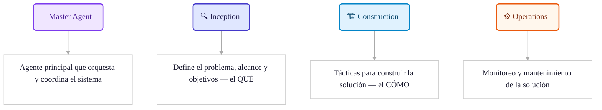
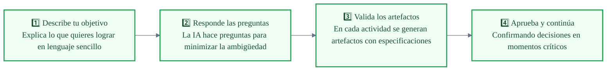
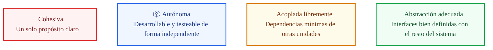
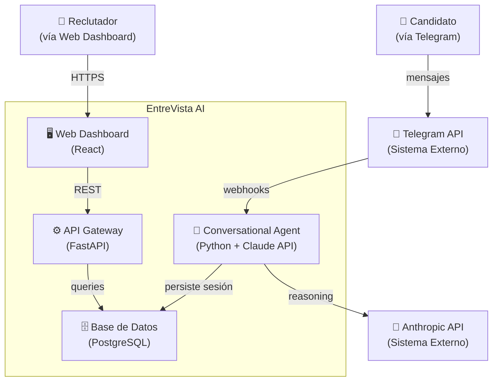

# 📘 Runbook Estudiante — Estación 4: Diseñando el QUÉ
**Spec Driven Development con AI-DLC · Fase Inception**

**Programa:** Hardcore AI | 30X &nbsp;·&nbsp; **Instructor:** Christian Braatz  
**Producto guía:** *EntreVista AI* — plataforma de screenings conversacionales vía Telegram

---

## 📋 Índice

1. [¿Para qué sirve este runbook?](#para-qué-sirve-este-runbook)
2. [Fundamento conceptual: por qué las especificaciones importan](#fundamento-conceptual)
3. [Setup: descarga e inicialización del repositorio](#setup)
4. [Inicio del framework: el prompt de contexto](#inicio-del-framework)
5. [Las fases del AI-DLC](#fases-del-ai-dlc)
6. [Fase Inception — Las 6 actividades](#fase-inception)
   - [PHASE 00 — Workspace Detection](#phase-00--workspace-detection)
   - [PHASE 01 — Requirements Analysis](#phase-01--requirements-analysis)
   - [PHASE 02 — User Stories](#phase-02--user-stories)
   - [PHASE 03 — Workflow Planning](#phase-03--workflow-planning)
   - [PHASE 04 — Application Design](#phase-04--application-design)
   - [PHASE 05 — Units Generation](#phase-05--units-generation)
7. [Arquitectura Just-in-Time: C4, NFRs y ADR](#arquitectura-just-in-time)
8. [Checklist de entrega](#checklist-de-entrega)
9. [Recursos](#recursos)

---

## ¿Para qué sirve este runbook?

Este documento es tu guía de trabajo activo durante y después de la sesión. No es una transcripción de clase — es el material que usas con las manos en el teclado.

Al terminar de aplicarlo tendrás **6 artefactos** para tu producto personal:

| Artefacto | Qué responde |
| :--- | :--- |
| `workspace-detection.md` | ¿En qué contexto técnico arranco? |
| `requirements-analysis.md` | ¿Qué hace mi sistema y cómo se comporta? |
| `user-stories.md` | ¿Qué necesitan mis usuarios y cómo lo verifico? |
| `workflow-planning.md` | ¿En qué orden construyo y qué apruebo yo como humano? |
| `application-design.md` | ¿Qué piezas tiene mi sistema y cómo se conectan? |
| `units-generation.md` | ¿Cuáles son las unidades mínimas de trabajo? |

Estos 6 artefactos son la **entrada obligatoria de la Estación 5 (Construction)**. Sin ellos el agente construirá código sin contrato — y sin contrato no hay forma de saber si lo que generó es correcto.

---

## Fundamento conceptual

### El problema que resuelve SDD

La IA genera volumen. Sin estructura, ese volumen es deuda técnica acelerada. El 45% del código generado por IA tiene vulnerabilidades de seguridad (Veracode, 2025) — no porque los modelos sean malos, sino porque reciben instrucciones ambiguas.

**Vibe coding vs Spec coding:**

| | Vibe | Spec |
| :--- | :--- | :--- |
| **Flujo** | Prompt → código → rezo | Especificación → código verificable |
| **Cuándo usarlo** | Prototipos de un día, exploración | Cualquier producto que deba sobrevivir más de una semana |
| **El riesgo** | Código que nadie entiende en dos semanas | Tiempo invertido en especificación (que se recupera en Construction) |

> **Principio central:** corregir en la especificación es 10x más barato que en código y 100x más barato que en producción. La IA no reemplaza el pensamiento de producto — lo amplifica cuando tiene un contrato preciso.

### Los tres frameworks de especificación

Antes de aplicar AI-DLC, entender por qué se elige sobre las alternativas:

| Framework | Filosofía | Cuándo usarlo |
| :--- | :--- | :--- |
| **Open Spec** | "Fluido no rígido, iterativo no cascada." Brownfield-first. | Equipos senior · Proyectos pequeños/ágiles · Velocidad sobre estructura |
| **Spec Kit** | Las especificaciones sirven al código; el código sirve a las especificaciones. | Separación clara de roles · Equipos con perfiles junior · Necesitan verificación formal |
| **AI-DLC** | Nativo para co-crear con IA. Trazabilidad integral + DDD integrado. | Trazabilidad completa · Lógica de dominio compleja · Entornos que deben escalar |

Para productos con lógica de negocio no trivial y equipos que van a iterar en el tiempo, **AI-DLC es la opción correcta**.

### XDD: DDD + BDD + TDD — la base de cualquier especificación seria

Estos tres no son buzzwords. Son el fundamento que hace que los artefactos de Inception sean ejecutables en Construction:

- **DDD (Domain-Driven Design):** Define los límites del dominio y el lenguaje de negocio compartido. Responde: ¿qué entidades y conceptos gobiernan este sistema?
- **BDD (Behavior-Driven Development):** Define el comportamiento esperado del sistema desde la perspectiva del usuario. Los escenarios Gherkin son sus artefactos.
- **TDD (Test-Driven Development):** Ciclo Red → Green → Refactor. Los escenarios BDD se convierten en tests antes que en código.

```
DDD define el QUÉ existe  →  BDD define CÓMO se comporta  →  TDD garantiza que funciona
```

---

## Setup

> 🔗 **Repositorio oficial:** [aidlc-workflows](https://github.com/awslabs/aidlc-workflows?tab=readme-ov-file#usage)  
> 📦 **Versión:** [Descargar v0.1.8](https://github.com/awslabs/aidlc-workflows/tree/v0.1.8)

### Estructura de archivos de partida

Antes de ejecutar cualquier comando, necesitas tener en tu workspace:

```
ai-dlc/
├── aidlc-rules/
│   ├── aws-aidlc-rules/
│   │   └── core-workflow.md          ← Las reglas del framework para el agente
│   └── aws-aidlc-rule-details/       ← Detalles de cada fase
│       ├── inception.md
│       ├── construction.md
│       └── ...
└── PRD_tu_producto.md                ← Tu PRD de la Estación 2
```

Si no tienes la carpeta `aidlc-rules`, descarga el framework desde el link de arriba y descomprímelo.

### Inicialización paso a paso

```sh
# 1. Ir al directorio de trabajo
cd /tu/ruta/ai-dlc

# 2. Crear el directorio de tu producto
mkdir nombre_de_tu_producto
cd nombre_de_tu_producto

# 3. Copiar los dos artefactos base
cp ../PRD_tu_producto.md PRD_tu_producto.md
cp ../aidlc-rules/aws-aidlc-rules/core-workflow.md ./CLAUDE.md
mkdir -p .aidlc-rule-details
cp -R ../aidlc-rules/aws-aidlc-rule-details/* .aidlc-rule-details/

# 4. Abrir en Cursor
cursor .
```

**Por qué cada paso importa:**

- `CLAUDE.md` es el cerebro del framework para el agente. Sin él, el agente improvisa. Con él, sigue un proceso estructurado y predecible.
- `.aidlc-rule-details/` contiene las instrucciones detalladas de cada fase. El agente las referenciará automáticamente según en qué fase esté.
- El PRD es el único input humano de partida. Todo lo que el framework genera deriva de él.

### Estructura resultante del workspace

```
nombre_de_tu_producto/
├── CLAUDE.md                     ← Reglas del framework (no editar)
├── PRD_tu_producto.md            ← Tu PRD de entrada
├── .aidlc-rule-details/          ← Detalles de fases (no editar)
│   ├── inception.md
│   ├── construction.md
│   └── ...
└── aidlc-docs/                   ← Aquí se generarán todos los artefactos
    └── inception/
        ├── workspace-detection.md
        ├── requirements-analysis.md
        ├── user-stories.md
        ├── workflow-planning.md
        ├── application-design.md
        └── units-generation.md
```

> ⚠️ **Regla crítica:** El código de la aplicación va en la raíz del workspace. La documentación SIEMPRE en `aidlc-docs/`. Nunca mezcles código y artefactos de especificación en la misma carpeta.

---

## Inicio del framework

Con el workspace inicializado y Cursor/Claude Code abierto, envía el prompt de contexto inicial. Este prompt **no genera código** — le dice al agente qué vas a construir y activa el framework.

### Estructura del prompt de inicio

```
Usando AI-DLC, construiremos un producto que consiste en [descripción de tu producto].
Con base en el Product Requirements Document (PRD) @PRD_tu_producto.md.
```

### Ejemplo con EntreVista AI

> **🚀 PROMPT:**
>
> *"Usando AI-DLC, construiremos un producto que consiste en una plataforma de entrevistas agénticas que conduce screenings conversacionales inteligentes vía Telegram para empresas de alto volumen en América Latina, reemplazando chatbots de reglas estáticas con un agente que razona, repregunta y entrega evidencia estructurada al reclutador humano; con base en el Product Requirements Document (PRD) `@PRD_agentic_interviewer_ai.md`."*

**Qué esperar como respuesta:** El framework confirmará en qué fase se encuentra, listará las actividades disponibles y preguntará si deseas continuar con la primera. Responde `sí` o `continúa` — el framework lleva el ritmo.

> 💡 **Tip:** El `@` antes del nombre del archivo hace que Claude Code cargue el PRD completo como contexto. No lo omitas.

---

## Las fases del AI-DLC



**Esta estación cubre únicamente la fase Inception.** La Estación 5 cubre Construction. No te adelantes a Construction sin tener Inception completa — el framework lo permite técnicamente, pero los artefactos de Construction dependen de los de Inception para ser precisos.

### El loop de intenciones — cómo trabajas con el agente en cada actividad



**El paso más importante es el 4.** El framework te pide aprobación antes de continuar a la siguiente actividad. No lo omitas con un "sí, continúa todo" automático — ese es el momento donde el humano mantiene el control. Lee el artefacto generado antes de aprobar.

---

## Fase Inception

> 🎯 **Objetivo:** Definir la "Única Fuente de Verdad" antes de escribir una línea de código.  
> Captura intenciones → elabora requisitos → desglosa el trabajo en unidades manejables.

### Mapa de actividades

| # | Actividad | Artefacto | Alimenta a |
| :--- | :--- | :--- | :--- |
| 00 | Workspace Detection | `workspace-detection.md` | Todas las actividades siguientes |
| 01 | Requirements Analysis | `requirements-analysis.md` | User Stories, Application Design |
| 02 | User Stories | `user-stories.md` | Workflow Planning, Units Generation |
| 03 | Workflow Planning | `workflow-planning.md` | Application Design |
| 04 | Application Design | `application-design.md` | Units Generation |
| 05 | Units Generation | `units-generation.md` | Estación 5 (Construction) |

---

### PHASE 00 — Workspace Detection

**¿Qué hace?** Analiza el entorno técnico del proyecto para darle al agente el contexto base sobre dependencias, tipo de proyecto y punto de partida. Sin este análisis, el agente asume — y los supuestos incorrectos generan artefactos que no corresponden a tu realidad.

**Artefacto generado:** `workspace-detection.md`

#### Qué captura el artefacto

**Project Information:**

| Campo | Descripción | Ejemplo (EntreVista AI) |
| :--- | :--- | :--- |
| `Project Name` | Nombre del proyecto | `Agentic Interviewer AI` |
| `Project Type` | Greenfield (nuevo) o Brownfield (existente) | `Greenfield` |
| `Start Date` | Fecha de inicio | `2026-03-09` |
| `Current Stage` | Fase actual del framework | `INCEPTION → Requirements Analysis` |

**Workspace State:**

| Campo | Descripción | Ejemplo |
| :--- | :--- | :--- |
| `Existing Code` | ¿Hay código base previo? | `No` |
| `Reverse Engineering` | ¿Se requiere análisis de código existente? | `No` |
| `Root` | Ruta raíz del proyecto | `.../ai-dlc/agentic_interviewer_ai` |

**Code Location Rules** — estas reglas guían al agente durante Construction:
- `Application Code` → raíz del workspace
- `Documentation` → solo en `aidlc-docs/`
- `Structure Patterns` → ver `code-generation.md` Critical Rules

#### Para proyectos Brownfield

Si tu producto tiene código existente (`Existing Code: Yes`), el framework añade una actividad previa de reverse engineering antes de Requirements Analysis. El agente analiza la base de código y genera un mapa de dependencias antes de continuar. No lo omitas — construir sobre un mapa incorrecto multiplica la deuda técnica.

---

### PHASE 01 — Requirements Analysis

**¿Qué hace?** Refina las necesidades del PRD mediante preguntas de clarificación, eliminando ambigüedades técnicas antes de que se conviertan en código incorrecto. El agente te hará preguntas — respóndelas con precisión.

**Artefacto generado:** `requirements-analysis.md`

#### Las tres dimensiones del análisis

**1. Functional Requirements — ¿Qué hace el sistema?**

Lista las capacidades del sistema que producen valor directo al usuario. Son los "verbos" del producto.

*Ejemplo (EntreVista AI):*
- [x] Core Agental Reasoning — el agente razona, repregunta y adapta el screening en tiempo real.
- [x] Telegram API Integration — la interfaz conversacional es Telegram, sin app adicional para el candidato.

**Cómo construir los tuyos:** Por cada épica de tu PRD, pregúntate: ¿qué acción concreta realiza el sistema? Si la respuesta es vaga ("gestionar usuarios"), descompone hasta que sea específica ("crear cuenta de reclutador con email + contraseña", "autenticar reclutador con JWT").

**2. Non-Functional Requirements — ¿Cómo se comporta el sistema?**

Definen la calidad del comportamiento, no el comportamiento en sí. Son los "adverbios" del producto. Sin ellos, el agente optimiza solo para que funcione, no para que escale o sobreviva.

*Ejemplo (EntreVista AI):*
- [x] Response Latency < 2s — el candidato no puede esperar más de 2 segundos entre su respuesta y la del agente.
- [ ] 99.5% Availability — ~3.6h de downtime mensual aceptable. Balance óptimo costo/estabilidad para MVP.

**Cómo construir los tuyos:** Para cada NFR define un valor numérico concreto, no un adjetivo. "Rápido" no es un NFR. "P95 de latencia < 500ms" sí lo es. Si no puedes medirlo, no puedes verificarlo.

**3. Success Criteria (MVP) — ¿Cómo sabemos que funciona?**

Los criterios de éxito del MVP son el filtro de scope. Todo lo que no cabe aquí es post-MVP. Son binarios: o se cumple o no se cumple.

*Ejemplo (EntreVista AI):*
- [x] Conversación fluida completada de inicio a fin por el candidato.
- [x] Notificación al reclutador al finalizar el screening con resultado estructurado.

> ⚠️ **Actores Out of Scope (MVP):** Administrador y Hiring Manager. Esta decisión explícita evita que el agente genere funcionalidades que no son del MVP.

#### Usuarios del Sistema

Documenta quién interactúa con el sistema y cómo accede:

| Actor | Descripción | Acceso |
| :--- | :--- | :--- |
| **Candidato** | Persona entrevistada. Sin cuenta requerida. | Link único por entrevista |
| **Reclutador** | Configura entrevistas, envía links, revisa resultados. | Cuenta con credenciales en plataforma |

**Regla de oro:** si un actor no aparece en los criterios de éxito del MVP, está Out of Scope. Ponlo explícitamente en el artefacto para que el agente no lo infiera.

---

### PHASE 02 — User Stories

**¿Qué hace?** Traduce los requerimientos en comportamientos verificables desde la perspectiva del usuario. Los escenarios Gherkin generados aquí se convertirán directamente en tests de aceptación en la Estación 5.

**Artefacto generado:** `user-stories.md`

#### Parte 1 — Personas

Una Persona es una representación semi-ficticia del usuario real, enfocada en necesidades psicológicas y laborales. No es un perfil demográfico — es un modelo de motivaciones y frustraciones.

*Ejemplo (EntreVista AI):*

**Valentina** — Reclutadora Tech Startup
- **Necesidades:** Evaluar candidatos de forma consistente, reducir tiempo por screening, tener evidencia documentada de cada evaluación.
- **Pain Points:** Los screenings manuales toman 45 min por candidato · Los chatbots actuales no adaptan preguntas · No hay registro estructurado del comportamiento del candidato.
- **Goals:** Hacer 3x más screenings por semana · Reducir bias en la selección inicial · Tener un sistema que escale sin contratar más reclutadores.

**Cómo construir la tuya:** Basa la persona en entrevistas reales o en tu conocimiento del usuario. El agente te hará preguntas de clarificación — responde con datos reales, no con suposiciones optimistas.

#### Parte 2 — Backlog de historias

Las historias se organizan por **Epics** (capacidades del agente o del sistema), no por pantallas ni por tareas técnicas.

**Formato de historia:**

```
Como [tipo de usuario]
quiero [acción/capacidad]
para [beneficio/objetivo]
```

*Ejemplo:*
```
Como Reclutadora
quiero que el agente evalúe automáticamente si un candidato cumple los criterios del rol
para reducir el tiempo de revisión manual de screenings
```

#### Parte 3 — Escenarios Gherkin

Cada historia tiene uno o más escenarios con criterios de aceptación en lenguaje Gherkin. Este formato no es opcional — es lo que transforma una historia en un test ejecutable.

**Estructura:**

```gherkin
Escenario: [Nombre descriptivo del caso]
  DADO QUE [precondición del sistema o del usuario]
  Y [condición adicional si aplica]
  CUANDO [acción del usuario o del sistema]
  ENTONCES [resultado observable y verificable]
  Y [resultado adicional si aplica]
```

*Ejemplo (EntreVista AI):*

```gherkin
Escenario: Candidato completa screening exitosamente
  DADO QUE el candidato tiene una conversación activa en Telegram
  Y cumple con los requisitos mínimos del rol definidos en la campaña
  CUANDO confirma el final de la conversación con el agente
  ENTONCES el sistema registra el resultado como 'APTO'
  Y envía una notificación al reclutador con el resumen estructurado del screening
```

```gherkin
Escenario: Agente repregunta ante respuesta ambigua
  DADO QUE el candidato ha respondido una pregunta de forma vaga o incompleta
  CUANDO el agente evalúa la respuesta contra los criterios del rol
  ENTONCES el agente formula una pregunta de seguimiento específica
  Y no avanza a la siguiente pregunta del screening hasta obtener una respuesta evaluable
```

**Cómo construir los tuyos:** Escribe al menos 2 escenarios por historia: el camino feliz (happy path) y al menos un caso alternativo (error, edge case, o comportamiento inesperado del usuario). Los tests que más valor aportan suelen estar en los casos alternativos.

> 💡 **Tip:** Si no puedes escribir el `ENTONCES` de forma que sea verificable automáticamente, el requerimiento es ambiguo. Vuelve a Requirements Analysis y clarifica antes de continuar.

---

### PHASE 03 — Workflow Planning

**¿Qué hace?** Define tácticamente el plan de ejecución para alimentar el Application Design. Establece el mecanismo para la definición de componentes, servicios y la estrategia de construcción, incluyendo los puntos donde el humano debe validar (human-in-the-loop).

**Artefacto generado:** `workflow-planning.md`

#### Qué define el artefacto

1. **Orden de construcción:** qué se construye primero y por qué. Generalmente empieza por la unidad de autenticación/sesión porque es transversal a todo lo demás.
2. **Dependencias entre actividades:** qué artefacto necesita estar aprobado antes de que pueda empezar la siguiente actividad.
3. **Puntos de validación humana:** en qué momentos el agente se detiene y espera aprobación explícita antes de continuar. Estos son los guardianes del proceso.
4. **Estrategia de construcción:** top-down (desde la API hacia abajo) o bottom-up (desde el dominio hacia arriba). AI-DLC recomienda bottom-up por DDD.

#### Cómo trabajar esta fase

El framework te presentará preguntas estratégicas sobre el orden de construcción. Para responderlas, usa este criterio:

- **Primero:** lo que más unidades dependen de ello (generalmente auth/session).
- **Segundo:** el core del dominio de negocio (la funcionalidad que hace único a tu producto).
- **Último:** integraciones con servicios externos (APIs de terceros, notificaciones, etc.).

---

### PHASE 04 — Application Design

**¿Qué hace?** Genera el blueprint arquitectónico del sistema. Este es el artefacto que más alimentará la fase Construction — define las piezas del sistema y cómo se conectan antes de escribir código.

**Artefacto generado:** `application-design.md` (que referencia `components.md`, `services.md` y `component-dependency.md`)

#### Las tres capas del diseño

| Capa | Archivo | Qué define |
| :--- | :--- | :--- |
| **Componentes** | `components.md` | Estilo arquitectónico (hexagonal, MVC, event-driven, etc.) y las capas del sistema. |
| **Servicios** | `services.md` | Lógica de negocio core: qué hace cada servicio, sus métodos principales y sus responsabilidades. |
| **Dependencias** | `component-dependency.md` | Relaciones entre componentes y patrón de resolución (inyección de dependencias, servicios compartidos, etc.). |

#### Cómo leer y validar este artefacto

Cuando el agente genere el Application Design, verifica:

- [ ] ¿Cada componente tiene una responsabilidad única y clara? (Single Responsibility)
- [ ] ¿Las dependencias fluyen en una sola dirección? (no hay ciclos)
- [ ] ¿Los servicios en `services.md` corresponden a dominios de negocio, no a operaciones técnicas?
- [ ] ¿El estilo arquitectónico elegido es sostenible para el tamaño del equipo y del producto?

> 💡 **Señal de alerta:** Si un componente tiene más de 3–4 responsabilidades descritas, está haciendo demasiado. Pídele al agente que lo descomponga antes de aprobar.

---

### PHASE 05 — Units Generation

**¿Qué hace?** Descompone el trabajo en unidades autónomas y cohesivas. Cada unidad es una pieza de Lego que, al unirse con las demás, construye el sistema completo. Son el input directo de la Estación 5.

**Artefacto generado:** `units-generation.md`

#### ¿Qué es una Unidad?



#### Principio de generación: por dominio de negocio, no por capa técnica

❌ **No hagas esto** (organización por capa técnica):
- Unidad 1: Base de datos
- Unidad 2: API REST
- Unidad 3: Frontend

✅ **Haz esto** (organización por dominio de negocio):
- Unidad 1: Auth & Session Management
- Unidad 2: Interview Campaign Management
- Unidad 3: Conversational Agent (Core Domain)
- Unidad 4: Evaluation & Results

La diferencia es que las unidades por dominio pueden construirse y testearse de forma completamente independiente. Las unidades por capa siempre tienen acoplamiento vertical.

#### Estructura de cada unidad en el artefacto

Por cada unidad, el artefacto documenta:

- **ID:** `U1`, `U2`, `U3`...
- **Nombre:** nombre del dominio de negocio que gestiona.
- **Responsabilidad:** qué hace esta unidad y solo esta unidad.
- **Historias de usuario asociadas:** qué HUs del `user-stories.md` cubre.
- **Dependencias:** qué otras unidades necesita para funcionar (mínimas).
- **Interfaces expuestas:** qué ofrece al resto del sistema.

*Ejemplo (EntreVista AI):*

```
U1 — Auth & Session Management
Responsabilidad: Gestión de identidad del Reclutador y estado de sesión del Candidato.
HUs asociadas: HU-01, HU-02
Dependencias: ninguna (es la unidad base)
Interfaces: /auth/login, /auth/refresh, /auth/logout, SessionStore
```

#### Criterio de validación de una Unidad

Hazte estas preguntas antes de aprobar:
- [ ] ¿Puedo describir qué hace esta unidad en una sola oración sin usar "y"?
- [ ] ¿Podría un desarrollador diferente construirla en paralelo sin coordinación constante con los demás?
- [ ] ¿Tiene un contrato claro (interfaces) con el resto del sistema?

Si la respuesta a cualquiera es no, la unidad necesita ser redefinida o dividida.

---

## Arquitectura Just-in-Time

> Esta sección complementa la fase Inception con tres decisiones arquitectónicas que la IA necesita entender antes de entrar a Construction. No son opcionales — son el puente entre especificar *qué* se construye y especificar *cómo* debe comportarse cuando escale.

La mayoría de los desarrolladores saltan directamente al código. En SDD, el primer paso es que la IA entienda **el dónde** está parada la solución. Sin este contexto, el agente construye piezas técnicamente correctas pero arquitectónicamente incoherentes.

### Bloque 1 — Visualización con C4 Model (Niveles 1 y 2)

**¿Qué es?** El C4 Model (Context and Container) es un sistema de diagramas en cuatro niveles de detalle. Para Inception solo necesitas los dos primeros.

- **Nivel 1 — Contexto del Sistema:** ¿Quién usa el sistema (actores) y con qué sistemas externos se conecta? Es el mapa de relaciones a 10,000 metros.
- **Nivel 2 — Contenedores:** ¿Qué piezas grandes componen el sistema? (Web App, API, Base de datos, Message Queue, etc.) y cómo se comunican entre sí.

**Por qué importa:** *"Si no puedes dibujar el sistema en 3 cajas, la IA va a construir 100 cajas sin sentido."* El C4 Nivel 1 y 2 es el contrato visual que evita que el agente invente arquitectura.

**Técnica IA — generar el diagrama en Mermaid.js:**

```
"Basándote en los artefactos de Inception generados, crea el diagrama C4 Nivel 1
(Contexto del Sistema) y Nivel 2 (Contenedores) en formato Mermaid.js.
Incluye todos los actores, sistemas externos y contenedores principales."
```

**Ejemplo de output esperado para EntreVista AI:**



**Validación del C4:** El diagrama está bien cuando cualquier persona del equipo puede responder en 30 segundos: ¿quién usa el sistema? ¿qué tecnologías principales tiene? ¿cómo fluyen los datos?

---

### Bloque 2 — Atributos de Calidad (NFRs aplicados arquitectónicamente)

**¿Qué es?** Los NFRs definidos en Requirements Analysis ahora se traducen en decisiones arquitectónicas concretas. Un desarrollador piensa en "que funcione"; un arquitecto piensa en "que no muera bajo carga, bajo ataque, y bajo mantenimiento sostenido".

Los cuatro atributos más relevantes para productos en etapa MVP:

| Atributo | Pregunta que responde | Táctica típica |
| :--- | :--- | :--- |
| **Disponibilidad** | ¿Qué pasa si el sistema cae? | Circuit breakers, health checks, degraded modes |
| **Escalabilidad** | ¿Qué pasa si 10x más usuarios entran mañana? | Caché, queues, stateless services |
| **Seguridad** | ¿Qué pasa si alguien intenta explotarlo? | JWT, rate limiting, input validation |
| **Mantenibilidad** | ¿Qué pasa cuando el equipo cambia? | Código limpio, tests, documentación automática |

**Técnica IA — el "Checklist de Supervivencia":**

```
"Analiza los artefactos de Inception de este proyecto e identifica los 3 atributos
de calidad más críticos para este MVP. Para cada uno:
1. Explica por qué es crítico para este producto específico.
2. Sugiere una táctica técnica concreta (con nombre de patrón o librería).
3. Indica cómo se verificaría que la táctica funciona."
```

*Ejemplo de output esperado para EntreVista AI:*

| NFR | Táctica | Verificación |
| :--- | :--- | :--- |
| Latencia < 2s | Caché de contexto de conversación en Redis · Respuestas en streaming de Claude API | Test de carga: P95 < 2s con 100 conversaciones simultáneas |
| Disponibilidad 99.5% | Degraded mode: si Redis falla, fallback a PostgreSQL para persistencia de sesión | Chaos test: matar Redis y verificar que las conversaciones activas no se interrumpen |
| Seguridad | JWT RS256 para autenticación del Reclutador · Rate limiting por IP en endpoints públicos | Pen test básico: intentar acceder a resultados sin token válido |

**Cómo usarlo:** No necesitas implementar todas las tácticas en el MVP. Lo que sí necesitas es *decidir* cuáles implementas y *documentar* cuáles dejas para después y por qué. Esa documentación va en el siguiente bloque.

---

### Bloque 3 — Architecture Decision Records (ADR)

**¿Qué es?** Un ADR es un documento corto que captura una decisión arquitectónica significativa, el contexto que la motivó y las consecuencias de tomarla. En AI-DLC, las decisiones se pierden en el chat si no se registran — el ADR es el rastro de migas de pan.

**Cuándo crear un ADR:** cada vez que tomes una decisión que sea difícil o costosa de revertir. Ejemplos: elección de base de datos, patrón de autenticación, arquitectura del agente, framework de backend.

**Estructura de un ADR:**

```markdown
# ADR-[número]: [Título descriptivo de la decisión]

## Contexto
[Por qué surgió esta decisión. Qué fuerzas estaban en juego.]

## Decisión
[Qué se decidió, de forma clara y sin ambigüedades.]

## Alternativas consideradas
- [Alternativa A] — descartada porque [razón]
- [Alternativa B] — descartada porque [razón]

## Consecuencias
- ✅ [Ventaja o resultado positivo de la decisión]
- ⚠️ [Trade-off o riesgo que se acepta con esta decisión]

## Estado
[Propuesto | Aceptado | Deprecado | Reemplazado por ADR-X]
```

**Técnica IA — "Destilar Decisiones":**

```
"Basado en nuestra discusión sobre [decisión], genera un ADR que documente:
- el contexto que nos llevó a esta decisión
- la decisión tomada
- las alternativas que consideramos y por qué las descartamos
- las consecuencias y trade-offs que aceptamos"
```

*Ejemplo (EntreVista AI) — ADR-001: Elección de canal conversacional:*

```markdown
# ADR-001: Uso de Telegram como canal conversacional del MVP

## Contexto
El producto requiere un canal conversacional accesible sin que el candidato instale
una app adicional. Se evaluaron WhatsApp Business API, Telegram Bot API y SMS.

## Decisión
Usar Telegram Bot API como canal conversacional para el MVP.

## Alternativas consideradas
- **WhatsApp Business API** — descartada por costo (aprobación + per-message fee)
  y restricciones de plantillas en conversaciones iniciadas por el sistema.
- **SMS** — descartada por limitaciones de longitud de mensaje y sin soporte nativo
  para conversaciones multi-turno estructuradas.

## Consecuencias
- ✅ API gratuita, bien documentada, con soporte nativo para bots conversacionales.
- ✅ Alta penetración en LATAM entre población trabajadora objetivo.
- ⚠️ Requiere que el candidato tenga cuenta de Telegram (fricción de onboarding).
- ⚠️ Dependencia de un tercero para el canal de comunicación principal.

## Estado
Aceptado
```

**Cuántos ADRs necesitas para Inception:** mínimo uno por cada decisión significativa tomada durante las actividades 01–05. Para un MVP típico, entre 3 y 6 ADRs es un rango razonable.

### El "Filtro de los 3 Pasos" — para llevarte a casa

Cada vez que uses IA para construir algo, pasa por este filtro antes de empezar a generar código:

```
1. DIBUJA    → (C4 Model) ¿Entiendo las conexiones del sistema?
2. CUESTIONA → (NFRs)     ¿Qué pasa si esto escala a 10,000 usuarios?
3. REGISTRA  → (ADR)      ¿Sabré por qué elegí esto en 6 meses?
```

Si no puedes responder los tres, no estás listo para Construction.

---

## Checklist de entrega

Antes de dar por completa la fase Inception, verifica cada ítem:

### Artefactos generados
- [ ] `workspace-detection.md` generado y revisado
- [ ] `requirements-analysis.md` con FRs, NFRs y Criterios de Éxito del MVP definidos
- [ ] `user-stories.md` con al menos 3 historias y escenarios Gherkin completos (happy path + alternativo)
- [ ] `workflow-planning.md` con orden de construcción y puntos de validación humana
- [ ] `application-design.md` con `components.md`, `services.md` y `component-dependency.md`
- [ ] `units-generation.md` con mínimo 3 unidades definidas por dominio de negocio

### Arquitectura Just-in-Time
- [ ] Diagrama C4 Nivel 1 y 2 generado en Mermaid.js y validado
- [ ] NFRs traducidos en tácticas arquitectónicas con criterio de verificación
- [ ] Mínimo 1 ADR documentado para las decisiones no reversibles del MVP

### Criterios de calidad
- [ ] Cada unidad tiene un solo propósito describible en una oración
- [ ] Los escenarios Gherkin tienen un `ENTONCES` verificable automáticamente
- [ ] El C4 es legible por alguien que no participó en la sesión
- [ ] Los ADRs documentan el "por qué", no solo el "qué"

---

## Recursos

| Recurso | Enlace | Para qué |
| :--- | :--- | :--- |
| AI-DLC Framework (AWS Labs) | [aidlc-workflows v0.1.5](https://github.com/awslabs/aidlc-workflows/releases/tag/v0.1.5) | El framework completo |
| Repositorio oficial con docs | [aidlc-workflows README](https://github.com/awslabs/aidlc-workflows?tab=readme-ov-file#usage) | Referencia de uso |
| C4 Model | [c4model.com](https://c4model.com) | Documentación oficial del modelo de diagramas |
| ADR Examples | [adr.github.io](https://adr.github.io) | Ejemplos y formatos de ADRs |
| Gherkin Reference | [cucumber.io/docs/gherkin](https://cucumber.io/docs/gherkin/reference/) | Sintaxis completa de Gherkin |
