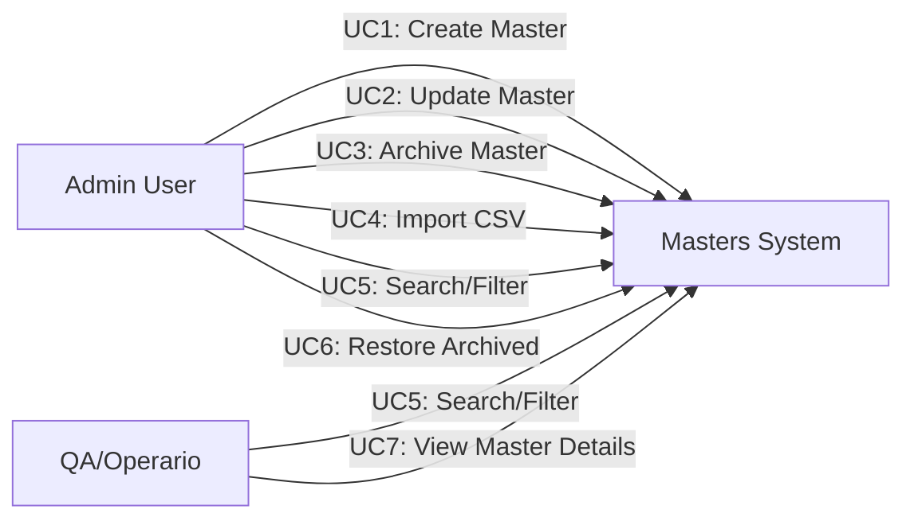
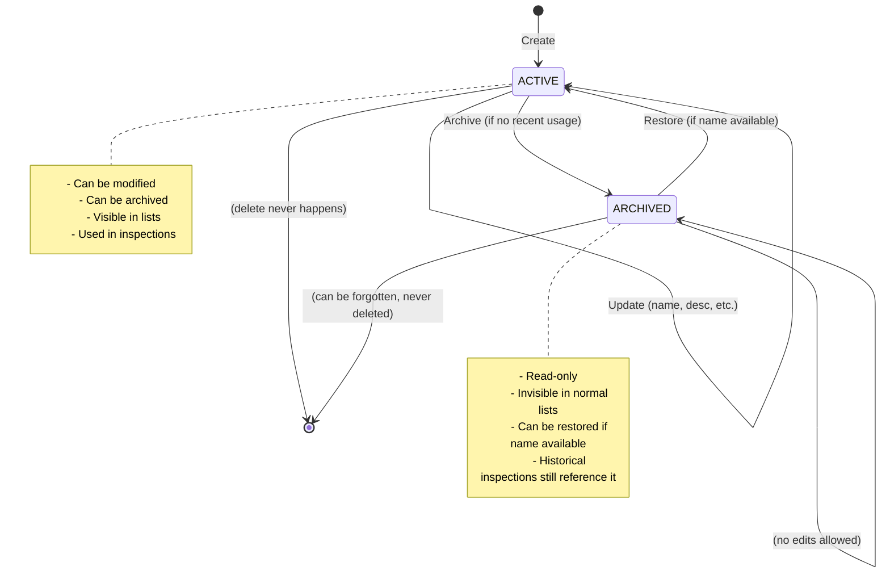
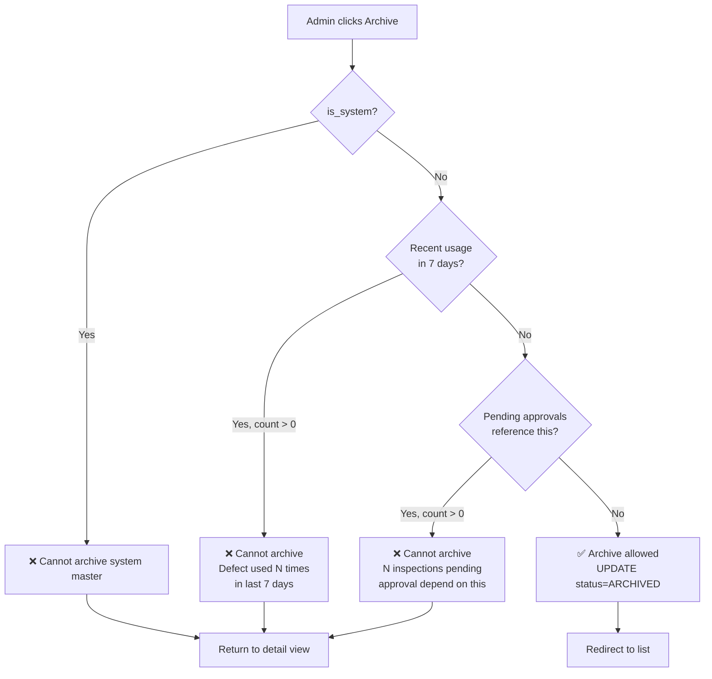
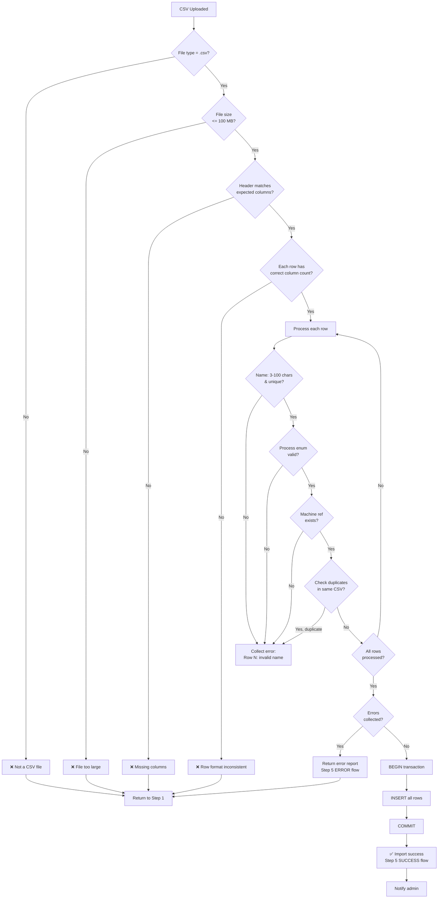
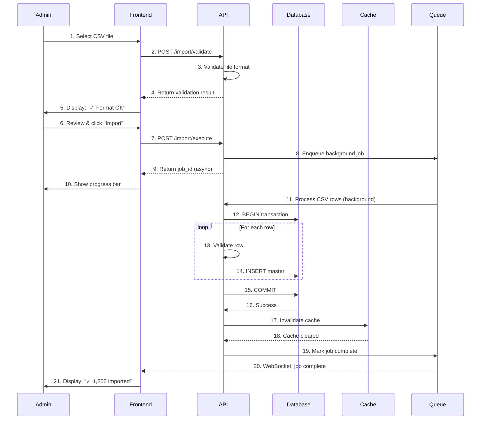
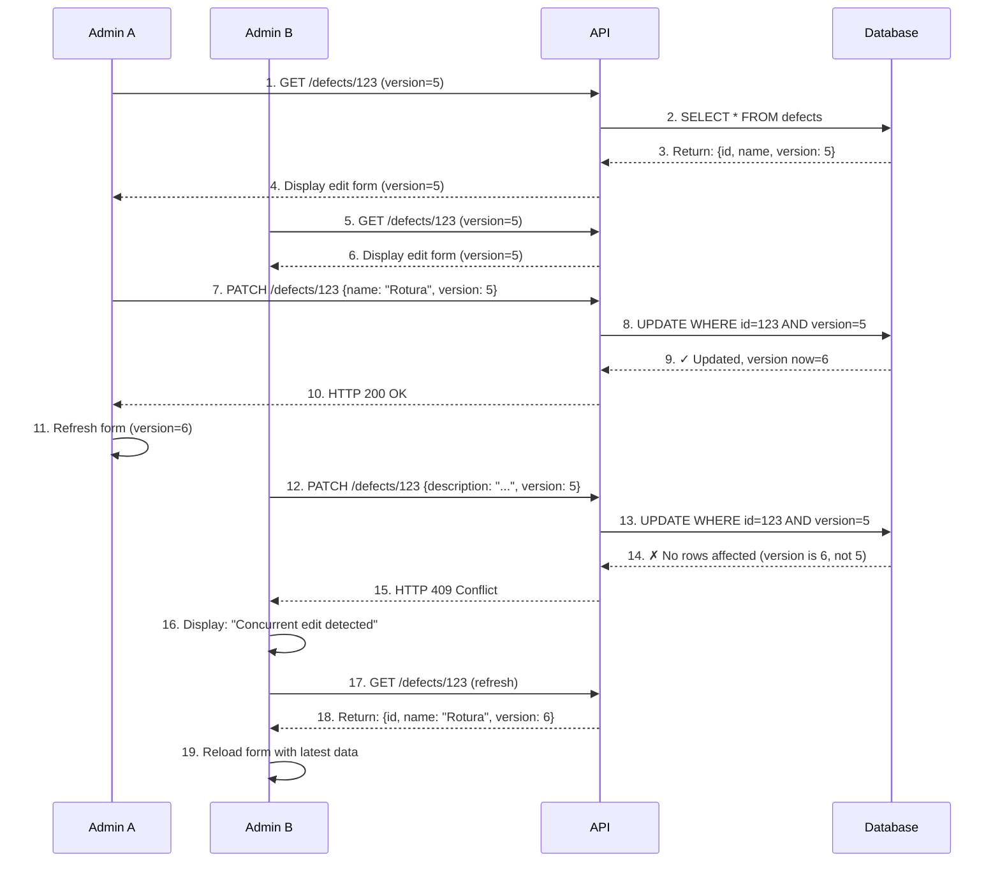
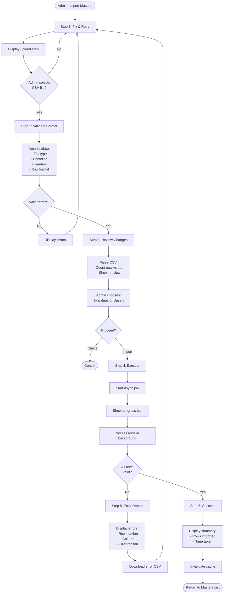

# Business Logic Model — Unit 3 (Maestros y Configuración)

**Date**: 2026-06-01  
**Unit**: Maestros y Configuración (Masters & Configuration Domain)  
**Scope**: Use cases, workflows, decision logic, and state transitions  
**Audience**: Architects, Developers, Business Analysts  

---

## 📋 OVERVIEW

The Business Logic Model documents how the Masters & Configuration domain handles its core operations. It visualizes use cases, workflows, and decision logic that translate requirements into executable processes.

**Key Objectives**:
- Define primary and secondary use cases
- Show control flows and decision points
- Illustrate state transitions
- Document actor interactions and system responses

---

## 🎯 USE CASE OVERVIEW



---

## 📌 PRIMARY USE CASES

### UC1: Create Master (Defect, Machine, Fabric)

**Actors**: Admin (primary), System (secondary)

**Preconditions**:
- Admin is authenticated
- Admin has ADMIN role
- Form UI is displayed

**Main Flow**:

1. Admin opens "Create New [Master Type]" form
2. System displays form with fields:
   - Required fields highlighted
   - Optional fields unmarked
   - Enum dropdowns pre-populated (e.g., Process = {TEÑIDO, ESTAMPADO, ACABADO, OTRA})
3. Admin enters data:
   - Name: "Roto"
   - Description: "Tear in fabric"
   - Typical Process: "TEÑIDO"
   - Typical Machine: "MAQ-TINT-01" (dropdown, existing machines)
4. Admin clicks "Create"
5. System validates:
   - [E1] Name length 3-100 chars → Invalid format error
   - [E2] Name already exists → Duplicate error
   - [E3] Typical machine doesn't exist → Reference error
   - [E4] Process not in enum → Invalid enum error
6. If valid: System creates master record:
   - Auto-set: id (DEF-xxx), status=ACTIVE, is_system=false, version=1
   - Auto-set: created_by=<admin_id>, created_at=NOW()
   - Publish DefectCreatedEvent
   - Invalidate cache: `cache:defects:all`
7. Response: HTTP 201 Created
   - Display: "Defect 'Roto' created successfully"
   - Toast: 3 second notification
   - Redirect to detail view or list

**Postconditions**:
- New master exists in database
- Master is ACTIVE and visible in lists
- Audit log entry created (created_by, created_at, new values)
- Event published (if applicable)

**Alternate Flows**:

- **[E1] Invalid Format**: 
  - System displays inline error: "Name must be 3-100 characters"
  - Admin corrects and retries
  - Return to step 4

- **[E2] Duplicate Name**:
  - System displays error: "Defect 'Roto' already exists"
  - Suggests: "Did you mean to search for existing defect?" with search link
  - Admin searches or enters different name
  - Return to step 4

- **[E3] Invalid Reference**:
  - System displays error: "Machine 'MAQ-TINT-01' not found or archived"
  - Admin selects valid machine from dropdown
  - Return to step 4

- **[E4] Form Abandonment**:
  - Admin closes form without saving
  - System asks: "Discard changes?"
  - No data written

---

### UC2: Update Master

**Actors**: Admin (primary)

**Preconditions**:
- Admin is authenticated with ADMIN role
- Master exists and is not ARCHIVED
- Master is not a system master (`is_system=false`)
- Edit form is open with current master data

**Main Flow**:

1. Admin opens master detail page (GET /masters/{id})
2. System displays current values + version field (hidden)
3. Admin modifies fields:
   - Name: "Roto" → "Rotura"
   - Description: updated
   - Other editable fields
4. Admin clicks "Save"
5. System validates changes:
   - [E1] New name is duplicate → Error
   - [E2] Version mismatch (concurrent edit) → Conflict error
   - [E3] Invalid enum value → Format error
6. If valid: System updates record:
   - Execute: UPDATE with version check (Rule 2.4 from Business-Rules.md)
   - Increment version: version = version + 1
   - Update: updated_by=<admin_id>, updated_at=NOW()
   - Invalidate cache: `cache:defects:{id}`, `cache:defects:all`
   - Publish DefectUpdatedEvent
7. Response: HTTP 200 OK
   - Display: "Defect updated successfully"
   - Refresh form with new version
   - Lock fields for 1 second to prevent double-submit

**Postconditions**:
- Master updated in database
- Version incremented
- Audit log entry: old values vs new values
- Event published

**Alternate Flows**:

- **[E1] Duplicate on Update**:
  - System displays: "Name 'Rotura' already exists"
  - Admin changes name to unique value or keeps original
  - Return to step 4

- **[E2] Concurrent Edit (Version Conflict)**:
  - Admin A and B load same defect (version=5)
  - Admin A saves first → version becomes 6
  - Admin B saves → version check fails (expects 5, finds 6)
  - System displays: "Defect was modified by another user. Click 'Refresh' to see latest changes"
  - Admin refreshes page (GET /masters/{id} again)
  - Returns to step 1 with new version
  - Admin can manually re-apply their changes or abandon

- **[E3] System Master Edit Attempt**:
  - Admin clicks Edit on "No Especificado" (is_system=true)
  - System returns HTTP 400 Bad Request: "Cannot modify system master"
  - Edit button was disabled in UI; this guards against malicious API calls

---

### UC3: Archive Master

**Actors**: Admin (primary)

**Preconditions**:
- Admin is authenticated with ADMIN role
- Master exists and is ACTIVE
- Master is not a system master
- Detail page is displayed

**Main Flow**:

1. Admin clicks "Archive" button on master detail
2. System displays confirmation dialog:
   - Message: "Archive Defect 'Roto'? Inspections using this defect will remain valid."
   - Optional reason textarea: "Reason for archival (optional)"
   - Buttons: "Cancel" | "Archive"
3. Admin (optionally) enters reason: "Haven't seen this defect in production for 3 months"
4. Admin clicks "Archive"
5. System validates archival eligibility:
   - [E1] Recent usage check (Rule 3.2):
     ```sql
     SELECT COUNT(*) FROM inspections 
     WHERE defect_type_id = ? 
     AND created_at >= (NOW() - INTERVAL '7 days')
     ```
     If count > 0: Archive blocked
   - [E2] Pending approvals check (Rule 3.3):
     ```sql
     SELECT COUNT(*) FROM inspections 
     WHERE defect_type_id = ? 
     AND status = 'PENDING_APPROVAL'
     ```
     If count > 0: Archive blocked
6. If validation fails: Display error
   - "Cannot archive; defect was used 2 times in last 7 days. Try again next week."
   - Admin acknowledges and returns to detail view
7. If validation passes: System executes archive:
   - UPDATE masters SET status='ARCHIVED', updated_by=?, updated_at=NOW()
   - Publish DefectArchivedEvent
   - Log audit entry with reason
   - Invalidate cache: `cache:defects:all`, `cache:defects:{id}`
8. Response: HTTP 200 OK
   - Display toast: "Defect archived"
   - Redirect to masters list (filtered to show active by default)

**Postconditions**:
- Master status = ARCHIVED
- Master invisible in normal list views (filter: WHERE status='ACTIVE')
- Master queryable if explicitly included
- Audit log records: who archived, when, reason
- Event published

**Alternate Flows**:

- **[E1] Recent Usage Detected**:
  - System error: "Cannot archive; defect was used {count} times in last 7 days"
  - Admin must wait 7 days from last usage before archiving
  - Admin acknowledges

- **[E2] Pending Approvals Exist**:
  - System error: "Cannot archive; {count} inspections pending approval depend on this defect"
  - Admin must wait for approvals to complete first
  - Link to pending approvals provided

---

### UC4: Import Masters via CSV

**Actors**: Admin (primary), System (secondary - background job)

**Preconditions**:
- Admin is authenticated with ADMIN role
- CSV file is selected and uploaded
- File format and size validated (Rule 4.1)

**Main Flow**: (5-Step Wizard)

#### Step 1: Select File

1. Admin navigates to "Import Masters"
2. System displays upload area with:
   - File input (accepts .csv only)
   - Format template link (downloadable CSV template)
   - Example: "defects_import_template.csv"
3. Admin selects CSV file: "defects_20260601.csv"
4. System detects file type and previews:
   - File name: "defects_20260601.csv"
   - File size: "245 KB"
   - Rows detected: "1,250 rows"
   - Estimated time: "15 seconds"
5. Button: "Next"

#### Step 2: Validate Format

6. System auto-validates (Rule 4.2):
   - Header row: Check columns match expected
   - Row count: Check each row has same column count
   - Data types: Preliminary type check per column
7. If issues found (Rule 4.3 error report):
   - Display: "⚠ Validation Issues Found"
   - Error table: row number, column, issue
   - Download error report: "Download Error CSV"
   - Action: "Fix and Re-Upload"
   - Return to Step 1
8. If valid:
   - Display: "✓ Format OK"
   - Show summary: "1,250 rows, 4 columns"
   - Button: "Next"

#### Step 3: Review Changes

9. System computes import preview:
   - Parse each row (Rule 4.4-4.8)
   - Categorize: NEW vs DUPLICATE vs UPDATE
   - Show: "1,200 new defects, 50 duplicates (will skip)"
   - Table preview (first 10 rows): name, type, action
   - Option: "Mode" radio buttons
     - **Mode A (Default)**: "Skip duplicates" (duplicate names ignored, no update)
     - **Mode B (Upsert)**: "Update if exists" (same name → update values)
10. Admin reviews and chooses mode
11. Button: "Import"

#### Step 4: Execute Import (Async Job)

12. System begins CSV import (async background job):
    - Create job entry with trace_id and start_timestamp
    - Publish CsvImportStartedEvent
    - Log: "CSV import started: trace_id={}, user={}, file={}, rows={}"
13. Progress monitoring (polling or WebSocket):
    - Admin sees progress bar: "Processing... 450/1250 rows (36%)"
    - Estimated time remaining: "9 seconds"
    - Cancel button available: "Stop Import"
14. System processes (streaming):
    - Read CSV row by row (not all in memory)
    - Validate each row (Rule 4.4-4.8)
    - Collect errors if any
    - If errors collected: Hold transaction, return to Step 5 (ERROR)
    - If clean: Begin DB transaction, INSERT all rows
15. System handles outcome:
    - **Success**: COMMIT transaction, increment counter, log completion
    - **Failure**: ROLLBACK transaction, collect error info, log failure

#### Step 5: Results & Error Handling

16. System displays completion status:
    - **Success**: 
      - "✓ Import Complete"
      - Summary: "1,200 defects imported successfully in 12 seconds"
      - Action: "Back to Masters" button
      - Cache invalidated: `cache:defects:all`
      - Event published: CsvImportCompletedEvent
    
    - **Validation Error**:
      - "✗ Validation Failed: 5 rows with errors"
      - Error table: row #, column, error reason
      - Download: "error_report.csv" (includes original row data + error message)
      - Action: "Fix and Re-Upload"
      - Return to Step 1
    
    - **System Error** (timeout, DB error, etc.):
      - "✗ Import Failed: Database error"
      - Action: "Retry" button (safe to retry; duplicate detection prevents double-insert)
      - Contact support message

**Postconditions**:
- New masters inserted into database (if success)
- Audit log: csv_import_started, csv_import_completed events with row count
- Cache invalidated
- Admin notified of outcome

**Alternate Flows**:

- **[E1] File Upload Timeout** (> 5 min upload):
  - System returns error
  - Admin retries upload

- **[E2] Admin Cancels Import**:
  - Admin clicks "Stop" during Step 4 processing
  - Backend terminates job
  - Rollback transaction (no rows committed)
  - Display: "Import cancelled"
  - No data written

- **[E3] Network Interruption During Upload**:
  - Connection lost at 50% upload
  - System cleans temp file
  - Admin retries upload (safe, temp file removed)

---

### UC5: Search & Filter Masters

**Actors**: Admin, QA/Operario (both can read)

**Preconditions**:
- User is authenticated
- Masters list page is open

**Main Flow**:

1. System loads masters list (paginated, cached):
   - Query: `SELECT * FROM defects WHERE is_system=false AND status='ACTIVE' LIMIT 20 OFFSET 0`
   - If cache hit: Return in < 50 ms
   - If cache miss: Rebuild from DB, cache for 1 hour
2. Display: Table with 20 rows, pagination controls
3. Admin can:
   - **Search by Name**: Type "Rot" in search box
     - Real-time filter: Show only names matching (case-insensitive)
     - API call: `GET /defects?search=Rot`
     - Response < 100 ms (cached)
   - **Filter by Status**: Click "Active / Archived / All" toggle
     - Reload table: Show only ACTIVE (default)
     - Cache key: `cache:defects:status:active`
   - **Sort by Column**: Click "Name", "Created", "Updated"
     - Sort order: ↑ ascending or ↓ descending
     - API: `GET /defects?sort=name&order=asc`
   - **Pagination**: Click page number or "Next"
     - Show: "Page 3 of 62, Total 1,250 items"

**Postconditions**:
- Filtered/sorted results displayed
- No updates to master data
- Read operation logged (optional, for audit)

---

### UC6: Restore Archived Master

**Actors**: Admin (primary)

**Preconditions**:
- Admin is authenticated with ADMIN role
- Master is ARCHIVED
- List shows archived masters (filter: status='ARCHIVED')

**Main Flow**:

1. Admin views archived masters list:
   - Navigate to Masters → Filter: "Archived"
   - Display: Table of archived defects, machines, fabrics
2. Admin finds "Roto" (archived 2 weeks ago)
3. Admin clicks "Restore" button on row
4. System checks restore eligibility:
   - [E1] System master check: is_system=false ✓ (allow restore)
   - [E2] Name collision: "Roto" name still available? 
     - If another active "Roto" exists: Conflict error
     - If name available: Proceed
5. System executes restore:
   - UPDATE masters SET status='ACTIVE', updated_by=?, updated_at=NOW()
   - Publish DefectRestoredEvent
   - Invalidate cache: `cache:defects:all`
6. Response: HTTP 200 OK
   - Display: "Defect 'Roto' restored"
   - Master now appears in active list

**Postconditions**:
- Master status = ACTIVE
- Master visible in default list views
- Audit log records: who restored, when

---

## 🔄 STATE MACHINE: Master Lifecycle



---

## 📊 DECISION TREES

### Archive Decision Tree



---

### CSV Import Decision Tree



---

## 🔀 INTERACTION DIAGRAMS

### UC4 CSV Import Sequence (Happy Path)



---

### UC2 Update Master with Concurrent Edit Conflict



---

## 📈 ACTIVITY FLOW: CSV Import



---

## 📋 USE CASE SUMMARY TABLE

| UC # | Title | Actors | Main Outcome | Preconditions | Key Validations |
|------|-------|--------|--------------|---------------|-----------------|
| 1 | Create Master | Admin | Master created, ACTIVE | Auth'd admin | Unique name, enum validation, FK check |
| 2 | Update Master | Admin | Master updated, version+1 | Master exists, not archived, not system | Name uniqueness, version match, field constraints |
| 3 | Archive Master | Admin | Master archived, status=ARCHIVED | Master exists, not system, ADMIN role | 7-day usage check, pending approval check |
| 4 | Import CSV | Admin | Multiple masters bulk imported | CSV file selected | Format validation, row validation, atomic TX |
| 5 | Search/Filter | Admin, QA | Filtered list displayed | List page open | Cache hit/rebuild, paginated results |
| 6 | Restore Archived | Admin | Master restored, status=ACTIVE | Master archived | Name available, not system |

---

## 🎭 ACTOR ROLES & PERMISSIONS

| Role | UC1 | UC2 | UC3 | UC4 | UC5 | UC6 | Notes |
|------|-----|-----|-----|-----|-----|-----|-------|
| **ADMIN** | ✅ | ✅ | ✅ | ✅ | ✅ | ✅ | Full CRUD + import |
| **JEFE_QA** | ❌ | ❌ | ❌ | ❌ | ✅ | ❌ | Read-only search |
| **OPERARIO** | ❌ | ❌ | ❌ | ❌ | ✅ | ❌ | Read-only search |
| **Anonymous** | ❌ | ❌ | ❌ | ❌ | ❌ | ❌ | Must authenticate |

---

## 🔗 INTEGRATION POINTS

### Event Publishing (Domain Events)

| Event | Triggered By | Consumers | Impact |
|-------|--------------|-----------|--------|
| **DefectCreatedEvent** | UC1 Create | - Logging service<br/>- Cache invalidation | New defect becomes available for selection |
| **DefectUpdatedEvent** | UC2 Update | - Audit trail<br/>- Cache invalidation | Changes visible in inspections after creation |
| **DefectArchivedEvent** | UC3 Archive | - Inspection service (FYI)<br/>- Reporting service | Archived defect hidden from new inspections |
| **CsvImportStartedEvent** | UC4 Start | - Progress tracker<br/>- Monitoring | Background job begun |
| **CsvImportCompletedEvent** | UC4 Success | - Cache invalidation<br/>- Audit trail<br/>- Email notification | Bulk import finished; cache rebuilt |
| **DefectRestoredEvent** | UC6 Restore | - Cache invalidation<br/>- Audit trail | Archived defect reactivated |

---

## 🛡️ ERROR HANDLING MATRIX

| Error Type | Source | User Message | Action | Retry? |
|-----------|--------|--------------|--------|--------|
| **Duplicate Name** | UC1, UC2, UC4 | "Name already exists: {name}" | Suggest search or choose new name | ✅ |
| **Invalid Enum** | UC1, UC2, UC4 | "Process must be one of: TEÑIDO, ESTAMPADO, ..." | Show dropdown options | ✅ |
| **FK Reference Invalid** | UC1, UC4 | "Machine not found: {id}" | Show available machines | ✅ |
| **System Master Protected** | UC2, UC3 | "Cannot modify system master: {name}" | Inform user; no action possible | ❌ |
| **Recent Usage Blocks Archive** | UC3 | "Defect used 3 times in last 7 days. Cannot archive." | Wait 7 days from last usage | ⏰ (wait) |
| **Pending Approval Blocks Archive** | UC3 | "5 inspections pending approval reference this. Complete approvals first." | Complete approval workflow | ⏰ (depends) |
| **Concurrent Edit Conflict** | UC2 | "Defect was modified by another admin. Refresh and retry." | Reload form; re-apply changes | ✅ |
| **CSV Format Invalid** | UC4 | "CSV missing columns: {list}. Expected: {expected}" | Provide correct template; re-upload | ✅ |
| **CSV Row Validation** | UC4 | "Row 47: Name is empty" | Fix row; re-upload | ✅ |
| **DB Transaction Timeout** | UC4 | "Import took too long (> 5 min). Please retry." | Retry import; no partial data left | ✅ |
| **Network Error** | UC4 | "Upload interrupted. Please retry." | Clean temp file; allow re-upload | ✅ |

---

## 📝 VALIDATION LOGIC FLOW

### Create Defect Validation

```
Input: name, description, typical_process, typical_machine_id

1. Check name:
   - Length: 3-100 chars? ✗ → HTTP 400 "Name too short/long"
   - Format: alphanumeric+space/-/_? ✗ → HTTP 400 "Invalid characters"
   - Uniqueness: Exists in DB? ✗ → HTTP 409 "Duplicate"

2. Check description:
   - Length: ≤ 500 chars? ✗ → HTTP 400

3. Check typical_process:
   - Enum value? ✗ → HTTP 400 "Invalid process"

4. Check typical_machine_id (if provided):
   - Exists in DB? ✗ → HTTP 400 "Machine not found"
   - Is active? ✗ → HTTP 400 "Machine archived"

5. All valid:
   - Set defaults: status=ACTIVE, is_system=false, version=1
   - INSERT into defects table
   - Publish DefectCreatedEvent
   - Invalidate cache
   - HTTP 201 Created + location header
```

---

## 🚀 CRITICAL WORKFLOWS

### Workflow 1: Admin Imports 10,000 Defects from Supplier

**Context**: Textile company has new supplier with new defect catalog. Admin needs to import 10,000+ defects.

**Flow**:
1. Admin downloads CSV template from system
2. Supplier provides: "defects_supplier_x.csv" (10,000 rows)
3. Admin uploads CSV → Step 1-2-3 wizard
4. System detects: "10,000 rows, 2 new, 9,998 duplicates"
5. Admin chooses: "Mode B: Update if exists"
6. Admin clicks Import → Step 4
7. System processes async:
   - Validates all 10,000 rows (< 1 min)
   - Begins transaction
   - Inserts 2 new, updates 9,998 existing
   - Commits (all or nothing)
   - Takes ~2 minutes total
8. Result: "✓ 10,000 rows processed (2 new, 9,998 updated)" → Back to list

**Critical Success Factors**:
- ✅ Async processing (doesn't block UI)
- ✅ Transactional atomicity (no partial state)
- ✅ Duplicate detection (safe retry)
- ✅ Progress feedback (admin sees progress)
- ✅ Time-bound (completes in < 3 min)

---

### Workflow 2: QA Department Searches Defects During Inspection

**Context**: Operario is capturing inspection data and needs to select defect from master list.

**Flow**:
1. Operario is on Inspection page
2. Clicks "Select Defect" dropdown
3. System loads defects (cached):
   - Query: SELECT * FROM defects WHERE status='ACTIVE' AND is_system=false
   - Cache hit: < 50 ms response
4. List shows: 1,200 active defects
5. Operario types: "Rot"
6. System filters in real-time: Shows only "Roto", "Rotura", "Rotura de Urdimbre"
7. Operario clicks: "Roto"
8. Value selected; form continues

**Critical Success Factors**:
- ✅ Real-time search (< 100 ms)
- ✅ Filtered list (not showing archived)
- ✅ System masters included (fallback "No Especificado" available)
- ✅ Cache working (fast response even with 1000+ items)

---

## ✅ ACCEPTANCE CRITERIA

### Business Logic Model Complete When:

- [ ] All 6 primary use cases documented with main/alternate flows
- [ ] State machine shows master lifecycle (ACTIVE → ARCHIVED → ACTIVE)
- [ ] Decision trees show complex validation paths (archive eligibility, CSV import validation)
- [ ] Sequence diagrams show critical interactions (CSV import, concurrent edit conflict)
- [ ] Activity flow visualizes 5-step wizard for CSV import
- [ ] Error handling matrix covers all foreseeable errors
- [ ] Validation logic flows specify exact checks and error codes
- [ ] Workflows document end-to-end scenarios (bulk import, live search)
- [ ] All diagrams use Mermaid syntax and render correctly

---

**Status**: ✅ **COMPLETE**  
**Related**: [domain-entities.md](../activity-1-functional-design/domain-entities.md) | [Business-Rules.md](./Business-Rules.md) | [NFR-Requirements.md](./NFR-Requirements.md)
