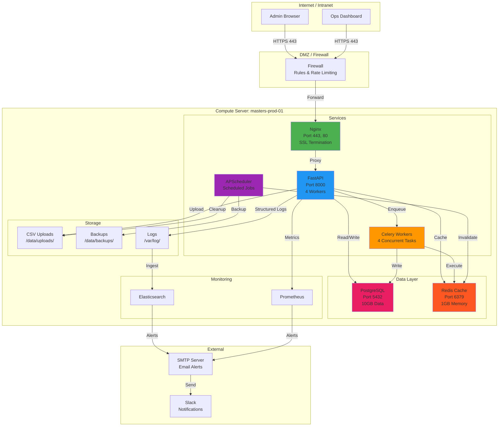
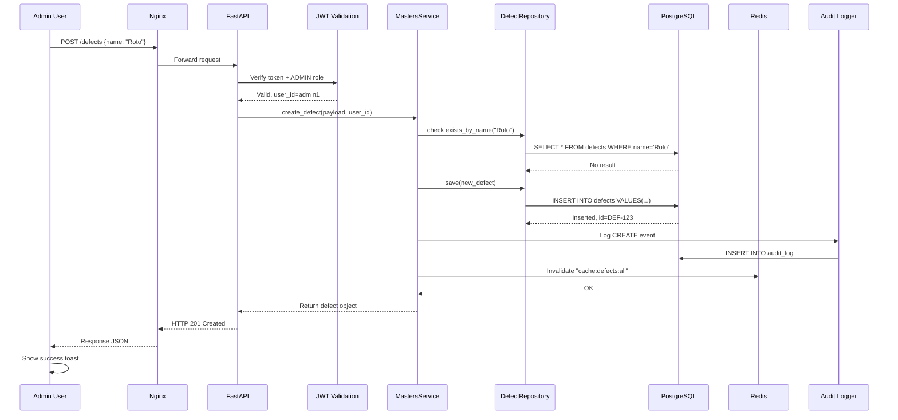
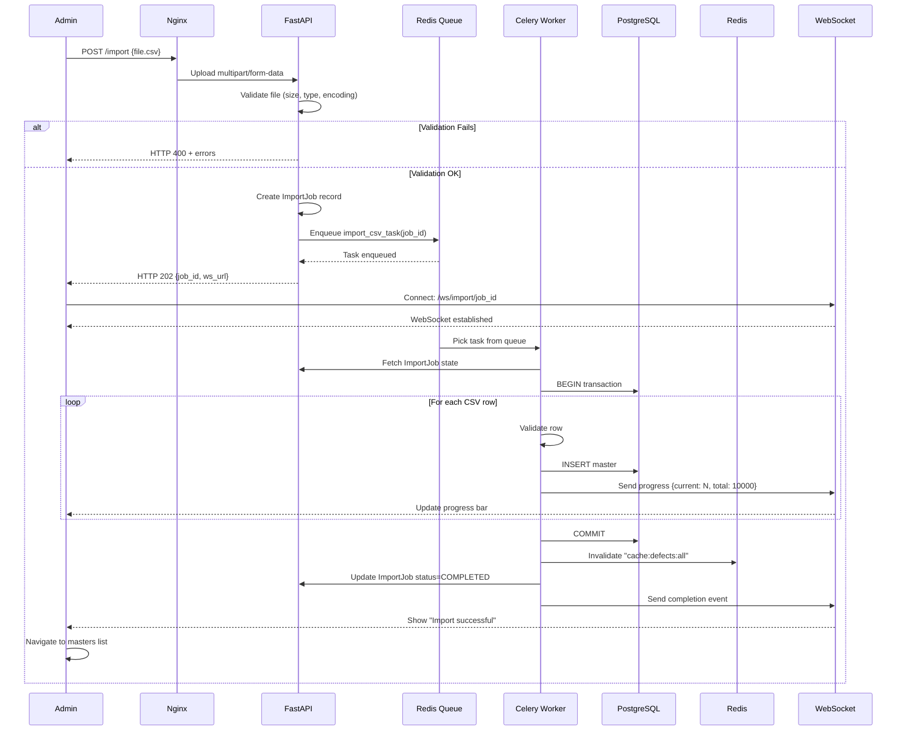
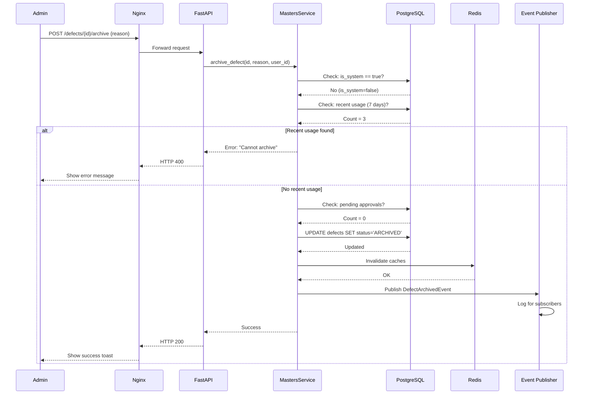
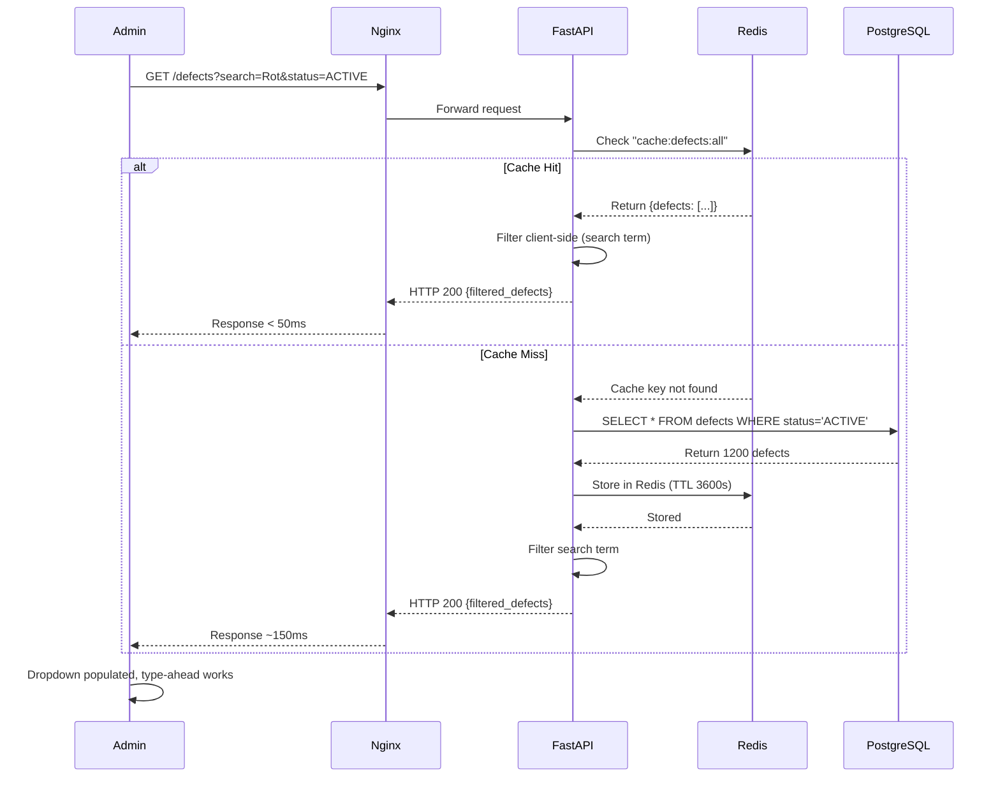
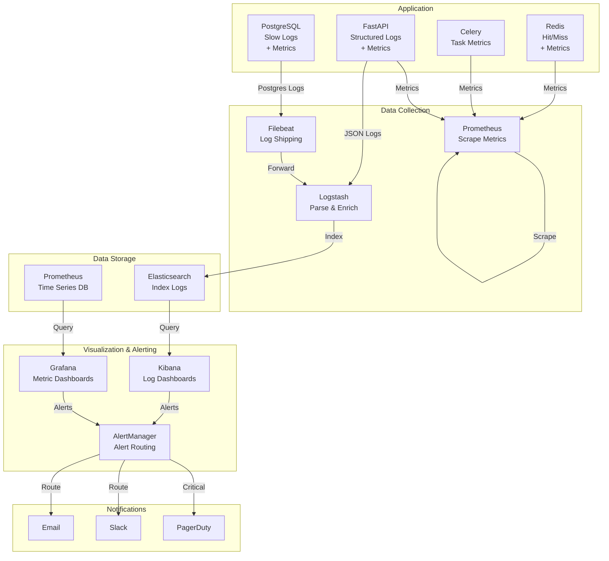
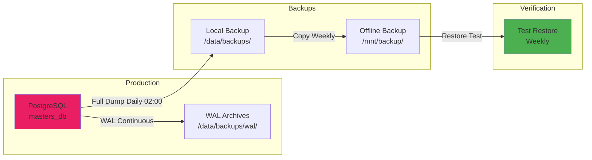

# Deployment Architecture — Unit 3 (Maestros y Configuración)

**Date**: 2026-06-01  
**Unit**: Maestros y Configuración (Masters & Configuration Domain)  
**Scope**: Deployment topology, data flows, disaster recovery, and operational diagrams  
**Audience**: DevOps Engineers, System Administrators, Infrastructure Architects  

---

## 🏗️ PHYSICAL DEPLOYMENT TOPOLOGY

### On-Premises Single-Server Setup



---

## 🔄 DATA FLOW DIAGRAMS

### Flow 1: Create Master (Synchronous CRUD)



---

### Flow 2: CSV Import (Asynchronous Background Job)



---

### Flow 3: Archive Master with Validation



---

### Flow 4: Search & Filter Masters (Cached)



---

## 🗂️ DATABASE ARCHITECTURE

### Entity-Relationship Diagram

```mermaid
erDiagram
    DEFECTS ||--o{ AUDIT_LOG : "logged_in"
    MACHINES ||--o{ AUDIT_LOG : "logged_in"
    FABRICS ||--o{ AUDIT_LOG : "logged_in"
    
    USERS ||--o{ DEFECTS : "created_by"
    USERS ||--o{ MACHINES : "created_by"
    USERS ||--o{ FABRICS : "created_by"
    
    DEFECTS {
        string id PK
        string name UK
        string description
        string typical_process
        string typical_machine_id FK
        string status
        boolean is_system
        int version
        string created_by FK
        timestamp created_at
        string updated_by FK
        timestamp updated_at
    }
    
    MACHINES {
        string id PK
        string name UK
        string process
        string manufacturer
        string model
        date installation_date
        string status
        boolean is_system
        int version
        string created_by FK
        timestamp created_at
    }
    
    FABRICS {
        string id PK
        string name UK
        string composition
        numeric width_cm
        numeric weight_gsm
        string status
        boolean is_system
        int version
        string created_by FK
        timestamp created_at
    }
    
    AUDIT_LOG {
        bigint id PK
        string entity_type
        string entity_id
        string operation
        json old_values
        json new_values
        string user_id FK
        timestamp timestamp
        string trace_id
    }
    
    USERS {
        string id PK
        string email UK
        string hashed_password
        string full_name
        string role
        boolean is_active
        timestamp created_at
    }
```



---

### Database Indexes

```sql
-- Defects indexes
CREATE UNIQUE INDEX idx_defects_name ON defects (LOWER(name))
WHERE is_system = false;

CREATE INDEX idx_defects_status_created ON defects (status, created_at DESC)
WHERE is_system = false;

CREATE INDEX idx_defects_is_system ON defects (is_system);

-- Machines indexes
CREATE UNIQUE INDEX idx_machines_name ON machines (LOWER(name))
WHERE is_system = false;

CREATE INDEX idx_machines_status ON machines (status)
WHERE is_system = false;

-- Audit log indexes
CREATE INDEX idx_audit_entity ON audit_log (entity_id);
CREATE INDEX idx_audit_timestamp ON audit_log (timestamp DESC);
CREATE INDEX idx_audit_user_time ON audit_log (user_id, timestamp DESC);

-- Composite indexes for common queries
CREATE INDEX idx_defects_status_name ON defects (status, LOWER(name));
```

---

## 📊 MONITORING & OBSERVABILITY ARCHITECTURE

### Observability Stack



### Key Dashboards

**Dashboard 1: Service Overview**
```
┌─────────────────────────────────────────┐
│ Masters API - Service Overview          │
├─────────────────────────────────────────┤
│                                         │
│  Uptime: 99.7%      Requests/sec: 120  │
│  Error Rate: 0.2%   P95 Latency: 145ms │
│                                         │
│  ┌─────────────┬─────────────┐         │
│  │ Request Rate│ Error Rate  │         │
│  │   [Graph]   │   [Graph]   │         │
│  ├─────────────┼─────────────┤         │
│  │ Response Time    │ Cache Hit Rate  │
│  │   P50: 80ms      │   80.5%        │
│  │   P95: 145ms     │   trend ↑      │
│  └──────────────────┴────────────────┘  │
└─────────────────────────────────────────┘
```

**Dashboard 2: Database Performance**
```
┌─────────────────────────────────────────┐
│ PostgreSQL - Performance Metrics         │
├─────────────────────────────────────────┤
│                                         │
│  Connections: 15/50    Disk: 8.2GB/10GB│
│  Slow Queries: 0       Cache Hit: 85%  │
│                                         │
│  ┌─────────────────────────────────┐   │
│  │ Query Execution Time (P95)      │   │
│  │   [Graph showing < 500ms]       │   │
│  ├─────────────────────────────────┤   │
│  │ Connection Pool Usage           │   │
│  │   [Graph showing 15/50]         │   │
│  └─────────────────────────────────┘   │
└─────────────────────────────────────────┘
```

**Dashboard 3: CSV Import Pipeline**
```
┌─────────────────────────────────────────┐
│ CSV Import - Pipeline Status            │
├─────────────────────────────────────────┤
│                                         │
│  Last 7 Days:                           │
│  Success: 28/30 (93%)                   │
│  Avg Time: 2m 15s                       │
│  Avg Rows: 8,500                        │
│                                         │
│  Queue Depth: 0 tasks                   │
│  Workers: 4 active                      │
│                                         │
│  ┌─────────────────────────────────┐   │
│  │ Import Duration Distribution    │   │
│  │   [Histogram graph]             │   │
│  └─────────────────────────────────┘   │
└─────────────────────────────────────────┘
```

---

## 🔐 DISASTER RECOVERY

### RTO & RPO Targets

| Scenario | RTO | RPO | Strategy |
|----------|-----|-----|----------|
| **Database Corruption** | 30 min | 1 day | Restore from daily backup |
| **Server Disk Full** | 15 min | Real-time | Add disk + resume |
| **Redis Cache Loss** | 5 min | 0 | Rebuild from DB on startup |
| **Application Crash** | 2 min | 0 | Restart container |
| **Complete Server Loss** | 4 hours | 1 day | Restore to new server |

### Backup Strategy



### Recovery Procedures

**Scenario 1: Database Corruption (Minor)**
```
1. Stop application: docker-compose down
2. Verify issue: SELECT * FROM defects LIMIT 1
3. If index corrupt:
   REINDEX INDEX idx_defects_name;
4. Restart: docker-compose up -d
5. Verify: curl https://masters-api.internal/health
```

**Scenario 2: Database Loss (Complete)**
```
1. Stop application
2. Drop corrupted database: dropdb masters_db
3. Create new database: createdb masters_db
4. List backups: ls -la /data/backups/
5. Restore from latest: 
   gunzip -c /data/backups/masters_db_20260601.sql.gz | psql
6. Verify tables: \dt
7. Restart application: docker-compose up -d
8. Resync cache: curl -X POST https://masters-api.internal/admin/cache/rebuild
9. Notify admins: Alert in Slack #ops-team
```

**Scenario 3: Complete Server Loss**
```
1. Provision new server (same specs)
2. Install OS + Docker
3. Copy configuration from backup
4. Restore database from /mnt/backup/
5. Spin up containers: docker-compose up -d
6. Update DNS/load balancer to point to new IP
7. Verify health checks
8. Run smoke tests
9. Announce recovery in Slack
10. Document RCA (Root Cause Analysis)
```

---

## 📈 CAPACITY PLANNING

### Current Resource Allocation

```
Server Specs: 4 CPU, 8GB RAM, 100GB Disk

Resource Usage (Expected):
├── FastAPI (4 workers)
│   ├── Memory: 500MB per worker = 2GB total
│   └── CPU: ~1.5 cores during peak
│
├── PostgreSQL
│   ├── Memory: 1GB (shared_buffers + cache)
│   └── Disk: 10GB (masters data + indexes)
│
├── Redis
│   ├── Memory: 1GB (master lists cache)
│   └── CPU: Minimal (< 0.1 core)
│
├── Celery Workers (4)
│   ├── Memory: 200MB per worker = 800MB total
│   └── CPU: ~1 core during CSV import
│
└── Other (Nginx, OS, monitoring)
    ├── Memory: 1GB
    └── Disk: 5GB (logs, temp files)

Total: 5-6GB RAM, 2-2.5 cores, 25-30GB disk
Available headroom: 40% capacity

Scaling Triggers:
├── If Memory > 90%: Add RAM or split services
├── If CPU > 80%: Add workers or second server
├── If Disk > 85%: Archive logs or expand disk
└── If DB connections > 40/50: Add connection pool
```

---

## 🔄 CI/CD PIPELINE INTEGRATION

### Deployment Pipeline

```mermaid
graph LR
    A["Push to<br/>main"] -->|Webhook| B["GitHub<br/>Actions"]
    B -->|Run Tests| C["pytest<br/>Coverage: 90%+"]
    C -->|Build| D["Docker Build<br/>masters-api:tag"]
    D -->|Test Image| E["Health Check<br/>Port 8000"]
    E -->|Success| F["Push to<br/>Registry"]
    F -->|Deploy| G["SSH to<br/>Production"]
    G -->|Stop Old| H["docker-compose down"]
    H -->|Pull New| I["docker pull"]
    I -->|Start New| J["docker-compose up"]
    J -->|Smoke Tests| K["curl /health<br/>curl /docs"]
    K -->|Success| L["Announce<br/>in Slack"]
    
    style C fill:#4CAF50
    style L fill:#2196F3
```



### Deployment Configuration

```yaml
# .github/workflows/deploy.yml
name: Deploy Masters API

on:
  push:
    branches: [main]

jobs:
  test:
    runs-on: ubuntu-latest
    steps:
      - uses: actions/checkout@v3
      - uses: actions/setup-python@v4
        with:
          python-version: '3.10'
      - run: pip install -r requirements.txt
      - run: pytest --cov=app --cov-report=term-missing
      - run: coverage report --fail-under=90

  build:
    needs: test
    runs-on: ubuntu-latest
    steps:
      - uses: actions/checkout@v3
      - uses: docker/build-push-action@v4
        with:
          push: false
          tags: masters-api:latest
          cache-from: type=gha
          cache-to: type=gha,mode=max

  deploy:
    needs: build
    runs-on: ubuntu-latest
    steps:
      - name: Deploy to production
        uses: appleboy/ssh-action@master
        with:
          host: ${{ secrets.PROD_HOST }}
          username: deploy
          key: ${{ secrets.PROD_KEY }}
          script: |
            cd /opt/masters-api
            git pull origin main
            docker-compose pull
            docker-compose up -d
            docker-compose exec masters-api alembic upgrade head
            curl -k https://masters-api.internal/health
```

---

## ✅ DEPLOYMENT CHECKLIST

### Pre-Deployment

- [ ] Code reviewed and approved
- [ ] Tests passing (90%+ coverage)
- [ ] Database migrations created (if schema changes)
- [ ] Environment variables defined
- [ ] Configuration reviewed
- [ ] Rollback plan documented
- [ ] Monitoring alerts configured

### Deployment

- [ ] Backup database
- [ ] Tag release in Git
- [ ] Build Docker image
- [ ] Test image locally
- [ ] Push to registry
- [ ] SSH to production server
- [ ] Pull new image
- [ ] Run database migrations
- [ ] Restart services
- [ ] Run health checks

### Post-Deployment

- [ ] Verify health check passing
- [ ] Monitor error rate (< 0.5%)
- [ ] Check response times (P95 < 200ms)
- [ ] Verify audit logs working
- [ ] Test CRUD operations manually
- [ ] Announce in Slack #ops-team
- [ ] Create incident report (if any issues)

---

**Status**: ✅ **ACTIVITY 4 COMPLETE**  
**Next Step**: Activity 5 — Code Generation  
**Related Documents**:
- [Infrastructure-Design-Services.md](./Infrastructure-Design-Services.md)
- [NFR-Design-Consolidated.md](../activity-3-nfr-design/NFR-Design-Consolidated.md)
