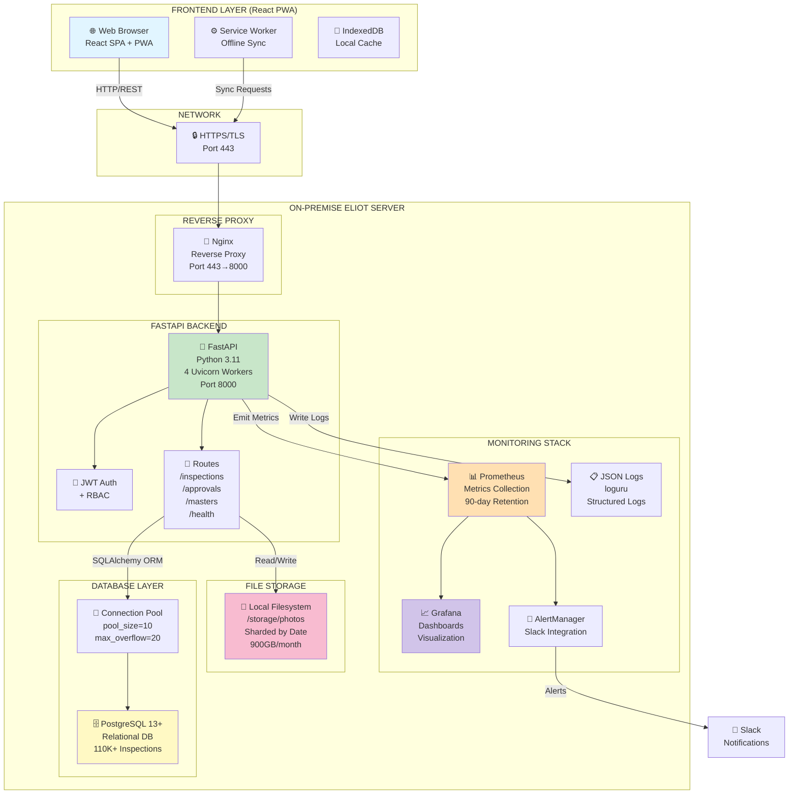
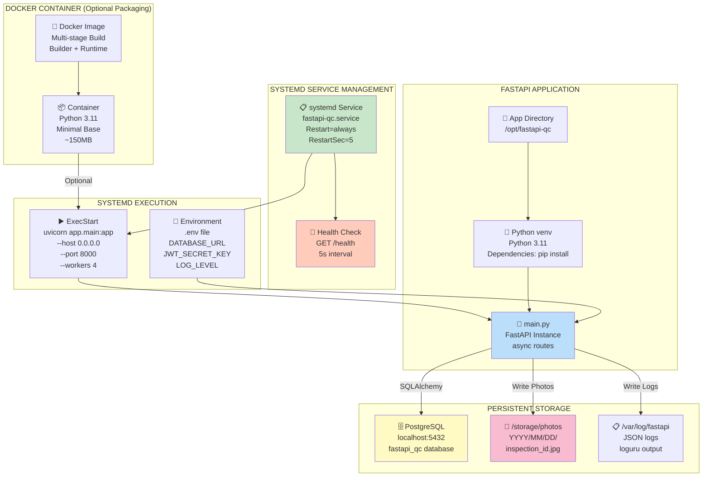
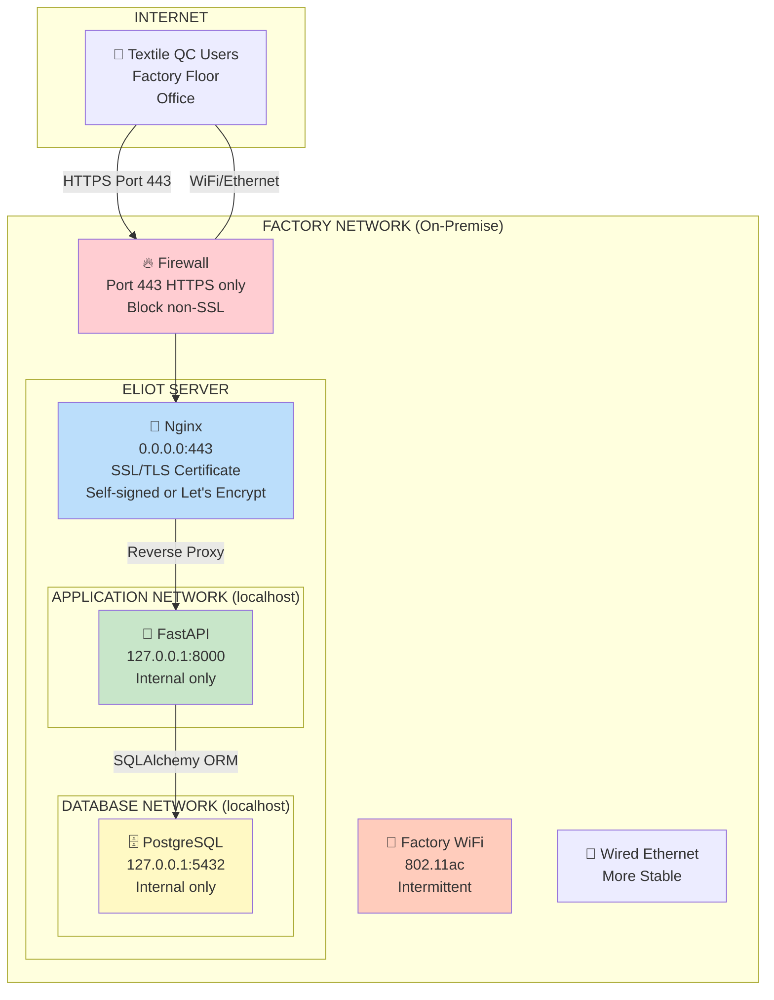
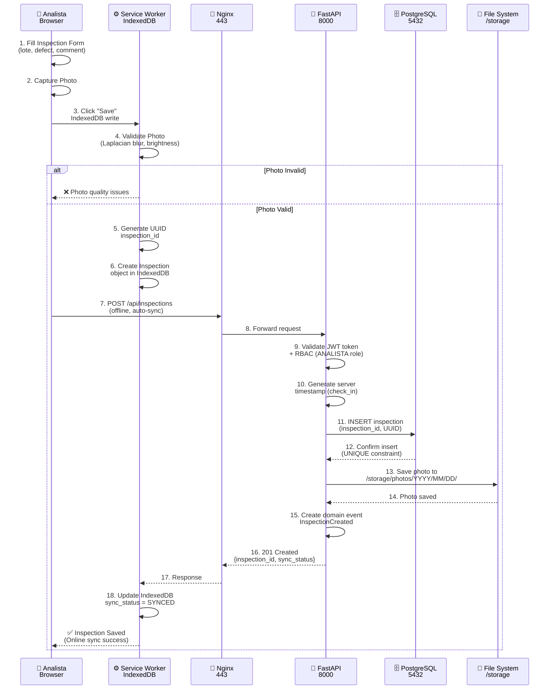
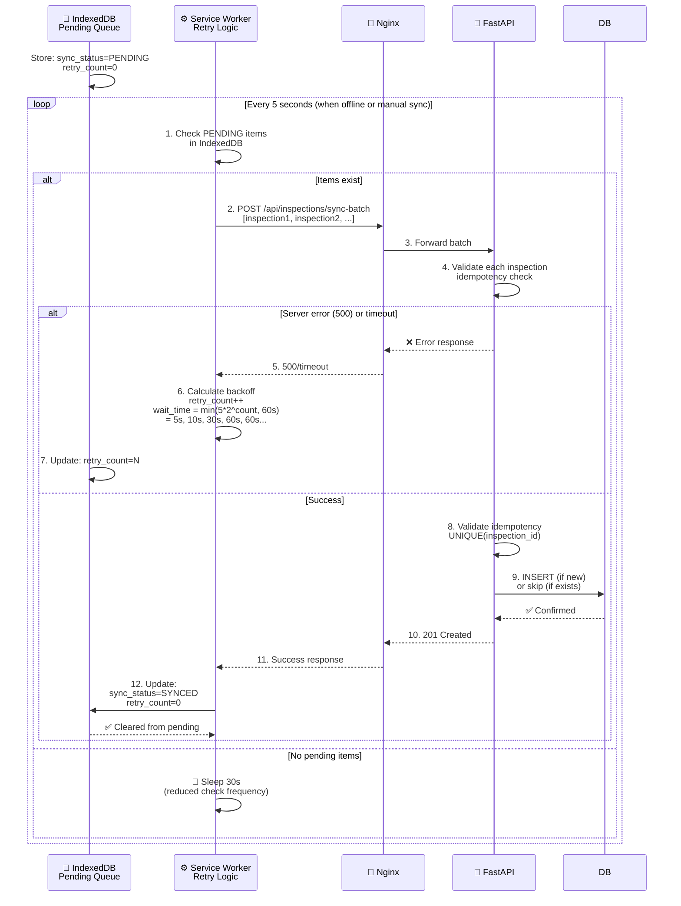
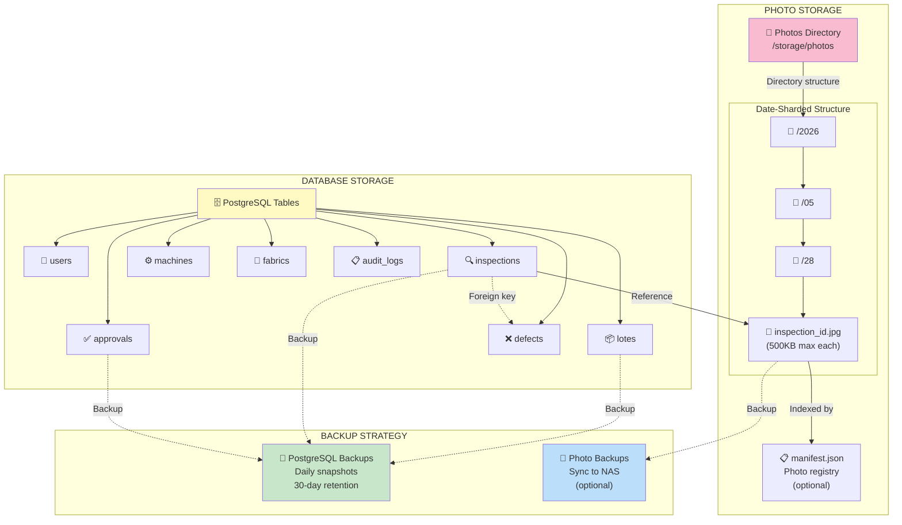
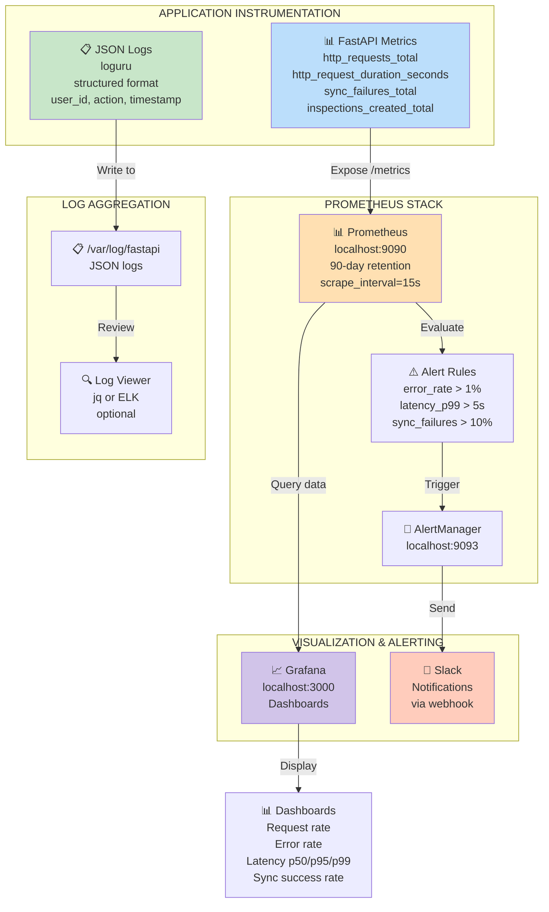
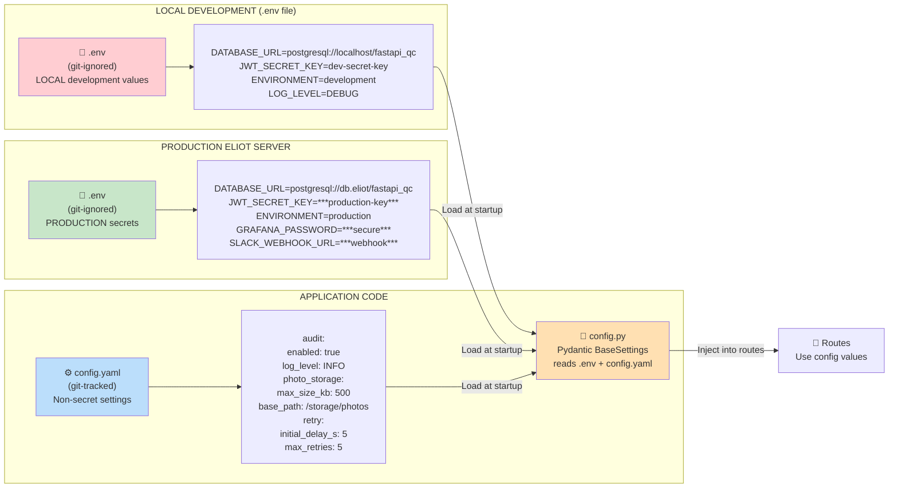
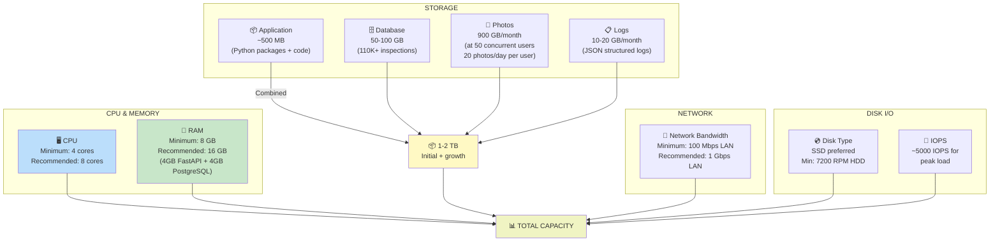

# Deployment Architecture — Textile Quality Control System
**Date**: 2026-05-28  
**Unit**: Backend API (Python FastAPI)  
**Environment**: On-Premise Eliot Server  
**Status**: ✅ ACCEPTED

---

## 📋 OVERVIEW

This document provides visual deployment architecture diagrams for the Backend API Unit, complementing the ADR-based infrastructure design. All decisions and rationales are documented in `infrastructure-design.md` (ADR-009 through ADR-015).

---

## 1️⃣ OVERALL SYSTEM ARCHITECTURE



**Key Characteristics**:
- **Frontend**: React PWA with offline capability (Service Worker + IndexedDB)
- **Transport**: HTTPS/TLS for all communication (encrypted in transit)
- **Reverse Proxy**: Nginx routes requests to FastAPI backend
- **Backend**: 4 Uvicorn worker processes handling concurrent requests
- **Database**: PostgreSQL with connection pooling (ADR-009, ADR-004)
- **File Storage**: Local filesystem with date-based sharding (ADR-012)
- **Monitoring**: Prometheus + Grafana + AlertManager (ADR-013)

---

## 2️⃣ DEPLOYMENT ARCHITECTURE (ELIOT SERVER)



**Key Components**:
- **systemd Service**: Manages FastAPI application lifecycle (ADR-010)
- **Python venv**: Isolated Python environment with locked dependencies
- **Uvicorn Workers**: 4 parallel worker processes for request handling
- **Health Check**: Endpoint for systemd and external monitoring to verify application health
- **Environment Variables**: Sensitive config in .env (JWT_SECRET_KEY, DATABASE_URL) — git-ignored (ADR-014)
- **Persistent Storage**: Database, photos, and logs persist on disk

**Deployment Steps** (ADR-010):
```bash
# 1. Install dependencies
pip install -r requirements.txt

# 2. Run database migrations
alembic upgrade head

# 3. Enable and start service
sudo systemctl enable fastapi-qc
sudo systemctl start fastapi-qc

# 4. Update code and restart
git pull origin main
sudo systemctl restart fastapi-qc
```

---

## 3️⃣ CI/CD PIPELINE (GITHUB ACTIONS)

```mermaid
graph LR
    subgraph "SOURCE CONTROL"
        Git["📦 GitHub Repo<br/>main branch push"]
    end

    subgraph "BUILD STAGE"
        Checkout["✅ Checkout Code"]
        SetupPy["🐍 Setup Python 3.11"]
        Install["📚 Install Dependencies<br/>pip install -r requirements.txt"]
    end

    subgraph "VALIDATION STAGE"
        Lint["🔍 Lint Code<br/>black<br/>flake8<br/>isort"]
        Test["✅ Run Tests<br/>pytest<br/>coverage >60%"]
        TypeCheck["📋 Type Check<br/>mypy"]
    end

    subgraph "PACKAGE STAGE"
        Docker["🐳 Build Docker Image<br/>Dockerfile multi-stage"]
        Tag["🏷️ Tag Image<br/>latest + commit_sha"]
        Push["📤 Push to Registry<br/>Docker Hub/<br/>Quay.io"]
    end

    subgraph "DEPLOY STAGE"
        SSH["🔐 SSH to Eliot<br/>Authentication key"]
        Deploy["🚀 Deploy Script<br/>systemctl restart<br/>fastapi-qc"]
        Verify["🏥 Verify Health<br/>GET /health<br/>Check 200 OK"]
    end

    Git -->|Push trigger| Checkout
    Checkout --> SetupPy
    SetupPy --> Install
    Install --> Lint
    Lint --> Test
    Test --> TypeCheck
    TypeCheck -->|All pass| Docker
    Docker --> Tag
    Tag --> Push
    Push --> SSH
    SSH --> Deploy
    Deploy --> Verify
    Verify -->|Health OK| Success["✅ Deployment<br/>Complete"]
    Verify -->|Health FAIL| Rollback["⚠️ Rollback<br/>Previous Version"]

    style Git fill:#e1f5ff
    style Success fill:#c8e6c9
    style Rollback fill:#ffcdd2
    style Verify fill:#ffccbc
```



**Pipeline Details** (ADR-011):
- **Trigger**: Push to `main` branch
- **Lint**: Code style consistency (black, flake8, isort)
- **Test**: Unit + integration tests with coverage >60%
- **Type Check**: Static type analysis (mypy)
- **Docker Build**: Multi-stage build for minimal image size
- **Registry Push**: Docker image to container registry
- **SSH Deploy**: Secure connection to on-premise Eliot server
- **Health Verification**: POST-deploy health check validation
- **Rollback**: Automatic rollback if health check fails

**Workflow File**: `.github/workflows/deploy.yml`

---

## 4️⃣ ON-PREMISE NETWORK & SECURITY



**Security Model** (ADR-003):
- **HTTPS Only**: Nginx enforces SSL/TLS on port 443
- **JWT Authentication**: All API requests require Bearer token (8h expiration)
- **RBAC**: Role-based access control (ANALISTA, JEFE_QA, ADMIN, GERENTE)
- **Internal Services**: FastAPI and PostgreSQL listen only on localhost (127.0.0.1)
- **Firewall**: Factory firewall blocks non-HTTPS traffic to Eliot server
- **Network Resilience**: WiFi unreliability handled by offline-first sync (ADR-001)

---

## 5️⃣ DATA FLOW — ONLINE INSPECTION REGISTRATION



**Key Characteristics**:
- **Idempotency**: UUID inspection_id prevents duplicate submissions (ADR-001)
- **Photo Quality**: Client-side validation before sync (ADR-002)
- **Server Timestamp**: Server generates check_in time, not client (Business Rule BR-006)
- **Async Processing**: FastAPI async routes (ADR-004)
- **Offline Handling**: IndexedDB fallback if network unavailable

---

## 6️⃣ DATA FLOW — OFFLINE INSPECTION SYNC (RETRY LOOP)



**Retry Parameters** (ADR-001, ADR-005):
- **Initial Delay**: 5 seconds
- **Exponential Backoff**: 5s → 10s → 30s → 60s → 60s (capped)
- **Max Retries**: 5 attempts before manual intervention
- **Total Window**: ~2 minutes for all retries to complete
- **Idempotency**: Duplicate submissions prevented by inspection_id UUID

**Success Guarantee**: Multi-layer persistence (ADR-001):
1. Layer 1: IndexedDB (local storage before sync)
2. Layer 2: Idempotent API (inspection_id unique constraint)
3. Layer 3: Exponential backoff retry (5x attempts)
4. **Result**: Zero data loss for inspections (100% guaranteed)

---

## 7️⃣ STORAGE ARCHITECTURE



**Photo Storage** (ADR-012):
- **Path**: `/storage/photos/YYYY/MM/DD/{inspection_id}.jpg`
- **Sharding**: By date to avoid too many files per directory
- **Max Size**: 500KB per photo (enforced on client and server)
- **Access**: Via `PhotoStorage` class methods

**Database Storage** (ADR-009):
- **Tables**: 8 tables covering users, lotes, inspections, approvals, masters
- **Schema**: Fully normalized with FK constraints and indexes
- **Indexes**: Strategic indexes on hot query paths (lote_id, analista_id, sync_status)
- **Retention**: Perpetual (no deletion, archival planned for future)

**Backup Strategy**:
- Database: Daily PostgreSQL snapshots with 30-day retention
- Photos: Optional sync to NAS for redundancy

---

## 8️⃣ MONITORING & OBSERVABILITY ARCHITECTURE



**Metrics** (ADR-008):
- `http_requests_total`: Total requests by endpoint, method, status
- `http_request_duration_seconds`: Histogram (p50, p95, p99 latency)
- `sync_failures_total`: Count of failed sync attempts
- `inspections_created_total`: Count of created inspections (business metric)

**Logs** (ADR-008):
- Format: JSON (structured, queryable)
- Fields: timestamp, user_id, action, duration_ms, status, error_message
- Storage: `/var/log/fastapi/app.log`
- Tool: loguru (Python logging replacement)

**Alerts** (ADR-013):
- **Error Rate**: If >1% of requests fail → alert
- **Latency**: If p99 latency >5s → alert
- **Sync Failures**: If >10% of sync attempts fail → alert
- **Notifications**: Sent to Slack via webhook

**Grafana Dashboards**:
- Request rate and error rate trends
- Latency percentiles (p50, p95, p99)
- Sync success vs. failure rates
- Inspection creation trends
- Database connection pool utilization

---

## 9️⃣ CONFIGURATION & SECRETS MANAGEMENT



**Secrets Management** (ADR-014):
- **.env file**: Git-ignored, contains sensitive values
  - `DATABASE_URL`: PostgreSQL connection string
  - `JWT_SECRET_KEY`: Secret key for JWT signing
  - `GRAFANA_PASSWORD`: Admin password
  - `SLACK_WEBHOOK_URL`: For alert notifications
- **config.yaml**: Git-tracked, contains non-sensitive settings
  - Audit logging configuration
  - Photo storage parameters
  - Retry logic parameters
  - Feature flags

**Configuration Loading**:
```python
# config.py (Pydantic BaseSettings)
from pydantic_settings import BaseSettings

class Settings(BaseSettings):
    database_url: str  # Reads DATABASE_URL from .env
    jwt_secret_key: str  # Reads JWT_SECRET_KEY from .env
    environment: str = "development"  # Defaults to development
    log_level: str = "INFO"
    
    class Config:
        env_file = ".env"
        case_sensitive = True

settings = Settings()
```

---

## 🔟 RESOURCE REQUIREMENTS (ELIOT SERVER)



**Server Sizing** (ADR-010):
- **CPU**: 4 cores minimum (1 per Uvicorn worker), 8 cores recommended
- **RAM**: 8 GB minimum (4GB FastAPI + 4GB PostgreSQL), 16 GB recommended
- **Storage**: 1-2 TB SSD (application + database + photos + logs)
- **Network**: 1 Gbps LAN preferred for reliability
- **Disk I/O**: ~5000 IOPS during peak inspection sync

---

## ✅ DEPLOYMENT CHECKLIST

Before deploying to on-premise Eliot server:

### Pre-Deployment
- [ ] PostgreSQL 13+ installed and running
- [ ] /storage/photos directory created with correct permissions
- [ ] systemd service file copied to /etc/systemd/system/fastapi-qc.service
- [ ] .env file created with production secrets (DATABASE_URL, JWT_SECRET_KEY, etc.)
- [ ] config.yaml in place with audit and photo storage settings
- [ ] SSL/TLS certificate installed on Nginx (self-signed or Let's Encrypt)
- [ ] Python 3.11 venv created with dependencies installed

### Deployment Steps
- [ ] Run database migrations: `alembic upgrade head`
- [ ] Enable systemd service: `sudo systemctl enable fastapi-qc`
- [ ] Start service: `sudo systemctl start fastapi-qc`
- [ ] Verify health endpoint: `curl https://localhost/health`
- [ ] Check Nginx reverse proxy: `curl https://localhost` (should proxy to FastAPI)
- [ ] Verify FastAPI is listening: `ss -tln | grep 8000`

### Post-Deployment
- [ ] Test offline inspection sync (take offline, create inspection, bring online)
- [ ] Verify photo storage working (check /storage/photos/{YYYY}/{MM}/{DD}/)
- [ ] Check Prometheus metrics: `curl http://localhost:9090/api/v1/targets`
- [ ] Verify Grafana dashboards load: http://localhost:3000
- [ ] Test AlertManager alerts with Slack integration
- [ ] Validate authentication: Test JWT token creation and RBAC enforcement
- [ ] Run health check script: Monitor /health endpoint for 5 minutes

### Monitoring Setup
- [ ] Prometheus configured to scrape FastAPI /metrics
- [ ] Grafana dashboards created for key metrics
- [ ] AlertManager rules configured (error rate, latency, sync failures)
- [ ] Slack webhook URL configured for notifications
- [ ] Log aggregation setup (tail -f /var/log/fastapi/app.log)

---

## 📋 REFERENCES

For detailed architecture decision rationale, see:
- **ADR-009**: Database Schema (PostgreSQL)
- **ADR-010**: Deployment Architecture (Docker + Systemd)
- **ADR-011**: CI/CD Pipeline (GitHub Actions)
- **ADR-012**: File Storage (Local Filesystem)
- **ADR-013**: Monitoring Infrastructure (Prometheus + Grafana)
- **ADR-014**: Configuration Management (.env + config.yaml)
- **ADR-015**: Project Layout (FastAPI Standard + DDD)

All located in `infrastructure-design.md`

---

**Status**: ✅ ACCEPTED  
**Last Updated**: 2026-05-28
