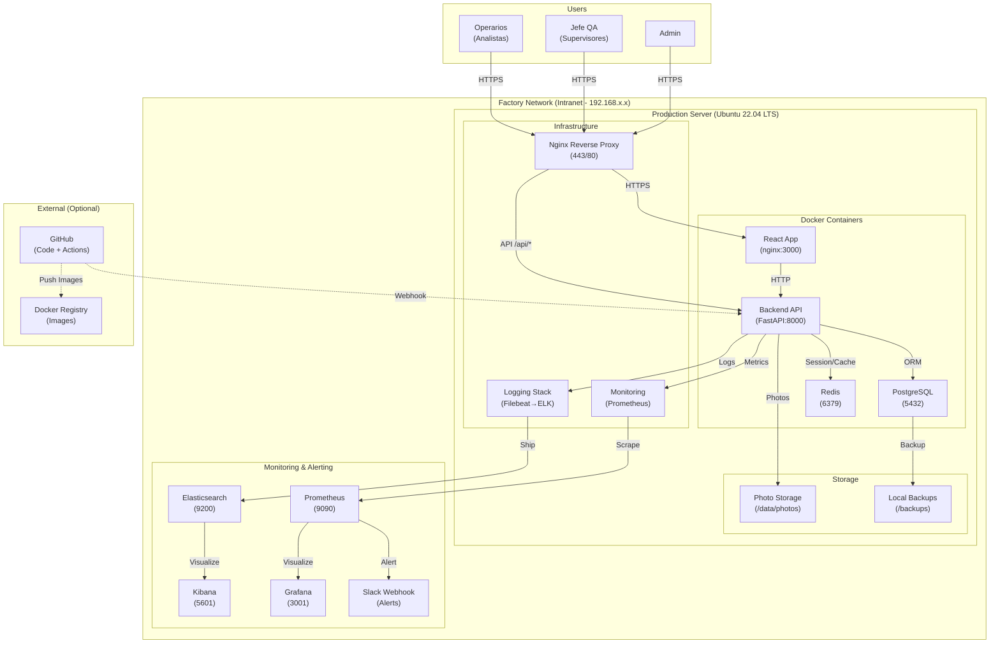
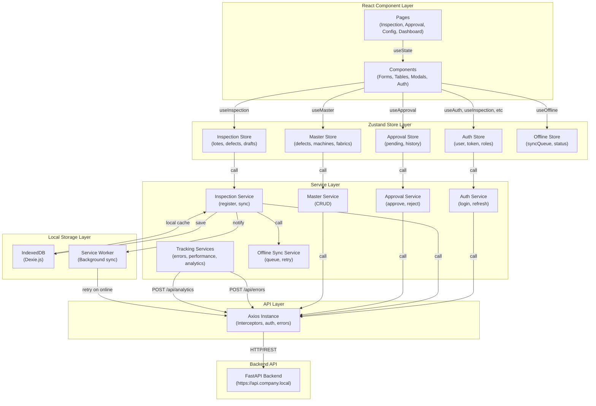
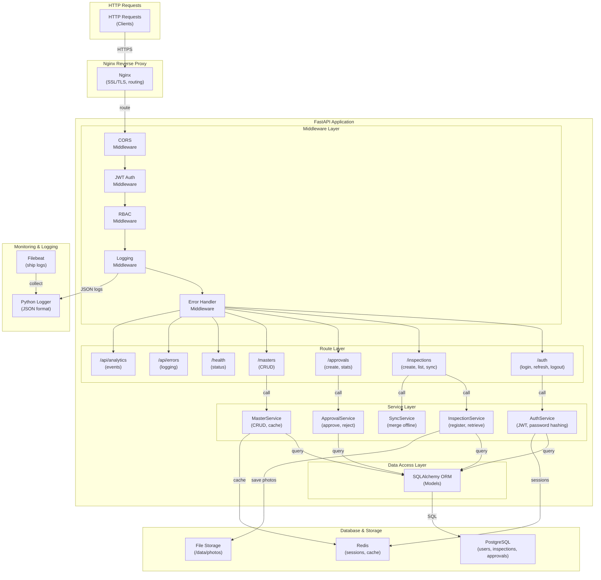
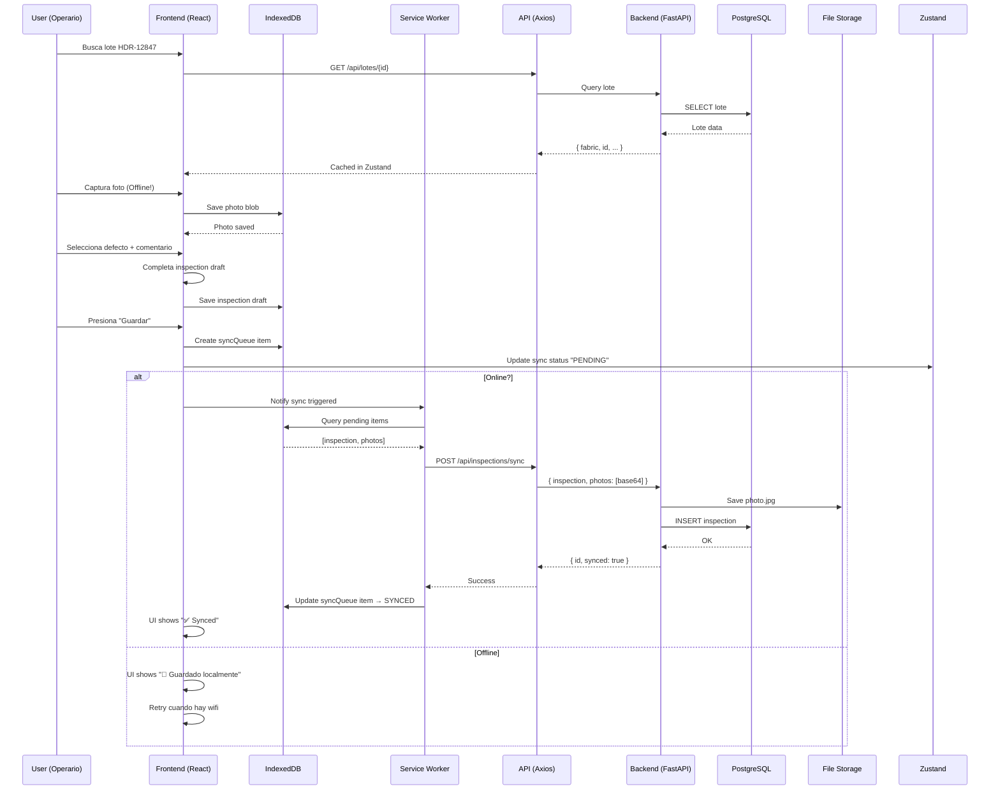
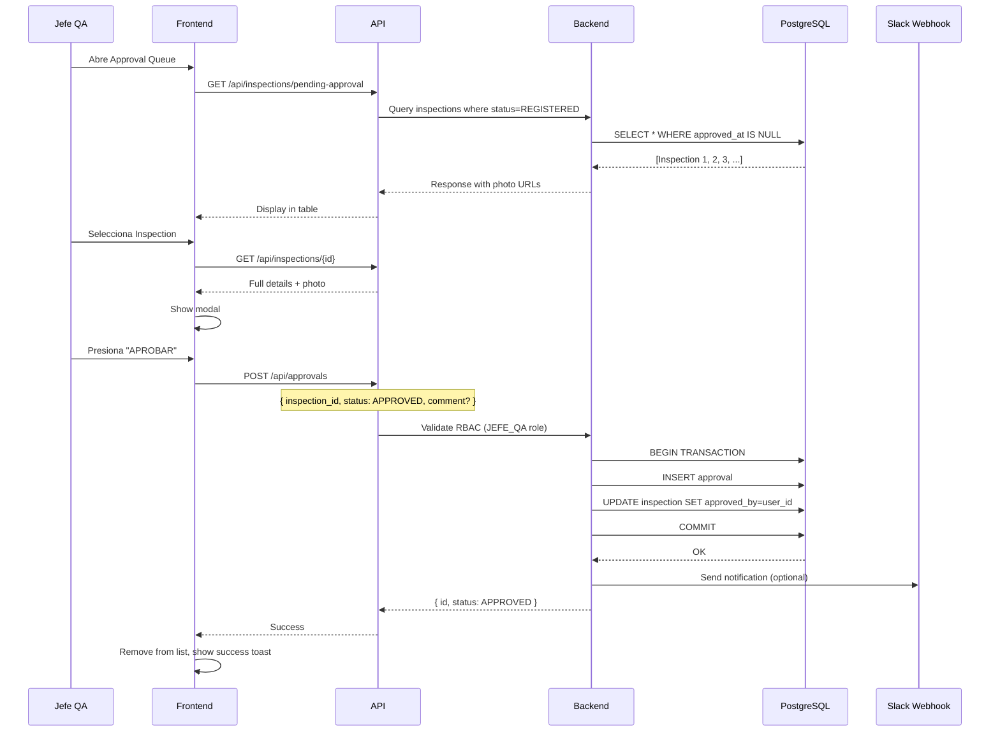
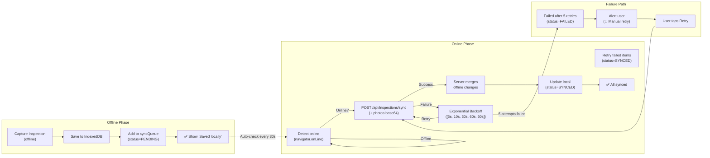
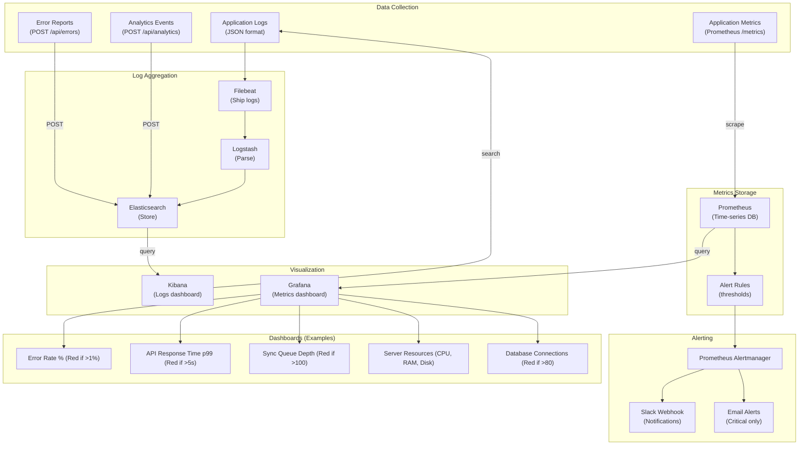
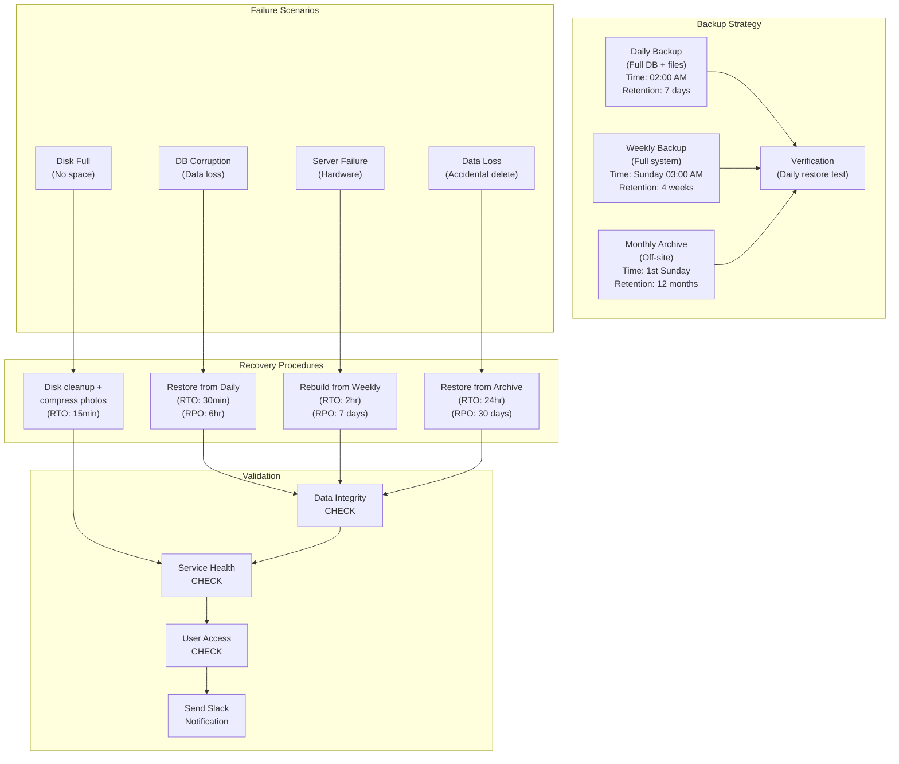

# Deployment Architecture — Complete Mermaid Diagrams
## Activity 4 — Frontend Web Unit

**Date**: 2026-05-31  
**Status**: ACCEPTED  
**Scope**: Full deployment topology, CI/CD pipeline, data flows, and disaster recovery

---

## 1️⃣ DEPLOYMENT TOPOLOGY (On-Premises)



---

## 2️⃣ CONTINUOUS INTEGRATION & DEPLOYMENT (CI/CD)

```mermaid
graph LR
    subgraph "Development"
        DEV["Developer<br/>Commits Code"]
    end
    
    subgraph "GitHub (Source Control)"
        GH["Repository<br/>(main/develop)"]
    end
    
    subgraph "GitHub Actions (CI/CD)"
        subgraph "Stage 1: Test"
            LINT["Lint<br/>(ESLint)"]
            TYPE["Type Check<br/>(TypeScript)"]
            TEST["Unit Tests<br/>(Jest)"]
            PYTEST["Backend Tests<br/>(pytest)"]
        end
        
        subgraph "Stage 2: Build"
            BUILD_FE["Build Frontend<br/>(React)"]
            BUILD_IMG_FE["Docker Image<br/>(frontend)"]
            BUILD_IMG_BE["Docker Image<br/>(backend)"]
            PUSH_IMG["Push to Registry<br/>(Docker Hub)"]
        end
        
        subgraph "Stage 3: Deploy"
            PULL["Pull Images<br/>(Latest)"]
            MIGRATE["DB Migrations<br/>(Alembic)"]
            DEPLOY["Deploy<br/>(docker-compose up)"]
            HEALTH["Health Check<br/>(curl /health)"]
        end
    end
    
    subgraph "Production Server"
        PROD["Running Services<br/>(Frontend + Backend)"]
    end
    
    subgraph "Notifications"
        SLACK_OK["✅ Slack<br/>Success"]
        SLACK_FAIL["❌ Slack<br/>Failure"]
    end
    
    DEV -->|git push| GH
    GH -->|trigger| LINT
    LINT --> TYPE
    TYPE --> TEST
    TEST --> PYTEST
    PYTEST -->|pass| BUILD_FE
    BUILD_FE --> BUILD_IMG_FE
    BUILD_IMG_FE --> BUILD_IMG_BE
    BUILD_IMG_BE --> PUSH_IMG
    PUSH_IMG --> PULL
    PULL --> MIGRATE
    MIGRATE --> DEPLOY
    DEPLOY --> HEALTH
    HEALTH -->|pass| SLACK_OK
    HEALTH -->|fail| SLACK_FAIL
    SLACK_OK --> PROD
```



---

## 3️⃣ FRONTEND ARCHITECTURE (Services & State)



---

## 4️⃣ BACKEND ARCHITECTURE (FastAPI Services)



---

## 5️⃣ DATA FLOW: INSPECTION CREATION (Happy Path)



---

## 6️⃣ DATA FLOW: APPROVAL WORKFLOW



---

## 7️⃣ OFFLINE SYNCHRONIZATION FLOW



---

## 8️⃣ MONITORING & ALERTING ARCHITECTURE



---

## 9️⃣ DISASTER RECOVERY FLOW



---

## 🔟 DEPLOYMENT CHECKLIST

```mermaid
checklist
- [ ] Production Server provisioned (8GB RAM, 4 CPU, 500GB SSD, Ubuntu 22.04)
- [ ] Docker & Docker Compose installed
- [ ] Nginx reverse proxy configured with SSL
- [ ] PostgreSQL database initialized with schema
- [ ] Redis cache running
- [ ] GitHub Actions workflow configured for CI/CD
- [ ] Environment variables (.env) set securely
- [ ] ELK stack running (Elasticsearch, Logstash, Kibana)
- [ ] Prometheus + Grafana for metrics
- [ ] Backup scripts scheduled (cron jobs)
- [ ] Slack webhooks configured
- [ ] Service Worker + IndexedDB working (tested in browser)
- [ ] DNS configured (qc.factory.local)
- [ ] SSL certificate installed (Let's Encrypt)
- [ ] Firewall rules applied (only 80/443 exposed)
- [ ] Health check endpoint configured
- [ ] Monitoring dashboards created
- [ ] Disaster recovery plan documented
- [ ] Team trained on deployment procedures
- [ ] Smoke tests passed on production
```

---

## 📊 DEPLOYMENT SUMMARY TABLE

| Component | Technology | Config | Status |
|-----------|-----------|--------|--------|
| **OS** | Ubuntu 22.04 LTS | Server, VM | ✅ |
| **Web Server** | Nginx Alpine | Reverse proxy, SSL | ✅ |
| **Frontend** | React 18 | Docker, Node 18 | ✅ |
| **Backend** | FastAPI | Docker, Python 3.11 | ✅ |
| **Database** | PostgreSQL 15 | Docker, alpine | ✅ |
| **Cache** | Redis 7 | Docker, alpine | ✅ |
| **Logs** | ELK Stack | Elasticsearch, Kibana | ✅ |
| **Metrics** | Prometheus | Time-series DB | ✅ |
| **Visualization** | Grafana | Dashboards | ✅ |
| **Backup** | Tar + Cron | Daily/Weekly/Monthly | ✅ |
| **Monitoring** | Custom services | /metrics, /health | ✅ |
| **CI/CD** | GitHub Actions | Test, build, deploy | ✅ |
| **Storage** | Filesystem | /data/photos | ✅ |
| **SSL/TLS** | Let's Encrypt | https:// enforced | ✅ |

---

**Status**: ✅ ACCEPTED  
**Implementation**: Docker Compose + GitHub Actions + ELK + Prometheus/Grafana  
**Testing**: Deployment tests, backup recovery tests, failover tests, load tests

