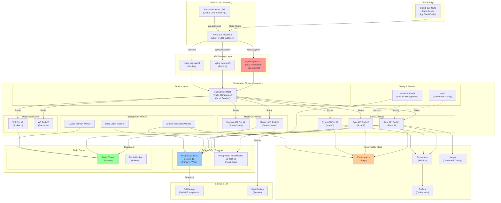

# Deployment Architecture — Unit 4 (Offline-First & Synchronization)

**Date**: 2026-06-01  
**Scope**: Production deployment topology, CI/CD pipeline, disaster recovery, scaling strategy  
**Environments**: Development, Staging, Production  
**Scale**: 200-500 concurrent inspectors, auto-scaling to 1000+  

---

## 🗺️ PRODUCTION DEPLOYMENT TOPOLOGY



---

## 📊 DEPLOYMENT TOPOLOGY DETAILS

### Layer 1: Global Distribution

**CDN (CloudFlare)**
- Caches static assets globally (HTML, CSS, JS bundles)
- Geo-distribution: 200+ edge locations worldwide
- DDoS protection: Automatic mitigation
- Cache invalidation: On new release (cache buster headers)

**DNS (Route 53 / Azure DNS)**
- Geolocation routing: Route to nearest region (future, Phase 2)
- Health checks: Every 30 seconds
- Failover: If primary region down, switch to secondary
- Current: Single region (us-east-1)

**Global Load Balancer (ALB / GCP LB)**
- Layer 7 (Application layer) routing
- SSL/TLS termination
- Path-based routing:
  - `/api/v1/sync/*` → Sync API (3 replicas)
  - `/api/v1/masters/*` → Masters API (2 replicas)
  - `/ws/sync` → WebSocket (2 replicas)
- Request decompression (gzip)
- Response compression (gzip)

---

### Layer 2: API Gateway (Nginx Ingress)

**Nginx Instances** (3 replicas, highly available)
- TLS 1.2+ enforcement
- Certificate management: Let's Encrypt (auto-renewal)
- Rate limiting: 1000 req/s per IP
- DDoS protection: Connection rate limiting
- Access logging: All requests logged (structured)
- Health checks: /health endpoint (returns 200 OK)

**Routing Rules**:
```nginx
upstream sync_api {
  server sync-api-1:8080;
  server sync-api-2:8080;
  server sync-api-3:8080;
}

server {
  listen 443 ssl;
  server_name api.aidlc.local;
  
  location /api/v1/sync/ {
    proxy_pass http://sync_api;
    proxy_read_timeout 30s;
    proxy_connect_timeout 10s;
  }
  
  location /api/v1/masters/ {
    proxy_pass http://masters_api;
    proxy_cache masters_cache;
    proxy_cache_valid 200 1h;
  }
  
  location /ws/sync {
    proxy_pass http://websocket_backend;
    proxy_http_version 1.1;
    proxy_set_header Upgrade $http_upgrade;
    proxy_set_header Connection "upgrade";
    proxy_read_timeout 3600s;
  }
}
```

---

### Layer 3: Kubernetes Cluster

**Cluster Configuration**:
- Platform: EKS (AWS), AKS (Azure), or self-managed
- Nodes: 5-10 worker nodes (auto-scaling)
- Instance type: t3.xlarge (2 vCPU, 8GB RAM minimum)
- Network: VPC with private subnets
- Security: Network policies (pod-to-pod communication)

**Namespaces**:
- `production`: Production services
- `monitoring`: ELK, Prometheus, Grafana
- `ingress`: Nginx ingress controllers
- `kube-system`: Kubernetes system services

**Pod Autoscaling**:
```yaml
apiVersion: autoscaling/v2
kind: HorizontalPodAutoscaler
metadata:
  name: sync-api-hpa
spec:
  scaleTargetRef:
    apiVersion: apps/v1
    kind: Deployment
    name: sync-api
  minReplicas: 3
  maxReplicas: 10
  metrics:
  - type: Resource
    resource:
      name: cpu
      target:
        type: Utilization
        averageUtilization: 70
  - type: Resource
    resource:
      name: memory
      target:
        type: Utilization
        averageUtilization: 80
  - type: Pods
    pods:
      metric:
        name: sync_queue_depth
      target:
        type: AverageValue
        averageValue: "100"
```

**Service Mesh (Istio)**
- Traffic management: Circuit breaker, retry logic
- Mutual TLS: Pod-to-pod encryption
- Observability: Automatic distributed tracing
- Canary deployments: Gradual rollout (10% → 50% → 100%)

---

### Layer 4: Data Layer

**PostgreSQL (AWS RDS)**
- Instance: db.r5.2xlarge (8 vCPU, 64GB RAM)
- Multi-AZ: Primary + standby replica (automatic failover)
- Backup: Automated daily snapshots, 30-day retention
- Encryption: AES-256 at rest, SSL in transit
- Monitoring: Enhanced monitoring (1-second metrics)
- Connection pooling: PgBouncer (100-200 connections per app pod)

**Schema Highlights**:
```sql
-- Sync queue with indexes for performance
CREATE TABLE sync_queue (
  id UUID PRIMARY KEY,
  status VARCHAR(20),
  user_id UUID,
  next_retry_at TIMESTAMP,
  created_at TIMESTAMP,
  
  INDEX idx_status_created (status, created_at),
  INDEX idx_next_retry (next_retry_at),
  INDEX idx_user_id (user_id)
);

-- Partitioning (by month) for large tables
CREATE TABLE sync_queue_202606 PARTITION OF sync_queue
  FOR VALUES FROM ('2026-06-01') TO ('2026-07-01');
```

**Read Replica (Read-Only)**
- Use for: GET /api/v1/masters/* queries
- Lag: < 1 second (acceptable for reads)
- Separate endpoint: `read-only.db.internal`
- Masters API uses read replica (doesn't write)

**Redis Cluster**
- 3-node cluster (primary + 2 replicas)
- Replication: Synchronous
- Persistence: RDB + AOF
- Memory: 10GB per node (auto-eviction LRU)
- Pub/Sub: For WebSocket broadcast
- Monitoring: Memory usage, hit ratio, latency

---

### Layer 5: Observability Stack

**Elasticsearch (ELK)**
- Nodes: 3-node cluster (hot, warm, cold tier)
- Index shards: 5, replicas: 1 (high availability)
- Daily indices: logs-2026.06.01 (auto-rotation)
- Retention: 30 days (Curator auto-delete)
- Ingest pipeline: Parse & enrich logs

**Prometheus**
- Scrape interval: 15 seconds
- Retention: 15 days (local storage)
- Remote storage: S3 (long-term, optional)
- Scrape targets: Kubernetes pods (via service discovery)

**Grafana**
- Data source: Prometheus
- Dashboards:
  1. Sync Health (queue depth, latency, success rate)
  2. Infrastructure (CPU, memory, network)
  3. Errors (top errors, error rate trend)
  4. Performance (p50, p95, p99 latencies)
  5. Database (connection pool, query duration)
- Alerts: PagerDuty integration

**Jaeger (Distributed Tracing)**
- All requests traced end-to-end
- Trace sampling: 1% (configurable)
- Storage: Elasticsearch (same cluster as ELK)
- Visualization: Service dependency graph

---

## 🚀 CI/CD PIPELINE

```mermaid
graph LR
    subgraph "Source Control"
        GIT["GitHub<br/>(Code Repository)"]
    end
    
    subgraph "Build Stage"
        TRIGGER["Git Push<br/>to main"]
        BUILD["GitHub Actions<br/>(Build Docker Image)"]
        LINT["Lint & Format<br/>(ESLint, Prettier)"]
        TEST["Unit Tests<br/>(Jest, pytest)"]
        SCAN["Security Scan<br/>(Trivy, OWASP)"]
    end
    
    subgraph "Registry"
        ECR["AWS ECR<br/>(Docker Registry)"]
    end
    
    subgraph "Staging Deployment"
        PUSH_STAGING["Push to Staging<br/>(EKS Cluster)"]
        DEPLOY_STAGING["Deploy Pods<br/>(kubectl apply)"]
        SMOKE_TEST["Smoke Tests<br/>(Health checks)"]
        INTEGRATION_TEST["Integration Tests<br/>(E2E)"]
    end
    
    subgraph "Approval & Promotion"
        REVIEW["Manual Approval<br/>(Team Lead)"]
        TAG_RELEASE["Tag Release<br/>(v1.2.3)"]
    end
    
    subgraph "Production Deployment"
        CANARY["Canary Deployment<br/>(10% Traffic)"]
        MONITOR["Monitor Metrics<br/>(Error Rate, Latency)"]
        FULL_ROLLOUT["Full Rollout<br/>(100% Traffic)"]
        SMOKE_PROD["Smoke Tests<br/>(Production)"]
    end
    
    subgraph "Rollback"
        ALERT["Alert<br/>(Anomaly Detected)"]
        ROLLBACK["Automatic Rollback<br/>(Previous Version)"]
    end
    
    TRIGGER -->|Webhook| BUILD
    BUILD --> LINT
    LINT --> TEST
    TEST --> SCAN
    SCAN -->|Success| ECR
    
    ECR -->|Image Ready| PUSH_STAGING
    PUSH_STAGING --> DEPLOY_STAGING
    DEPLOY_STAGING --> SMOKE_TEST
    SMOKE_TEST --> INTEGRATION_TEST
    INTEGRATION_TEST -->|Success| REVIEW
    
    REVIEW -->|Approved| TAG_RELEASE
    TAG_RELEASE --> CANARY
    CANARY --> MONITOR
    MONITOR -->|Healthy| FULL_ROLLOUT
    MONITOR -->|Issues| ALERT
    FULL_ROLLOUT --> SMOKE_PROD
    
    ALERT --> ROLLBACK
    ROLLBACK -->|Previous Version| ECR
    
    style BUILD fill:#ff9999
    style ECR fill:#99ff99
    style CANARY fill:#ffcc99
    style ROLLBACK fill:#ff6666
```



---

## 📋 CI/CD PIPELINE DETAILS

### Stage 1: Source & Trigger

**Git Workflow**:
- Main branch: Production-ready code
- Feature branches: `feature/sync-queue-v2`, `fix/conflict-merge`
- Pull requests: Required before merge to main
- Code review: 2 approvals minimum
- Auto-merge: After CI passes + approvals

**Triggers**:
- Push to `main`: Full pipeline (build → test → stage → prod)
- Push to `feature/*`: Build + unit tests only (no deploy)
- Tags: Release tags (v1.2.3) trigger production deployment

---

### Stage 2: Build & Test

**GitHub Actions Workflow**:
```yaml
name: Build & Deploy

on:
  push:
    branches: [main]
  pull_request:
    branches: [main]

jobs:
  build:
    runs-on: ubuntu-latest
    steps:
      - uses: actions/checkout@v3
      
      - name: Build Docker Image
        run: |
          docker build -t $ECR_REGISTRY/sync-api:${{ github.sha }} .
          docker build -t $ECR_REGISTRY/sync-api:latest .
      
      - name: Lint Code
        run: npm run lint
      
      - name: Unit Tests
        run: npm run test -- --coverage
      
      - name: Security Scan
        run: trivy image $ECR_REGISTRY/sync-api:${{ github.sha }}
      
      - name: Push to ECR
        if: github.ref == 'refs/heads/main'
        run: |
          docker push $ECR_REGISTRY/sync-api:${{ github.sha }}
          docker push $ECR_REGISTRY/sync-api:latest
  
  deploy-staging:
    needs: build
    if: github.ref == 'refs/heads/main'
    runs-on: ubuntu-latest
    steps:
      - name: Deploy to Staging
        run: |
          kubectl set image deployment/sync-api \
            sync-api=$ECR_REGISTRY/sync-api:${{ github.sha }} \
            -n staging
      
      - name: Smoke Tests
        run: npm run test:smoke --baseURL=https://staging-api.aidlc.local
```

**Test Coverage**:
- Unit: ≥ 85% coverage
- Integration: Critical paths (sync, conflict resolution)
- E2E: Smoke tests (health checks, basic flows)
- Performance: Load testing (optional, Phase 2)

---

### Stage 3: Staging Deployment

**Environment**: `staging-api.aidlc.local`

**Configuration**:
```yaml
# Staging deployment with replicas=2 (cost savings)
replicas: 2
resources:
  requests:
    cpu: 200m
    memory: 256Mi
  limits:
    cpu: 500m
    memory: 512Mi

# Staging database: Separate RDS instance
database: staging-db.internal
redis: staging-redis.internal
```

**Validation**:
- Smoke tests: Basic health checks
- Integration tests: API endpoints work
- Data validation: Sample data in staging DB
- Performance: Latency < 1s

---

### Stage 4: Manual Approval & Production Deployment

**Approval Process**:
- Reviewer: Team lead or release manager
- Check: Pipeline passed, test coverage > 85%, security scan OK
- Decision: Approve or request changes
- Approval triggers: Production deployment

**Canary Deployment**:
```yaml
# Istio VirtualService: Traffic splitting
apiVersion: networking.istio.io/v1beta1
kind: VirtualService
metadata:
  name: sync-api
spec:
  hosts:
  - api.aidlc.local
  http:
  - match:
    - uri:
        prefix: /api/v1/sync
    route:
    - destination:
        host: sync-api-v1
      weight: 90      # 90% traffic to stable version
    - destination:
        host: sync-api-v2
      weight: 10      # 10% traffic to new version
```

**Canary Metrics** (monitored for 15 minutes):
- Error rate: < 1% increase
- Latency p95: < 10% increase
- Exception rate: 0 new exceptions
- If healthy: Increase to 50%, then 100%
- If issues: Automatic rollback

---

### Stage 5: Rollback Strategy

**Automatic Rollback Triggers**:
1. Error rate > 5% (vs baseline)
2. Latency p95 > 2x baseline
3. Pod crash loop (> 3 restarts in 10 min)
4. Database connection pool exhausted

**Rollback Process**:
```bash
# Automatic via Prometheus alert
# 1. Alert fires (error rate > 5%)
# 2. PagerDuty notifies on-call
# 3. If no manual acknowledgment in 2 minutes:
kubectl rollout undo deployment/sync-api
# 4. Reverts to previous version
# 5. Monitors new version for 10 minutes
# 6. If stable: Dismiss alert
# 7. If issues persist: Page engineer
```

---

## 🔄 SCALING STRATEGY

### Horizontal Scaling (Add More Pods)

**Triggers**:
- CPU utilization > 70% → Add pod (max 10 replicas)
- Memory utilization > 80% → Add pod
- Sync queue depth > 500 → Add pod
- Request latency p95 > 2s → Add pod

**Process** (Kubernetes HPA):
```yaml
minReplicas: 3
maxReplicas: 10
metrics:
- cpu: 70%
- memory: 80%
- sync_queue_depth: 500
targetAverageUtilization: 70
scaleUpBehavior:
  stabilizationWindowSeconds: 60
  policies:
  - type: Percent
    value: 100
    periodSeconds: 60  # Double replicas every 60s
```

**Time to Scale**:
- Pod startup: ~30 seconds
- Ready for traffic: ~45 seconds
- Total: ~75 seconds from trigger to handling traffic

---

### Vertical Scaling (Upgrade Instance Type)

**When**: Horizontal scaling exhausted (10 replicas max)

**Process**:
1. Upgrade RDS instance (db.r5.2xlarge → db.r5.4xlarge)
2. Add more Redis nodes (3 → 5)
3. Upgrade Kubernetes worker nodes (t3.xlarge → t3.2xlarge)
4. Rolling restart of pods (no downtime)

---

### Database Scaling

**Read-Heavy Workloads**:
- Add read replicas (currently 1, can add 3-5 more)
- Route GET requests to read replicas
- Write requests still go to primary

**Write-Heavy Workloads**:
- Partition tables by date (sync_queue_202606, sync_queue_202607, etc.)
- Archive old data (> 1 month) to S3
- Query recent data from main tables (faster)

**Connection Pool Scaling**:
- Current: 100-200 connections per pod × 3 pods = 300-600 total
- At capacity: Increase pool size or add connection pooler (PgBouncer)

---

## 🛡️ DISASTER RECOVERY (DR)

### Backup Strategy

**Database Backups**:
- Frequency: Daily automated snapshots
- Retention: 30 days
- RPO (Recovery Point Objective): < 1 day
- RTO (Recovery Time Objective): < 30 minutes
- Location: S3 (cross-region replication)

**Secrets Backup** (HashiCorp Vault):
- Backup frequency: Daily
- Encryption: KMS key
- Location: S3 + separate region
- Restore test: Monthly (verify restore process works)

---

### Failover Plan

**Single Region Failure** (us-east-1 down):
1. DNS failover to us-west-2 (Route 53 health check)
2. Databases: Multi-AZ failover (automatic, < 2 min)
3. RDS failover: Primary (us-east-1a) → Standby (us-east-1b)
4. Restore from snapshot: If entire AZ lost
5. Time to recovery: < 5 minutes

**Data Center Failure** (entire AZ):
1. RDS multi-AZ: Automatic failover to standby
2. Kubernetes cluster: Nodes in different AZs survive
3. Redis cluster: Replica in different AZ (1 second lag)
4. Sync queue: Recovered from database (ACID properties)
5. Time to recovery: < 2 minutes

**Complete Region Failure** (us-east-1):
1. Activate secondary region (us-west-2)
2. Restore RDS from snapshot (< 30 min)
3. Restore Redis from backup (< 5 min)
4. Deploy Kubernetes cluster (< 15 min)
5. DNS switch: Point to us-west-2 (instant)
6. Data loss: < 24 hours (last backup)
7. Time to recovery: < 1 hour
8. RTO: 1 hour, RPO: < 24 hours

---

### Disaster Recovery Testing

**Monthly DR Drill**:
1. Simulate region failure
2. Restore from backup to staging region
3. Verify data integrity
4. Measure RTO and RPO
5. Document issues + fixes
6. Update runbooks

**Runbook**:
- Owner: DevOps team
- Location: Wiki (internal)
- Contents: Step-by-step recovery procedures
- Updated: After each DR test

---

## 📊 ENVIRONMENT CONFIGURATION

### Development Environment

**Deployment**:
- Kubernetes: Minikube or local cluster
- Database: PostgreSQL local container
- Redis: Local container
- Monitoring: Optional (usually disabled)

**Configuration**:
```yaml
api:
  timeout: 30s
  max_retries: 5
  
logging:
  level: DEBUG
  output: console
  
features:
  sync_enabled: true
  conflict_resolution: true
  
cache:
  ttl: 1h
  size: 50MB
```

---

### Staging Environment

**Deployment**:
- Kubernetes: EKS cluster (2 nodes)
- Database: AWS RDS (db.t3.small)
- Redis: Single node
- Monitoring: ELK + Prometheus (minimal)

**Configuration**:
```yaml
replicas: 2
resources:
  cpu: 200m
  memory: 256Mi
  
database: staging-db.internal
redis: staging-redis.internal

features:
  sync_enabled: true
  conflict_resolution: true
  canary_deployment: false
```

---

### Production Environment

**Deployment**:
- Kubernetes: EKS cluster (5-10 nodes)
- Database: AWS RDS Multi-AZ (db.r5.2xlarge)
- Redis: 3-node cluster
- Monitoring: Full ELK + Prometheus + Grafana + Jaeger

**Configuration**:
```yaml
replicas: 3-10 (auto-scaling)
resources:
  cpu: 500m
  memory: 512Mi
limits:
  cpu: 1000m
  memory: 1Gi
  
database: production-db.internal
redis: production-redis.internal

features:
  sync_enabled: true
  conflict_resolution: true
  canary_deployment: true
  rate_limiting: true
  
monitoring:
  metrics_scrape_interval: 15s
  log_retention: 30d
  trace_sampling: 1%
```

---

## 📈 PERFORMANCE & CAPACITY PLANNING

### Current Capacity (200-500 Inspectors)

| Component | Capacity | Utilization | Headroom |
|-----------|----------|-------------|----------|
| Kubernetes CPU | 20 vCPU | 40% | 60% |
| Kubernetes Memory | 40GB | 50% | 50% |
| PostgreSQL | 64GB | 30% | 70% |
| Redis | 30GB | 25% | 75% |
| Network | 10Gbps | 5% | 95% |

---

### Future Capacity (1000 Inspectors)

**Expected Changes**:
- Kubernetes: 20-30 nodes (from current 5-10)
- PostgreSQL: db.r5.4xlarge (from r5.2xlarge)
- Redis: 10-node cluster (from 3-node)
- API pods: 20-30 replicas (from current 3-10)
- Network: 50Gbps (upgrade from 10Gbps)

**Timeline**: Phase 2 (6-12 months)

---

## ✅ DEPLOYMENT CHECKLIST

**Pre-Deployment**:
- [ ] Code review approved (2 reviewers)
- [ ] Tests passing (> 85% coverage)
- [ ] Security scan clean (no critical issues)
- [ ] Staging deployment successful
- [ ] Smoke tests pass in staging
- [ ] Database migrations tested
- [ ] Feature flags ready (if needed)

**Deployment**:
- [ ] Team lead approval
- [ ] Canary deployment started (10% traffic)
- [ ] Metrics monitored (error rate, latency)
- [ ] Logs checked for errors
- [ ] No PagerDuty alerts

**Post-Deployment**:
- [ ] Full rollout completed (100% traffic)
- [ ] Smoke tests in production pass
- [ ] No rollbacks triggered
- [ ] Metrics stable (p95 < baseline + 10%)
- [ ] Team notified (Slack message)
- [ ] Release notes published

---

## 🔍 MONITORING DASHBOARDS

### Dashboard 1: Sync Health
```
Metrics:
├─ Queue Depth (gauge): Current items in sync queue
├─ Sync Latency (histogram): P50, P95, P99
├─ Success Rate (counter): % of items successfully synced
├─ Conflict Rate (counter): % of items with conflicts
├─ Error Rate (counter): % of permanent failures
├─ Retry Rate (counter): % of items retried
└─ Time to Sync (histogram): E2E latency
```

### Dashboard 2: Infrastructure
```
Metrics:
├─ Pod CPU (gauge): Per pod, per node
├─ Pod Memory (gauge): Per pod, per node
├─ Network I/O (gauge): Bytes in/out
├─ Disk I/O (gauge): Read/write latency
├─ Pod Restarts (counter): Crashes, OOMKills
└─ Node Status (gauge): Ready, NotReady, Unknown
```

### Dashboard 3: Database
```
Metrics:
├─ Query Latency (histogram): Per query type
├─ Connections (gauge): Active, idle, total
├─ Transactions (counter): Commit/rollback rate
├─ Cache Hit Ratio (gauge): % of queries from cache
├─ Storage (gauge): Used/available space
└─ Replication Lag (gauge): Master → replica lag
```

### Dashboard 4: Errors
```
Metrics:
├─ Error Count (counter): By error type
├─ Error Rate (gauge): Errors per second
├─ Top Errors (table): Most frequent errors
├─ Error Trend (graph): Error rate over time
└─ Affected Services (table): Which services erroring
```

---

## 🚨 ALERTING RULES

| Condition | Severity | Action | Threshold |
|-----------|----------|--------|-----------|
| Error rate > 5% | CRITICAL | Page on-call | 5% |
| Latency p95 > 5s | HIGH | Slack notification | 5s |
| Queue depth > 500 | MEDIUM | Monitor closely | 500 |
| Pod crash loop | CRITICAL | Page on-call | > 3 restarts / 10min |
| DB connection pool exhausted | CRITICAL | Page on-call | 100% |
| Redis memory > 80% | HIGH | Scale up | 80% |
| Disk usage > 90% | HIGH | Manual cleanup | 90% |
| Replication lag > 10s | MEDIUM | Monitor | 10s |

---

**Status**: 🎯 **DEPLOYMENT ARCHITECTURE COMPLETE**  
**Total Diagrams**: 2 Mermaid diagrams (topology + CI/CD pipeline)  
**Configuration**: Dev, Staging, Production environments  
**DR Strategy**: RTO < 1 hour, RPO < 24 hours  
**Scaling**: 3-10 pods (auto), prepared for 20-30 pods (1000 inspectors)  
**Next**: Data Flow Diagrams (Artefacto 3) or Activity 5 (Code Generation)
