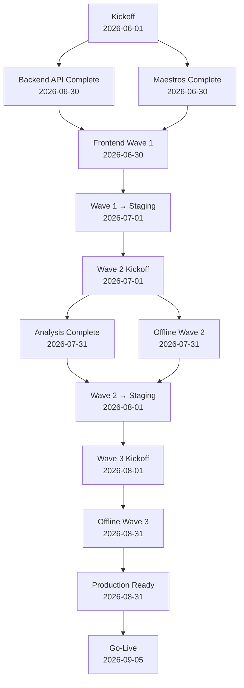

# 📅 Project Milestones — Control de Calidad Textil

**Project Duration**: 90 días (3 meses)  
**Start Date**: 2026-06-01  
**Go-Live Date**: 2026-09-05

---

## 🎯 Critical Path

```
Wave 1 (Semana 1-4)
├── Backend API ─┐
│                ├─→ Frontend Wave 1 ──→ Wave 1 Staging
├── Maestros ────┘
└── [Parallel execution]

     ↓
     
Wave 2 (Semana 5-8)
├── Frontend Analysis ─┐
│                      ├─→ Offline-Sync Wave 2 ──→ Wave 2 Staging
└── [Offline-Sync starts]

     ↓
     
Wave 3 (Semana 9-12)
└── Offline-Sync Optimization ──→ Production Ready ──→ Go-Live
```

---

## 📍 Milestone Timeline

### **Wave 1: MVP Foundation (Semana 1-4)**

#### **Hito 1: Kickoff** 
📅 **2026-06-01**
- Equipos asignados
- Entornos configurados
- Repositorios listos
- Primeras reuniones de diseño
- **Owner**: Product Owner

#### **Hito 2: Backend API Complete** 
📅 **2026-06-30**
- ✅ Todas las APIs REST funcionales
- ✅ Database con migraciones
- ✅ Autenticación JWT
- ✅ Audit logging
- ✅ Tests > 80% coverage
- ✅ Swagger documentation
- ✅ Deployed to AWS staging
- **Owner**: Backend Lead
- **Acceptance Criteria**: 
  - [ ] All endpoints tested
  - [ ] Load test: 100 req/s sustained
  - [ ] Zero security issues (OWASP)

#### **Hito 3: Maestros Management Complete**
📅 **2026-06-30**
- ✅ CRUD operacional para 3 catálogos
- ✅ Bulk import (CSV/Excel)
- ✅ Admin UI
- ✅ Validaciones exhaustivas
- ✅ Audit logging
- ✅ Tests > 80% coverage
- **Owner**: Backend Lead + Frontend Lead
- **Acceptance Criteria**:
  - [ ] Import handles 10k+ records
  - [ ] No data validation errors
  - [ ] Performance < 2s for queries

#### **Hito 4: Frontend Wave 1 Complete**
📅 **2026-06-30**
- ✅ Dashboard responsive
- ✅ Inspección module (capture, save, history)
- ✅ Aprobación module (list, review, approve/reject)
- ✅ Maestros UI (CRUD)
- ✅ Authentication integrated
- ✅ Tests > 75% coverage
- ✅ Lighthouse > 80
- ✅ Accessibility WCAG AA
- **Owner**: Frontend Lead
- **Acceptance Criteria**:
  - [ ] All happy paths tested
  - [ ] Mobile responsive (320px+)
  - [ ] < 3s page load (3G)
  - [ ] Zero console errors

#### **Hito 5: Wave 1 → Staging**
📅 **2026-07-01**
- ✅ Todos los componentes de Wave 1 integrados
- ✅ End-to-end smoke tests passed
- ✅ Performance baselines established
- ✅ Security audit passed
- ✅ Documentation complete
- ✅ Team trained on deployment
- **Owner**: DevOps Lead
- **Acceptance Criteria**:
  - [ ] Zero blockers in staging
  - [ ] All APIs responding
  - [ ] DB migrations successful
  - [ ] 99% uptime in 24h test

---

### **Wave 2: Enhancement & Offline (Semana 5-8)**

#### **Hito 6: Wave 2 Kickoff**
📅 **2026-07-01**
- Equipos reconfigurados para Wave 2
- Analysis & Offline teams ready
- Design docs reviewed
- **Owner**: Product Owner

#### **Hito 7: Analysis Module Complete**
📅 **2026-07-31**
- ✅ Dashboard con métricas
- ✅ Gráficos: By Machine, By Defect, By Fabric
- ✅ Reportes (PDF/Excel export)
- ✅ Advanced filters
- ✅ Real-time updates
- ✅ Tests > 80% coverage
- **Owner**: Frontend Lead
- **Acceptance Criteria**:
  - [ ] Charts render correctly
  - [ ] Reports export < 5s
  - [ ] Filters responsive (< 200ms)
  - [ ] Performance: Lighthouse > 85

#### **Hito 8: Offline-Sync Wave 2 Complete**
📅 **2026-07-31**
- ✅ Service Worker operational
- ✅ IndexedDB storage working
- ✅ Offline data capture
- ✅ Auto-sync when online
- ✅ Conflict detection
- ✅ Sync queue functional
- ✅ Tests > 75% coverage
- **Owner**: Frontend Lead
- **Acceptance Criteria**:
  - [ ] Offline capture tested
  - [ ] Sync queue persists
  - [ ] Conflict detection working
  - [ ] Battery drain < 5%/hour

#### **Hito 9: Wave 2 → Staging**
📅 **2026-08-01**
- ✅ Wave 2 features integrated
- ✅ Integration testing complete
- ✅ Performance baselines for new features
- **Owner**: DevOps Lead

---

### **Wave 3: Optimization & Go-Live (Semana 9-12)**

#### **Hito 10: Wave 3 Kickoff**
📅 **2026-08-01**
- Advanced offline features begin
- Performance optimization sprint
- **Owner**: Product Owner

#### **Hito 11: Offline-Sync Wave 3 Complete**
📅 **2026-08-31**
- ✅ Conflict resolution UI
- ✅ Bidirectional sync (WebSocket)
- ✅ Advanced merge strategies
- ✅ Performance optimized
- ✅ Monitoring + alerting
- ✅ Tests > 85% coverage
- **Owner**: Frontend Lead
- **Acceptance Criteria**:
  - [ ] Conflict resolution UI intuitive
  - [ ] Bidirectional sync < 2s latency
  - [ ] Compression reduces bandwidth 40%+
  - [ ] Battery drain < 3%/hour

#### **Hito 12: Production Ready**
📅 **2026-08-31**
- ✅ All features complete and tested
- ✅ Security audit passed
- ✅ Scalability tested (1000+ concurrent users)
- ✅ Disaster recovery plan ready
- ✅ Runbook documentation complete
- ✅ Support team trained
- ✅ Performance baselines met
- **Owner**: Tech Leads + DevOps
- **Acceptance Criteria**:
  - [ ] OWASP Top 10 verified
  - [ ] Load test: 1000 users/hour
  - [ ] Zero critical bugs
  - [ ] SLA: 99.5% uptime
  - [ ] RTO/RPO defined

#### **Hito 13: Production Deployment**
📅 **2026-09-05**
- ✅ Platform goes live
- ✅ Real users can access
- ✅ 24/7 monitoring active
- ✅ Support team on standby
- **Owner**: DevOps + Support Lead
- **Acceptance Criteria**:
  - [ ] All systems healthy
  - [ ] User access verified
  - [ ] Support tickets monitored
  - [ ] Incident response ready

---

## 📊 Success Metrics by Milestone

| Milestone | Success Metric | Target |
|-----------|---|---|
| Backend Complete | Test Coverage | > 80% |
| Backend Complete | API Response Time (p95) | < 500ms |
| Maestros Complete | Bulk Import Time (10k records) | < 30s |
| Frontend Wave 1 | Lighthouse Score | > 80 |
| Frontend Wave 1 | Page Load (3G) | < 3s |
| Analysis Complete | Chart Render Time | < 1s |
| Analysis Complete | Report Export Time | < 5s |
| Offline Wave 2 | Offline Capture Success Rate | > 99% |
| Offline Wave 2 | Sync Success Rate | > 99% |
| Offline Wave 3 | Conflict Detection Accuracy | > 99% |
| Production Ready | OWASP Vulnerabilities | 0 Critical |
| Production Ready | Load Test Capacity | 1000 users/hour |
| Go-Live | System Uptime (first week) | > 99.5% |

---

## 🚨 Risk Milestones (Early Warnings)

If any of these milestones are missed by > 3 days, escalate:

1. **Backend API Complete (Day 30)** — If APIs aren't ready, entire Wave 1 is at risk
2. **Frontend Wave 1 Complete (Day 30)** — If UI isn't ready, demo to stakeholders fails
3. **Wave 1 → Staging (Day 31)** — If integration fails, Wave 2 starts late
4. **Analysis Complete (Day 61)** — If delayed, go-live could slip by weeks
5. **Production Ready (Day 90)** — Final checkpoint before go-live

---

## 📋 Milestone Approval Process

For each milestone completion:

1. **Owner** verifies all acceptance criteria
2. **QA Lead** confirms testing is complete
3. **Tech Lead** approves code quality
4. **Product Owner** signs off on scope
5. **Document** completion in GENERATION-STATUS.md

---

## 📞 Milestone Owners

| Milestone | Owner | Backup |
|-----------|-------|--------|
| Backend API | Backend Lead | Tech Lead |
| Maestros | Backend Lead + Frontend Lead | Tech Lead |
| Frontend Wave 1 | Frontend Lead | Tech Lead |
| Wave 1 → Staging | DevOps Lead | Tech Lead |
| Analysis | Frontend Lead | Tech Lead |
| Offline Wave 2 | Frontend Lead | Tech Lead |
| Wave 2 → Staging | DevOps Lead | Tech Lead |
| Offline Wave 3 | Frontend Lead | Tech Lead |
| Production Ready | Tech Leads | Product Owner |
| Go-Live | DevOps Lead | Tech Leads |

---

## 🔄 Milestone Dependencies


