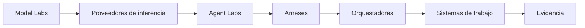
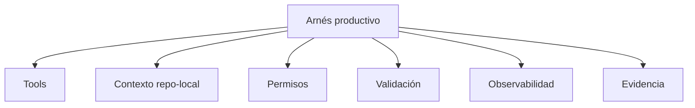

# Slides: Estación 6

> Storyboard sencillo para construir una presentación HTML y renderizarla a PDF usando el `DESIGN.md` canónico de Hardcore AI.

---

## 1. Cover

**Tipo:** cover  
**Eyebrow:** ESTACIÓN 6 · COHORTE 2  
**Título:** Implementando  
**Subtítulo:** Scaffolding, diseño agencial y sistemas de ejecución  
**Nota:** Abrir con cambio de zoom: AI-DLC dio el contrato; ahora elegimos cómo ejecutar.

---

## 2. Demo inicial

**Tipo:** content  
**Eyebrow:** LIVE CODING  
**Título:** Primero generamos este deck

1. Leer `PRODUCT.md`.
2. Leer `DESIGN.md`.
3. Usar este storyboard Markdown.
4. Generar slides HTML.
5. Renderizar PDF.
6. Usar el resultado durante la sesión.

> SIGUE DEMO: contexto canónico → HTML → PDF → clase

---

## 3. Diseño UX agencial

**Tipo:** section  
**Eyebrow:** DESIGN STANDARDS AND SKILLS  
**Título:** Skills dan hábitos. DESIGN.md da memoria.  
**Subtítulo:** Estándares y skills de diseño según el artículo "Fixing Visual AI Slop".

---

## 4. Instalación de skills

**Tipo:** content  
**Eyebrow:** SETUP  
**Título:** El agente necesita hábitos instalados

- Impeccable.
- Make Interfaces Feel Better.
- Web Design Guidelines.
- Userinterface Wiki.
- Accessibility, Best Practices, Core Web Vitals, Performance, SEO.
- React Best Practices.
- Imagegen.
- Google DESIGN.md.

---

## 5. PRODUCT.md y DESIGN.md

**Tipo:** content  
**Eyebrow:** MEMORIA DEL PRODUCTO  
**Título:** Criterio y memoria visual viven en archivos

- `PRODUCT.md`: audiencia, propósito, tono, promesa.
- `DESIGN.md`: tokens, componentes, layout, anti-patrones.
- Linting: estructura revisable.
- Skills: revisión y ejecución con mejores defaults.

---

## 6. Punto de partida

**Tipo:** content  
**Eyebrow:** YA DEBERÍAS TENER  
**Título:** El agente empieza con contexto verificable

- PRD o ISB con problema definido.
- Artefactos de Inception.
- Unidad o tareas priorizadas.
- Diseño de Construction o contrato suficiente.
- Repo o sandbox listo para ejecución.

**Key point:** Contexto explícito convierte una tarea en trabajo ejecutable.

---

## 7. Cambio de nivel

**Tipo:** content  
**Eyebrow:** ZOOM OUT  
**Título:** La pregunta central: qué sistema permite producir

- Spec como contrato de entrada.
- Arnés como superficie de ejecución.
- Orquestación como coordinación.
- Evidencia como cierre del trabajo.

---

## 8. Scaffolding

**Tipo:** content  
**Eyebrow:** CONTEXTO OPERATIVO  
**Título:** Antes de ejecutar, prepara el terreno

- Unidad o feature.
- Tareas pequeñas.
- Criterios de aceptación.
- Comandos de validación.
- Contexto operativo.
- Evidencia esperada.

---

## 9. Mapa completo

**Tipo:** diagram  
**Eyebrow:** TAXONOMÍA  
**Título:** Modelos, inferencia, arneses, orquestación

**Nota:** Separar capas que suelen mezclarse en conversaciones de herramientas.

---

## 10. Model Labs

**Tipo:** content  
**Eyebrow:** CAPA 1  
**Título:** El modelo marca capacidades

- Razonamiento.
- Código.
- Seguimiento de instrucciones.
- Multimodalidad.
- Contexto largo.
- Latencia percibida.

---

## 11. Proveedores de inferencia

**Tipo:** content  
**Eyebrow:** CAPA 2  
**Título:** Inferencia convierte capacidad en operación

- Ventana de contexto.
- Cache tokens.
- Tool calling.
- Multimodalidad.
- Throughput y latencia.
- Costo operativo.
- Límites de API.

---

## 12. Benchmarks y señales

**Tipo:** content  
**Eyebrow:** EVALUACIÓN DE CAPACIDADES  
**Título:** Benchmarks ayudan a calibrar expectativas

- Terminal Bench.
- Artificial Analysis.
- Benchmarks de código y razonamiento.
- Pruebas reales sobre tu repo.
- Costo y latencia en contexto operativo.

**Key point:** Un benchmark orienta; la evidencia de tu repo decide.

---

## 13. Agent Labs y arneses

**Tipo:** content  
**Eyebrow:** CAPA 3  
**Título:** El arnés es donde el agente toca el mundo

- Lee archivos.
- Ejecuta comandos.
- Edita código.
- Usa permisos.
- Observa resultados.
- Devuelve evidencia.

---

## 14. Arneses en el mapa

**Tipo:** content  
**Eyebrow:** EJEMPLOS  
**Título:** Superficies distintas, trabajo verificable

- Claude Code.
- Codex.
- OpenHands.
- Factory.
- OpenCode.
- Antigravity 2.
- Pi.

**Nota:** Presentar características observables: superficie, permisos, contexto, ejecución, validación y evidencia.

---

## 15. Anatomía de un arnés productivo

**Tipo:** diagram  
**Eyebrow:** HARNESS DESIGN  
**Título:** Seis piezas mínimas

---

## 16. Sistema de trabajo

**Tipo:** content  
**Eyebrow:** WORK MANAGEMENT  
**Título:** El backlog también es contexto

- Beads.
- Linear.
- GitHub Issues.
- Markdown local.
- Issues como unidades de ejecución.
- PRs como evidencia de cambio.

**Nota:** Preparar el puente hacia Estación 7.

---

## 17. Orquestación

**Tipo:** content  
**Eyebrow:** CAPA 4  
**Título:** Orquestar coordina alcance, contexto y ejecución

- Divide trabajo.
- Controla dependencias.
- Asigna agentes o arneses.
- Recoge evidencia.
- Coordina validación.
- Mantiene continuidad.

---

## 18. Señales para subir de abstracción

**Tipo:** content  
**Eyebrow:** CRITERIO  
**Título:** La coordinación crece con el sistema

- Muchas tareas dependientes.
- Varios agentes o ramas.
- Validación como bloqueo.
- Handoffs frecuentes.
- Evidencia dispersa.
- Repetición suficiente para automatizar.

---

## 19. Orquestación en el horizonte

**Tipo:** content  
**Eyebrow:** PUENTE A ESTACIÓN 7  
**Título:** Un orquestador organiza trabajo, agentes y evidencia

- Tareas con schema.
- Dependencias.
- Checkpoints.
- Estados.
- Validaciones.
- Handoffs.

---

## 20. Tarea

**Tipo:** task  
**Eyebrow:** ENTREGA PARA ESTACIÓN 7  
**Título:** Prepara tu scaffolding operativo

- Ficha de arnés.
- `AGENTS.md` o equivalente.
- Una skill de proyecto.
- `PRODUCT.md` y `DESIGN.md` si hay interfaz.
- Validaciones disponibles.
- Nota de orquestación futura.

**Cierre:** La próxima estación convierte AI-DLC en trabajo orquestable.
