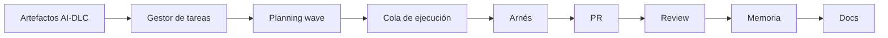
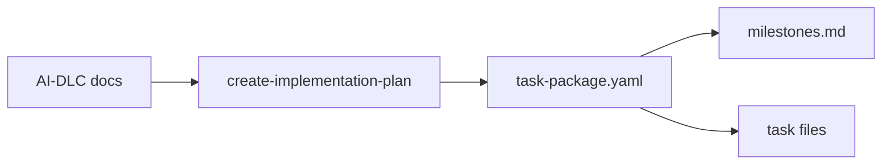
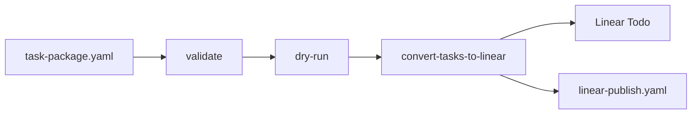
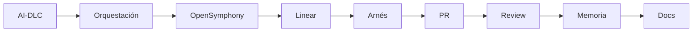

# Slides: Estación 7

> Storyboard para construir la presentación final usando el `DESIGN.md` canónico de Hardcore AI.

---

## 1. Cover

**Tipo:** cover  
**Eyebrow:** ESTACIÓN 7 · COHORTE 2  
**Título:** Agentes de código  
**Subtítulo:** Orquestación de trabajo, review y memoria  
**Nota:** Abrir con la transición: ya existen artefactos AI-DLC; ahora diseñamos el sistema que los convierte en trabajo coordinado.

---

## 2. La promesa de hoy

**Tipo:** content  
**Eyebrow:** OBJETIVO  
**Título:** Convertir intención en trabajo confiable

- Tomar artefactos reales de AI-DLC.
- Diseñar una cola de trabajo orquestable.
- Usar OpenSymphony como ejemplo.
- Publicar tareas en Linear.
- Ejecutar con arnés.
- Revisar PRs automáticamente.
- Capturar memoria y sincronizar docs.

---

## 3. Orquestación de trabajo

**Tipo:** content  
**Eyebrow:** CONCEPTO  
**Título:** Coordinar trabajo requiere más que un buen arnés

- Intención.
- Contexto.
- Scope.
- Dependencias.
- Ejecución.
- Validación.
- Review.
- Memoria.

---

## 4. Mapa de capas

**Tipo:** diagram  
**Eyebrow:** TAXONOMÍA  
**Título:** Varias capas sostienen la ejecución



---

## 5. Fuente de entrada

**Tipo:** content  
**Eyebrow:** ESTACIÓN 5  
**Título:** El ejemplo viene de EntreVista AI

- `aidlc-state.md`.
- `audit.md`.
- Inception requirements.
- User stories.
- Application design.
- Unit of work.
- Construction de Unit 6: `auth-lambda`.

---

## 6. Unidad de demo

**Tipo:** content  
**Eyebrow:** UNIT 6  
**Título:** `auth-lambda` es la primera unidad

- Repo objetivo: `entrevista-auth`.
- Runtime: Python 3.12 / FastAPI + Mangum.
- Story principal: US-18, Authenticate Into Dashboard.
- Wave 1 en la secuencia de construcción.
- Servicio fundacional para dashboard.

---

## 7. OpenSymphony como ejemplo

**Tipo:** section  
**Eyebrow:** ORQUESTACIÓN  
**Título:** OpenSymphony materializa la cola de trabajo  
**Subtítulo:** Planning wave, task package, Linear, arnés, review y memoria.

---

## 8. Contrato OpenSymphony

**Tipo:** content  
**Eyebrow:** PLANNING WAVE  
**Título:** La intención queda en un paquete revisable

- `task-package.yaml`.
- `milestones.md`.
- Task files.
- IDs estables.
- Dependencias.
- Parent/sub-issues.
- Acceptance criteria.
- Test plan.
- Contexto.

---

## 9. De AI-DLC a paquete

**Tipo:** diagram  
**Eyebrow:** DEMO  
**Título:** Primero se descompone el trabajo



> SIGUE DEMO: artefactos AI-DLC a paquete revisable

---

## 10. Revisión del paquete

**Tipo:** content  
**Eyebrow:** CHECKPOINT  
**Título:** La cola se revisa antes de publicarse

- Manifest completo.
- Milestones coherentes.
- Task files existentes.
- Dependencias válidas.
- Acceptance criteria medibles.
- Test plans ejecutables.
- Contexto AI-DLC referenciado.

---

## 11. De paquete a Linear

**Tipo:** diagram  
**Eyebrow:** PUBLICACIÓN  
**Título:** Luego se proyecta al sistema de trabajo



> SIGUE DEMO: validate, dry-run, Linear

---

## 12. Resultado en Linear

**Tipo:** content  
**Eyebrow:** ESTADO INICIAL  
**Título:** Las tareas quedan listas para implementación

- Issues en estado Todo.
- Milestones por wave.
- Parent/sub-issues.
- Blocker relations.
- Links al proyecto.
- Overview actualizado.
- Mapping local.

---

## 13. Ejecutar con arnés

**Tipo:** content  
**Eyebrow:** AGENTE DE CÓDIGO  
**Título:** Una tarea publicada entra al arnés

- Leer issue y task file.
- Pedir plan corto.
- Revisar scope y validación.
- Aprobar implementación.
- Ejecutar tests.
- Adjuntar evidencia.

---

## 14. Code review automatizado

**Tipo:** section  
**Eyebrow:** CALIDAD  
**Título:** Review temprano reduce bugs y deuda técnica  
**Subtítulo:** Un segundo lector técnico mejora el ciclo antes del merge.

---

## 15. Qué debe revisar

**Tipo:** content  
**Eyebrow:** SEÑALES  
**Título:** El review automatizado necesita evidencia

- Intención del cambio.
- Diff.
- Tests.
- Logs o screenshots.
- Riesgos.
- Áreas sensibles.
- Invariants del codebase.
- Notas para reviewer humano.

---

## 16. OpenSymphony PR review

**Tipo:** content  
**Eyebrow:** EJEMPLO  
**Título:** OpenHands PR Review implementa esa capa

- Rol advisory.
- Merge gate humano.
- Same-repo PRs por defecto.
- Evidence section requerida.
- Comentarios high-signal.
- Label de rerun: `review-this`.
- Setup explícito de secrets y variables.

---

## 17. Memoria evolutiva

**Tipo:** section  
**Eyebrow:** CONTINUIDAD  
**Título:** El codebase debe volverse más fácil de entender  
**Subtítulo:** Cada tarea deja conocimiento para la siguiente.

---

## 18. Qué debe recordar el sistema

**Tipo:** content  
**Eyebrow:** CODEBASE UNDERSTANDING  
**Título:** La memoria captura conocimiento operativo

- Qué cambió.
- Qué decisión quedó validada.
- Qué invariant apareció.
- Qué validación fue útil.
- Qué review feedback se repitió.
- Qué docs deben evolucionar.

---

## 19. OpenSymphony memory

**Tipo:** content  
**Eyebrow:** EJEMPLO  
**Título:** `opensymphony memory` implementa captura y consulta

- Issue capsules.
- DuckDB index.
- `memory.yaml`.
- Related issues.
- Context bundle.
- Topic docs.
- Docs sync.
- Lint de memoria y docs.

---

## 20. Consultas de contexto

**Tipo:** content  
**Eyebrow:** EJEMPLOS  
**Título:** La memoria asiste antes de tocar código

```bash
opensymphony memory context --issue COE-456
opensymphony memory related --paths crates/opensymphony-openhands
opensymphony memory search "reconnect recovery"
opensymphony memory docs --area authentication
```

---

## 21. Docs que evolucionan

**Tipo:** content  
**Eyebrow:** DOCUMENTACIÓN  
**Título:** La documentación recibe conocimiento estable

```bash
opensymphony memory capture COE-123 --dry-run
opensymphony memory sync-docs --since-last-sync --dry-run
opensymphony memory lint --public-docs
```

**Key point:** La memoria alimenta docs que ayudan al siguiente agente y al siguiente humano.

---

## 22. Cadena completa

**Tipo:** diagram  
**Eyebrow:** SISTEMA  
**Título:** La estación completa el ciclo de implementación



---

## 23. Tarea

**Tipo:** task  
**Eyebrow:** ENTREGA  
**Título:** Publica una wave y cierra el ciclo

- `task-package.yaml`.
- `milestones.md`.
- Task files.
- Evidencia de validación.
- Issues en Linear Todo.
- PR con Evidence.
- AI PR review o setup.
- Memory capture dry-run.
- Docs sync dry-run.

---

## 24. Cierre

**Tipo:** content  
**Eyebrow:** PRINCIPIO FINAL  
**Título:** Trabajo reusable, evidencia visible, memoria viva

- AI-DLC preserva intención.
- OpenSymphony estructura ejecución.
- Linear publica coordinación.
- El arnés implementa.
- PR review reduce riesgo.
- Memory convierte aprendizaje en contexto.
